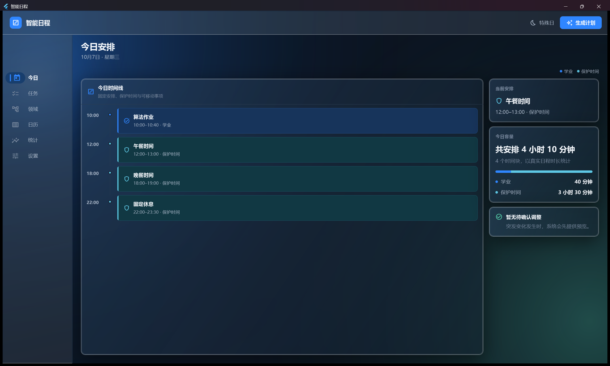
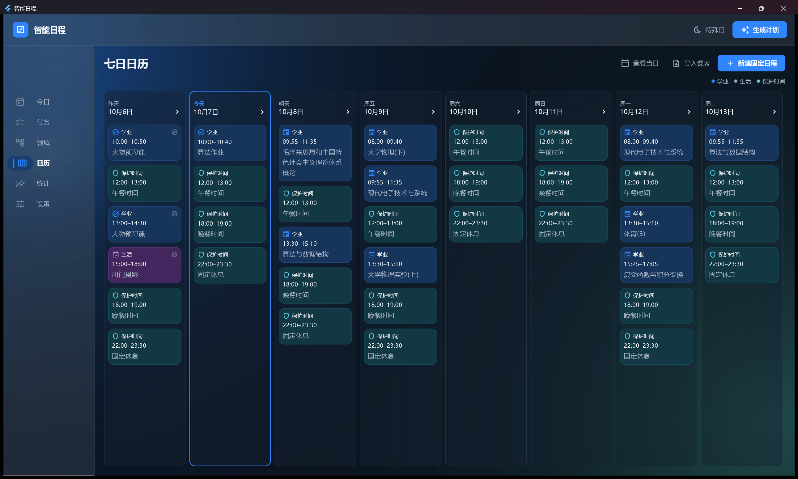
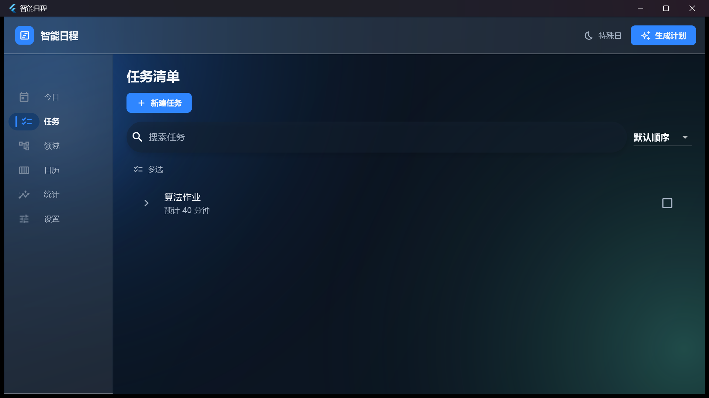
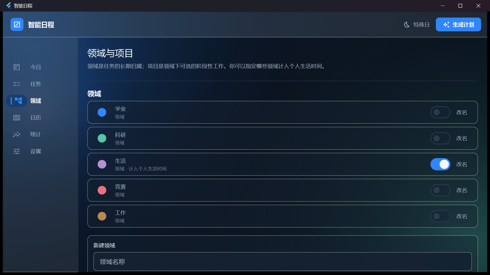
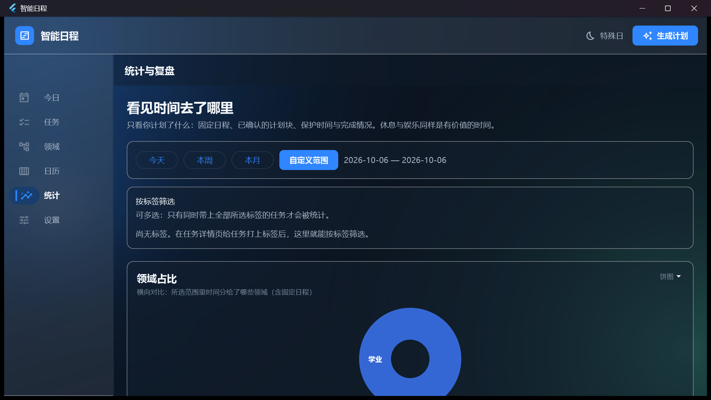
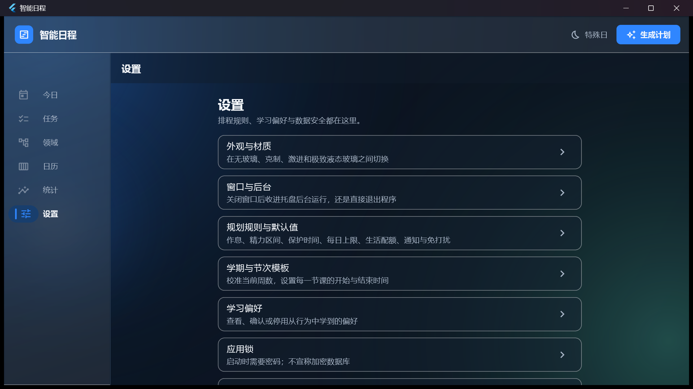

# Best Planning / 智能日程

### A local-first intelligent schedule planner for Windows / 面向大学生的本地优先智能日程软件

[](https://github.com/ShuoZhuang/Best-Planning/releases)
[](https://github.com/ShuoZhuang/Best-Planning/releases)
[](https://github.com/ShuoZhuang/Best-Planning/releases)
[](#privacy--数据与隐私)

---

## Download / 下载

Download the latest Windows release here:

在这里下载最新 Windows 版本：

[https://github.com/ShuoZhuang/Best-Planning/releases](https://github.com/ShuoZhuang/Best-Planning/releases)

> [!TIP]
> 推荐下载名称中包含 `windows-x64` 的完整 ZIP，完整解压后双击 `安装.cmd`。  
> ZIP 已包含 MSIX、签名公钥证书、安装脚本、安装说明和便携版文件，无需安装 Flutter 或配置开发环境。

---

## Documentation / 使用文档

- [最新版使用教程](docs/release/1.5.0-build34-user-guide.md)
- [Windows 安装与发布说明](docs/release/windows-release.md)
- [版本号规则](版本号规则.md)
- [提交问题](https://github.com/ShuoZhuang/Best-Planning/issues)

---

## Features / 主要功能

- 滚动规划未来 7 天，并检查更远的截止日期。
- 根据截止时间、预计时长、精力要求和个人偏好自动安排任务。
- 支持固定日程、保护时间、可移动任务和个人生活安排。
- 支持连续任务和可拆分任务，计划变化后可以重新计算。
- 支持课表图片识别，并确认学期、周数、节次和课程时间。
- 统一展示领域、保护时间和无领域任务的颜色。
- 按自选时间范围统计计划时间与实际投入。
- 提供无玻璃、克制、激进和极致液体玻璃外观。
- 本地保存数据，并支持备份、恢复和导出。

---

## Supported Platforms / 支持平台

| Platform / 平台 | x64 | x86 | arm64 |
| --- | --- | --- | --- |
| Windows | ✅ | - | - |
| Android | Planned / 计划中 | - | - |
| iOS | Planned / 计划中 | - | - |

当前可下载版本为 Windows x64。具体安装要求请查看对应 Release 中的 `安装说明.txt`。

---

## Signature Verification / 签名校验

Windows MSIX 使用 Authenticode 签名。Release 同时提供公开证书 `PersonalPlanner-signing-cert.cer`，用于验证签名和完成侧载安装。

```text
Subject:     CN=Shuo Zhuang, O=Personal User, C=CN
Thumbprint:  9E157ECE535D16A224593CA39C084705A4FD3C13
```

`.cer` 只包含公开证书和公钥，不包含签名私钥。各发布文件的 SHA-256 校验值记录在 Release 说明和[构建台账](docs/release/build-ledger.md)中。

---

## Screenshots / 界面预览

### Today / 今日



### Calendar / 日历



<details>
<summary>查看其他界面 / More screenshots</summary>









</details>

---

## Privacy / 数据与隐私

软件默认在本机保存任务、课表、设置和统计数据，不要求登录，也不会默认上传这些内容。建议定期在设置中导出 JSON 备份。

提交 Issue 时请先对截图和日志脱敏，不要上传任务数据库、备份文件、真实课表、签名私钥或密码。

---

## Development / 开发

普通用户无需配置开发环境。需要修改源码、运行测试或自行构建时，请阅读：

- [开发者说明](docs/developer-readme-legacy.md)
- [需求与技术设计](docs/superpowers/specs/2026-10-01-personal-intelligent-scheduling-design.md)
- [Windows 发布流程](docs/release/windows-release.md)
