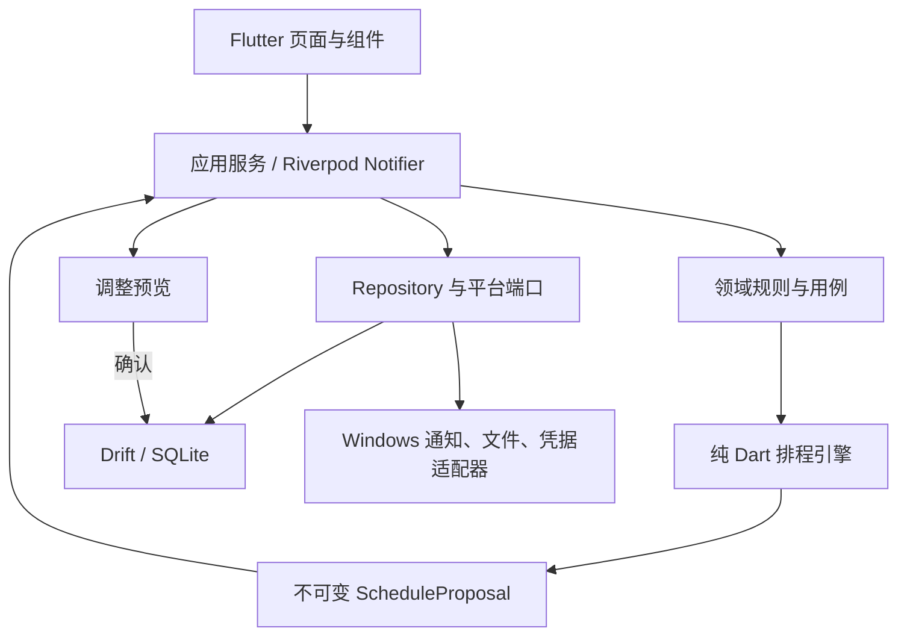

# 个人智能日程规划软件技术设计与实施计划

> **For agentic workers:** REQUIRED SUB-SKILL: Use superpowers:subagent-driven-development (recommended) or superpowers:executing-plans to implement this plan task-by-task. Steps use checkbox (`- [ ]`) syntax for tracking.

**Goal:** 构建一个本地优先、可解释、可恢复的 Windows 智能日程程序，并保留通过同一 Flutter 代码库扩展 Android/iOS 的能力。

**Architecture:** 使用单一 Flutter 应用和按功能划分的模块结构；排程核心是无 Flutter 依赖的纯 Dart 模块，数据库、系统通知和文件系统通过端口接口接入。SQLite/Drift 保存事实数据和版本化计划，任何重新排程先生成不可变提案，确认后才以事务替换当前计划。

**Tech Stack:** Flutter stable（最低 3.38.1，实施时使用并锁定当期 stable）、Dart、Riverpod、go_router、Drift/SQLite、timezone、uuid、flutter_local_notifications、fl_chart、flutter_test、fake_async、integration_test、MSIX。

**Spec:** `docs/superpowers/specs/2026-10-01-personal-intelligent-scheduling-design.md`

## Global Constraints

- 首发平台为 Windows 10/11 x64，产物包含可执行程序和 MSIX 安装包。
- 运行时不要求账号、网络、云端服务或在线 AI。
- 睡眠、用餐、固定休息、固定日程、锁定时间块、连续任务及每日任务上限属于硬约束。
- 默认详细规划未来 7 天，同时评估全部未完成任务的远期截止压力。
- 时间计算使用 5 分钟粒度；持久化瞬时时间使用 UTC 微秒，重复规则保留本地墙上时间和 IANA 时区标识。
- 默认先显示调整预览；只有用户开启“信任自动调整”后才可直接应用可行提案。
- 用户主动设置优先于确认后的学习偏好，学习偏好优先于产品默认值。
- 学习模块只能更新软约束；硬约束只能由用户明确修改或单次放宽。
- 所有核心写入使用事务；计算失败、保存失败或取消操作时保留当前已确认计划。
- `pubspec.lock`、Drift schema 快照和数据库迁移测试必须提交版本控制。
- 面向用户的中文文案保持中性，不因休息、娱乐、延期或中断进行羞辱和惩罚。

## Review Focus

- 夏令时、跨午夜和系统时区改变：固定事项与重复事项必须保持用户预期的本地时间，不产生重复或遗漏时间块；由 Task 5 的边界测试固定。
- 总需求时长大于可用时间：必须返回结构化冲突和缺口分钟数，不能给出违反硬约束的“成功”计划；由 Task 8 的不可行提案测试固定。
- 计算完成前数据再次改变：过期提案必须因输入快照哈希不匹配而拒绝应用；由 Task 9 的并发版本测试固定。
- 计时中崩溃或系统时钟跳变：恢复时要求用户确认真实结束时间，不能直接把异常间隔算作实际投入；由 Task 12 的恢复测试固定。
- 损坏、截断或来自新版本的备份：必须在临时位置验证并拒绝覆盖当前数据库；由 Task 16 的恢复测试固定。

---

## 1. 技术选择

### 1.1 为什么选择 Flutter

Flutter 官方支持从同一代码库构建 Windows、Android 和 iOS 应用，并可生成 Windows 原生桌面产物。该能力直接匹配“Windows 首发、未来手机 App”的产品路线。首版不拆分桌面端和移动端两个前端工程，避免提前承担双技术栈成本。

备选方案及未选择原因：

- Tauri + React + Rust：体积小且桌面能力强，但会引入 TypeScript/Rust 双语言边界，首版排程、数据库和 UI 联调成本更高。
- .NET MAUI：Windows 集成好，但未来移动端与跨平台组件选择更受 .NET 生态约束。
- Electron：开发便利，但对本地单用户工具而言运行体积和内存开销不占优势。

技术依据：

- Flutter 支持平台：https://docs.flutter.dev/reference/supported-platforms
- Flutter 桌面支持与 Windows 构建：https://docs.flutter.dev/platform-integration/desktop
- Flutter Windows 发布方式：https://docs.flutter.dev/platform-integration/windows/building
- Drift 事务：https://drift.simonbinder.eu/dart_api/transactions/
- Drift 迁移与测试：https://drift.simonbinder.eu/migrations/
- Drift 后台 isolate：https://drift.simonbinder.eu/isolates/
- Windows 本地通知限制：https://pub.dev/packages/flutter_local_notifications

### 1.2 依赖策略

- 使用 Flutter stable；项目创建时记录 `flutter --version`，并在升级前通过完整测试和数据库迁移测试。
- 应用项目提交 `pubspec.lock`，确保安装包构建可复现。
- 依赖只解决明确需求；不得为了“以后可能用到”引入网络、遥测、机器学习或云 SDK。
- 排程算法不依赖平台插件，确保可通过 `flutter test` 在内存中快速验证。
- Riverpod 只管理运行时状态和依赖注入；数据库仍是唯一事实来源，不使用实验性离线状态持久化替代 Drift。

## 2. 总体结构



### 2.1 模块边界

| 模块 | 职责 | 禁止依赖 |
| --- | --- | --- |
| `domain` | 实体、值对象、枚举、业务错误和 repository 接口 | Flutter、Drift、平台插件 |
| `scheduling` | 可用时间、压力计算、候选生成、评分、验证、解释和计划 diff | Flutter、Drift、平台插件 |
| `data` | Drift 表、DAO、迁移、repository 实现和事务 | 页面组件 |
| `application` | 用例编排、提案生命周期、计时恢复、备份和通知协调 | 具体页面布局 |
| `features/*` | 页面、组件、表单和 Riverpod 状态 | 直接 SQL、排程内部实现 |
| `platform` | Windows 通知、文件、开机恢复和应用锁适配器 | 业务决策 |

### 2.2 目录结构

```text
personal_planner/
├── pubspec.yaml
├── analysis_options.yaml
├── build.yaml
├── lib/
│   ├── main.dart
│   ├── app/
│   │   ├── planner_app.dart
│   │   └── router.dart
│   ├── core/
│   │   ├── clock.dart
│   │   ├── ids.dart
│   │   ├── result.dart
│   │   └── time_zone.dart
│   ├── domain/
│   │   ├── models/
│   │   ├── repositories/
│   │   └── services/
│   ├── scheduling/
│   │   ├── schedule_engine.dart
│   │   ├── schedule_problem.dart
│   │   ├── schedule_proposal.dart
│   │   ├── availability_builder.dart
│   │   ├── pressure_calculator.dart
│   │   ├── candidate_generator.dart
│   │   ├── candidate_scorer.dart
│   │   ├── plan_validator.dart
│   │   ├── plan_differ.dart
│   │   └── explanations.dart
│   ├── data/
│   │   ├── database/
│   │   │   ├── app_database.dart
│   │   │   ├── tables/
│   │   │   └── daos/
│   │   └── repositories/
│   ├── application/
│   │   ├── planning_service.dart
│   │   ├── plan_application_service.dart
│   │   ├── focus_service.dart
│   │   ├── analytics_service.dart
│   │   ├── preference_service.dart
│   │   └── backup_service.dart
│   ├── platform/
│   │   ├── notifications/
│   │   ├── files/
│   │   └── app_lock/
│   └── features/
│       ├── onboarding/
│       ├── today/
│       ├── tasks/
│       ├── calendar/
│       ├── planning/
│       ├── focus/
│       ├── analytics/
│       └── settings/
├── test/
│   ├── domain/
│   ├── scheduling/
│   ├── data/
│   ├── application/
│   ├── features/
│   └── fixtures/
├── integration_test/
├── drift_schemas/
└── windows/
```

目录结构说明：

- `lib/app/providers.dart` 从未创建：Riverpod 状态目前由各页面自行组织，依赖注入集中在 `main.dart` 与 `PlannerApp` 构造参数，本计划不再要求该文件。若后续需要集中 provider 定义，应作为独立任务引入。
- `lib/data/database/migrations/` 尚未创建：当前 schemaVersion 为 1，只有 `onCreate`，无迁移代码。首次提升 schemaVersion 时必须创建该目录、导出 schema 快照并补充迁移测试（见 §4.2 与 Task 3）。
- `integration_test/` 属于 Task 20 交付物，当前不存在。

## 3. 核心领域接口

以下接口名和字段名是后续实现的稳定边界。UI、数据库和排程模块不得各自定义一套同义模型。

```dart
typedef EntityId = String;
typedef Minutes = int;

abstract interface class Clock {
  DateTime nowUtc();
}

abstract interface class IdGenerator {
  EntityId next();
}

abstract interface class TaskRepository {
  Stream<List<PlannerTask>> watchOpenTasks();
  Future<PlannerTask?> getById(EntityId id);
  Future<void> save(PlannerTask task);
}

abstract interface class CalendarRepository {
  Future<List<CalendarOccurrence>> occurrencesBetween(
    DateTime startUtc,
    DateTime endUtc,
  );
  Future<void> save(CalendarEvent event);
}

abstract interface class PlanRepository {
  Future<ConfirmedPlan?> current();
  Future<ApplyPlanResult> applyProposal(
    ScheduleProposal proposal,
    String expectedInputHash,
  );
}

abstract interface class ScheduleEngine {
  ScheduleProposal generate(ScheduleProblem problem);
}
```

关键值对象：

- `TimeRange(startUtc, endUtc)`：半开区间 `[start, end)`，结束必须晚于开始。
- `LocalTimeRange(startMinute, endMinute)`：0–1440 分钟；跨午夜规则拆成两个日期片段。
- `PlanningRules`：睡眠、用餐、休息、每日上限、周末规则、生活配额和 5 分钟粒度。
- `TaskConstraints`：允许拆分、最短/最长片段、必须连续、期望时段和脑力强度。
- `InputSnapshot`：任务、日程、设置和当前计划的规范化 JSON 计算 SHA-256，形成 `inputHash`。
- `ScheduleProposal`：只读结果；包含 `blocks`、`unscheduled`、`conflicts`、`explanations`、`inputHash` 和 `algorithmVersion`。

## 4. 数据模型

### 4.1 表结构

| 表 | 关键字段 | 说明 |
| --- | --- | --- |
| `areas` | `id`, `name`, `color`, `sort_order` | 学业、科研、生活等领域，可自定义。 |
| `projects` | `id`, `area_id`, `name`, `archived_at_utc` | 项目归属领域。 |
| `tasks` | `id`, `project_id`, `title`, `notes`, `priority`, `estimated_minutes`, `remaining_minutes`, `due_at_utc`, `energy_level`, `split_mode`, `min_chunk_minutes`, `max_chunk_minutes`, `status`, `created_at_utc`, `updated_at_utc` | 任务事实数据，不直接保存派生日程。 |
| `calendar_events` | `id`, `title`, `start_at_utc`, `end_at_utc`, `time_zone_id`, `recurrence_rule_id`, `exception_of_id`, `locked`, `area_id`, `updated_at_utc` | 一次性事件和重复事件实例例外。 |
| `recurrence_rules` | `id`, `weekdays_mask`, `local_start_minute`, `duration_minutes`, `valid_from_local_date`, `valid_until_local_date`, `time_zone_id` | 首版只实现按周重复。 |
| `energy_windows` | `id`, `day_kind`, `start_minute`, `end_minute`, `energy_level`, `source` | 工作日、周末或指定日期精力段。 |
| `settings` | `key`, `json_value`, `updated_at_utc` | 带 schema 的设置值；不保存无法验证的任意对象。 |
| `plan_versions` | `id`, `created_at_utc`, `input_hash`, `algorithm_version`, `status`, `summary_json` | 已确认、已被替代和已撤销的持久化计划版本；未确认提案只保存在内存。 |
| `schedule_blocks` | `id`, `plan_version_id`, `task_id`, `start_at_utc`, `end_at_utc`, `locked`, `explanation_code` | 每个计划版本的任务块。 |
| `time_entries` | `id`, `task_id`, `started_at_utc`, `ended_at_utc`, `paused_minutes`, `source`, `recovery_state` | 实际投入；未确认恢复记录不计入统计。 |
| `preference_evidence` | `id`, `kind`, `subject_key`, `observed_at_utc`, `numeric_value`, `special_day`, `metadata_json` | 原始偏好证据，可追溯。 |
| `preference_rules` | `id`, `kind`, `subject_key`, `value_json`, `confidence`, `status`, `source`, `updated_at_utc` | 建议、已确认、自动采用、停用状态。 |
| `change_log` | `id`, `entity_type`, `entity_id`, `operation`, `changed_at_utc`, `revision` | 为撤销、诊断和未来同步保留最小变更历史。 |

### 4.2 数据约束

- 所有实体 ID 使用 UUID v4 字符串；未来同步不依赖数据库自增 ID。
- `estimated_minutes`、`remaining_minutes` 和片段长度必须是正整数，且按 5 分钟向上取整用于排程；原始输入仍保留。
- `due_at_utc` 可为空；没有截止日期的任务由优先级、生活配额和用户期望时段参与排序。
- `schedule_blocks` 必须引用存在的 `plan_versions` 和 `tasks`，外键在每次连接打开时启用。
- 删除任务默认采用状态转换而非物理删除；永久清除数据除外。
- 日期实例使用 UTC；重复规则使用本地日期、墙上时间和时区 ID，展开后生成 UTC occurrence。
- Drift schema 每次变化都提高 `schemaVersion`、导出 schema 快照并运行生成的迁移测试。

## 5. 排程引擎设计

### 5.1 输入与输出

```dart
final class ScheduleProblem {
  final DateTime planningStartUtc;
  final DateTime planningEndUtc;
  final String timeZoneId;
  final List<SchedulableTask> tasks;
  final List<BusyInterval> fixedIntervals;
  final List<BusyInterval> protectedIntervals;
  final List<PlannedBlock> lockedBlocks;
  final PlanningRules rules;
  final PreferenceProfile preferences;
  final String inputHash;
}

final class ScheduleProposal {
  final String proposalId;
  final String inputHash;
  final String algorithmVersion;
  final List<PlannedBlock> blocks;
  final List<UnscheduledTask> unscheduled;
  final List<PlanningConflict> conflicts;
  final List<PlanExplanation> explanations;
  final ProposalMetrics metrics;
}
```

`ScheduleEngine.generate` 是纯函数：不读数据库、不调用当前时间、不产生随机结果。当前时间和 ID 在应用层注入。

候选排序的完整顺序（与 `schedule_engine.dart` 的 `_compareRankedCandidates` 一致）：`coverageMinutes` 降序 → 软约束总分降序 → `startUtc` 升序 → `taskId` → 候选 ID。最后三项构成最终平局键，保证相同输入产生相同输出。

> **已解决（算法版本 5）**：本节原先只声明了最后三项平局键，遗漏了前两个实质排序键；更重要的是排序首键曾是 `coverageMinutes`（一次能覆盖多少目标时长），与 5.2 第 7 步"选择**最高分**候选"冲突。按"实现以需求文档为准"的原则，现在以软约束总分为首键，覆盖度退为同分时的次级依据。实测该改动不改变 golden 周的输出（该场景中评分顺序与覆盖度顺序恰好一致），但它会在"覆盖度与评分不一致"的输入上改变结果，因此算法版本提升为 5。

### 5.2 处理管线

1. **规范化**：校验输入，按 5 分钟粒度标准化可调度时长，合并重叠的忙碌区间。
2. **构造可用时间**：从 7 个本地日中扣除固定事件、保护时间和锁定时间块，再按每日上限裁剪。
3. **远期压力**：对全部开放任务估算截止日前容量；计算“七日内必须完成量”和“均匀推进量”。
4. **任务排序**：先按不可行风险和有效松弛时间，再按用户优先级、可用候选数量和稳定 ID 排序。
5. **候选生成**：按任务拆分规则，在可用区间中以 5 分钟步长生成候选时间块。与已排片段在 `Rules.breakMinutes` 以内相邻的候选位置在分配与局部改进阶段都被排除——该规则作用于**任意两个任务块之间，不区分任务类型**（参见 13.0.7 的 C1 决策）。连续任务与另一任务相邻时同样需要休息。算法版本 4 起生效。
6. **候选评分**：对精力匹配、期望时段、连续性、生活配额、切换成本、碎片化和移动成本计分。
7. **初始分配**：选择**软约束总分最高**且不破坏硬约束的候选；总分相同时按覆盖度、开始时间、任务 ID、候选 ID 依次决胜。算法版本 5 起排序与此一致（此前首键为覆盖度）。
8. **局部改进**：限定次数地尝试交换或移动两个可移动块，只接受总分提高且仍通过验证的结果。
9. **最终验证**：重新验证重叠、硬约束、片段总量、每日上限和生活配额。
10. **差异与解释**：与当前计划比较，生成新增、移动、拆分、删除、逾期和冲突说明。

### 5.3 远期压力

对截止日期在规划窗口之外的任务：

- `requiredNow = max(0, remaining - estimatedCapacityAfterHorizonBeforeDue)`；
- `pacedNow = ceil(remaining * horizonCapacity / estimatedCapacityUntilDue)`；
- 七日目标为 `max(requiredNow, pacedNow)`，但不得超过任务剩余时长。

目标大于零但小于最小可排片段时，会抬到**确实可排的最小量**（可拆分任务为最小片段，连续任务为整块），否则均匀推进量会因为没有这么短的片段而完全落空——这正是"远端任务整周排入 0 分钟"的成因。算法版本 6 起如此。对应地，不可拆分任务的取舍是"要么整体排入、要么一个也排不进"。

未来容量根据已知重复日程、长期保护规则、工作日/周末上限估算；一次性未来固定事项存在时必须扣除。截止日期超过 180 天时，以未来 180 天容量和周均推进量估算，避免无界展开重复日程。

### 5.4 评分

排程的决策实际分两级，评分只作用于第二级：

1. **任务级排序**（决定先排哪个任务）：由 `_compareTasks` 完成，依次比较有效松弛时间（截止前可用容量 − 目标分钟数）、用户优先级、截止时间、稳定 ID。紧迫度由第一条以梯度方式决定，而不是靠评分表。
2. **候选级排序**（在同一任务的候选位置之间选择）：先按**软约束总分**降序（设计 §5.2 第 7 步），总分相同时按 `coverageMinutes`（该候选及其后的可续排容量）降序，最后以开始时间、任务 ID、候选 ID 平局决胜，保证可复现。算法版本 5 起如此。

因此**评分表只在第二级生效**，且只比较同一任务的候选。凡是在该任务上恒定的因子都不参与选择。当前实现中各因子的实际作用范围如下：

| 因素 | 权重范围 | 当前实际作用 |
| --- | --- | --- |
| 截止与负松弛风险 | 0 至 +3000 | **不生效**：`deadlineRiskPermille` 只按"有无截止日期"取 0/1000，对同一任务的所有候选都是同一个值。紧迫度改由第 1 级的有效松弛时间承担。 |
| 用户优先级 | 0 至 +1500 | **不生效**：同上，任务级常量；优先级在第 1 级作为次级键生效。 |
| 远期均匀推进 | 0 至 +500 | **不生效**：同上，任务级常量。 |
| 精力匹配 | -800 至 +800 | 生效：随时段能量变化，是候选间的主要区分项之一。 |
| 用户期望时段 | -300 至 +500 | **未注入**：引擎从未传入 `preferredTimeScore`（模型层也还没有"期望时段"字段，见 R5）。 |
| 生活娱乐配额缺口 | 0 至 +1000 | **不生效**：同一轮迭代内 `plannedLifeMinutes` 相同，为任务级常量。 |
| 同任务连续性 | 0 至 +400 | 生效：候选所在**本地日**内已有同一任务的片段时计入（算法版本 7 起）。连续性约束"落在哪一天"，与片段间休息约束"间隔多长"互不冲突。 |
| 类别切换 | 0 至 -300 | 生效：候选在时间上紧邻的前一个或后一个片段属于其它任务、且在同一本地日内时计入（算法版本 7 起）。"紧邻"指中间没有其它片段的那个，不引入额外时间阈值。 |
| 过度碎片化 | 0 至 -600 | 生效：随片段长度变化。 |
| 移动已确认但未锁定的时间块 | 0 至 -700 | 生效：`ScheduleProblem.existingBlocks` 承载"已确认但未锁定"的块；候选与某次确认**完全一致**时不计代价，否则计一次移动（部分重叠算冲突而非保留；占用其它任务的确认位置也算移动）。算法版本 8 起。 |

判定"是否生效"的方法可复现：对同一任务的两个不同候选调用 `CandidateScorer`，在时段能量等级相同时，未生效的因子取值完全相同（见 §13.0.7 的实测记录与 C2）。

任何高分都不能突破硬约束。每个解释使用稳定的 `explanationCode` 和参数生成中文文案，不把不可测试的自由文本写入引擎。

**尚未实现的软约束**：仅剩用户期望时段一项——它需要给任务模型加上 §7.1 要求的"期望时段"字段，属于数据库结构变更，需运行 `build_runner` 生成迁移与快照，无法在当前环境完成（见 §13.0 的 R5）。在补实现之前，该行不应视为已兑现的能力。

### 5.5 冲突模型

```dart
enum ConflictCode {
  insufficientCapacity,
  fixedEventOverlap,
  protectedTimeOverlap,
  lockedBlockMoved,
  blockOverlap,
  continuousBlockUnavailable,
  dailyLimitExceeded,
  scheduledDurationExceeded,
  minimumSleepConflict,
  staleProposal,
  invalidInput,
}

final class PlanningConflict {
  final ConflictCode code;
  final EntityId? taskId;
  final Minutes shortageMinutes;
  final List<EntityId> relatedEntityIds;
  final Map<String, Object?> details;
}
```

不可行计划仍返回 `ScheduleProposal`，但 `metrics.isFullyFeasible` 为 `false`，并为每个未安排任务提供缺口分钟数和可选处理动作。引擎绝不自行修改原始截止时间、预计时长或硬约束。

## 6. 提案、确认与并发一致性

```mermaid
sequenceDiagram
    participant UI as 调整预览
    participant PS as PlanningService
    participant E as ScheduleEngine
    participant DB as Drift
    UI->>PS: createProposal()
    PS->>DB: load snapshot
    PS->>E: generate(problem + inputHash)
    E-->>PS: immutable proposal
    PS-->>UI: diff + explanations
    UI->>PS: apply(proposalId)
    PS->>DB: recompute current inputHash
    alt hash matches
      DB->>DB: transaction: version + blocks + log
      DB-->>UI: applied
    else stale
      DB-->>UI: staleProposal; request recalculation
    end
```

- 提案在应用前不替换当前计划。
- 用户编辑任何排程输入后，旧提案仍可查看，但不能应用。
- 开启自动调整时也必须执行哈希检查、完整验证和事务写入。
- 每次成功应用创建新的 `plan_versions` 记录；保留上一已确认版本用于撤销。
- 计划版本只保存必要快照摘要和块，不复制任务全文。

## 7. 偏好学习设计

首版不训练黑盒模型，使用可解释的统计规则：

- 完成一次专注，记录任务领域、脑力强度、计划/实际时段、计划/实际长度、完成状态和是否特殊日。
- 手动移动任务，记录原时段、新时段和移动方向。
- 接受、修改或拒绝提案，记录解释代码和用户动作。
- 特殊日、生病、考试周和明确标记的异常记录不参与长期偏好计算。

生成建议的最低门槛：相关领域至少 20 个有效完成记录，覆盖至少 14 个活跃日期；或同一种手动调整在非特殊日出现至少 5 次。时段效果差异低于 15% 时不生成“更适合”结论。

```dart
abstract interface class PreferenceAnalyzer {
  List<PreferenceSuggestion> analyze(
    List<PreferenceEvidence> evidence,
    PreferenceProfile current,
  );
}
```

建议包含证据数量、观察时间范围、效果差异、建议值和预计影响。默认状态是 `suggested`；用户确认后变为 `confirmed`。开启自动采用时只能把达到同一门槛的软偏好变为 `autoApplied`，并写入变更历史以便撤销。

## 8. 统计设计

统计数据直接来自任务、计划块和已确认实际时间记录：

- 计划时长：所选范围内已确认计划块与范围的交集分钟数。
- 实际时长：所选范围内已确认 `time_entries` 的有效分钟数。
- 完成率：范围内到期或完成任务中已完成数量占比；界面必须显示分母。
- 按期完成率：完成时间不晚于截止时间的已完成任务占比。
- 预估偏差：`(实际 - 预计) / 预计`，预计为零或数据缺失时不计算。
- 生活配额：生活娱乐实际或计划分钟数与目标分钟数分别展示，不互相冒充。

首版使用 Drift 聚合查询按需计算，不提前建立复杂数据仓库。只有性能测试证明跨一年查询不能满足交互要求时，才增加可重建的日汇总缓存。

## 9. 计时、恢复与系统时间

- 计时开始后立即保存 `startedAtUtc` 和 `recoveryState=running`。
- 暂停和继续都持久化累计暂停分钟及最后状态时间。
- 正常结束写入 `endedAtUtc` 和 `recoveryState=confirmed`。
- 程序启动发现 `running` 记录时，不自动把整个离线间隔计入实际时间；显示恢复对话框让用户确认结束时间或丢弃异常部分。
- `Clock` 同时提供 UTC 墙上时间和单调计时来源；单次运行中的持续时长优先使用单调时钟，落库时再转换为 UTC 边界。
- 检测到系统时间向前或向后跳变超过 5 分钟时暂停自动结束计算并要求确认。

## 10. 通知设计

- 只预排未来 7 天的一次性 Windows 通知，不使用 Windows 不支持的重复通知接口。
- 每次计划确认后，比较通知计划并重新安排受影响的一次性通知。
- MSIX 作为正式安装方式，以获得 Windows 包身份和可靠的通知取消/查询能力。
- 通知 payload 只包含实体 ID 和动作，不包含任务备注等敏感内容。
- 睡眠免打扰期间推迟普通通知；固定事件冲突等需要用户处理的提醒在下次允许时段汇总显示。

## 11. 备份、恢复与应用锁

### 11.1 备份

备份格式为带版本的 ZIP：

```text
backup.zip
├── manifest.json
├── planner.sqlite
└── exports/settings.json
```

`manifest.json` 包含格式版本、数据库 schema 版本、应用版本、创建时间、文件长度和 SHA-256。创建备份前执行 WAL checkpoint，并在禁止写入的短事务窗口中生成一致快照。

### 11.2 恢复

恢复流程先解压到应用专用临时目录，验证路径安全、manifest、哈希、SQLite integrity check 和 schema 兼容性。验证通过后关闭数据库，把当前数据库移动为可恢复副本，再原子替换并重新打开。任何一步失败都恢复原数据库。

### 11.3 应用锁

首版应用锁只阻止通过正常 UI 打开程序，不宣称数据库加密。密码使用 `PBKDF2-HMAC-SHA256` 保存验证值，每次安装生成独立随机盐，迭代次数固定为 600,000；数据库中不保存明文密码。连续失败采用递增等待，不提供不可恢复的数据加密承诺。

## 12. UI 与状态管理

- 每个 feature 对外暴露一个页面入口和少量 provider；页面不直接访问 DAO。
- 表单状态与持久化状态分开，取消编辑不会污染数据库。
- 长时排程在独立 Dart isolate 中运行，提供取消 token；取消不保存半成品。
- 所有页面覆盖 loading、empty、content、recoverable error 四种状态。
- 周视图使用虚拟化或裁剪绘制，固定日程、保护时间、任务块和生活时间使用不同纹理或图标，不能只依赖颜色区分。
- 调整预览按“新增、移动、拆分、移除、冲突”分组，可展开查看原因；确认按钮在提案过期后禁用。

主要路由：

```text
/onboarding              未接线：页面已存在，但未加入路由表，首启门控未生效
/today                   已实现，但注入 EmptyScheduleViewSource，恒显示空日程
/tasks                   已接线（真实 TaskService + Drift 仓储）
/tasks/:id               未实现（无任务详情路由）
/calendar                已实现，但注入 EmptyScheduleViewSource 与 DisabledWeekMoveController
/planning/preview/:proposalId  已实现，但硬编码空 changes/conflicts、isStale=true、onConfirm 为空
/focus/:taskId           未接线（页面已存在，无路由）
/analytics               未接线（页面已存在，无路由）
/settings                已接线（PlanningRulesPage）
/settings/preferences    未接线（页面已存在，无路由）
/settings/data           未接线（页面已存在，无路由）
```

`/today`、`/calendar`、`/planning/preview/:proposalId` 的空桩状态是当前产品不可用的直接原因，已登记在 §13.0，属于接线任务（见 §13.0 的 W1–W5）。

## 13. 分阶段实施

由于完整需求包含多个可独立验收的子系统，实施分为三个发布增量：

1. **基础排程版**：Task 1–10。交付任务、固定日程、规则设置、七日排程、预览确认、今日页和周视图。
2. **可靠执行版**：Task 11–16。交付特殊日、恢复保护、计时、通知、备份、导出和应用锁。
3. **洞察个性化版**：Task 17–20。交付统计、正向反馈、偏好学习、完整验收和 Windows 发布包。

每个增量都必须能独立运行和测试；不得等到第三阶段才验证排程正确性或数据恢复。Task 10A 属于基础排程版。

### 13.0 实施状态与偏差登记（2026-10-02 复核）

#### 13.0.1 实施状态

| 范围 | 状态 | 证据 |
| --- | --- | --- |
| Task 1–19 | 已完成并提交 | 提交 `8b2838e..e15d243`；逐任务测试日志见 `.superpowers/sdd/2026-10-01-personal-intelligent-scheduler-technical-design/task-N-tests.log` |
| Task 10A | 已完成并提交 | 提交 `05ac22a` |
| Task 20 | **进行中** | 首次引导门控已生效（`7955037`）；`docs/testing/manual-windows-checklist.md` 与 `docs/release/windows-release.md` 已创建；`integration_test/` 下已有三条端到端流程并加入 SDK 自带的 `integration_test` 依赖（`bac1f7d`）；`msix` 依赖与 `msix_config` 已加入 `pubspec.yaml`，但 `dart run msix:create` 尚未执行、包标识仍为示例值；手工验收清单尚未执行 |

Task 1–19 的复选框已按上述证据勾选。每个 checkbox 只代表该任务自身步骤已执行且其测试通过，**不代表产品整体可用**。

#### 13.0.2 关键结论：任务级完成 ≠ 产品可用

复核发现生产装配层缺失：`DeterministicScheduleEngine`、`RecurrenceExpander`、`PlanningService`、`PlanApplicationService`、`RecoveryPlanningService`、`FocusService` 在 `lib/` 中从未被实例化（仅测试构造），且 `router.dart` 的今日页与周视图注入恒空数据源。因此 §17 原先声称的"已覆盖"并不能在运行期兑现。以下偏差按类别登记，编号供后续任务引用。

#### 13.0.3 接线缺失

| 编号 | 偏差 | 证据 |
| --- | --- | --- |
| W1 | 排程引擎与全部应用服务未在应用中构造；无生产用 `ScheduleProblemSource` | **已解决**（提交 `b0a1f69`、`7955037`）：生产用 `RepositoryScheduleProblemSource`、`ProtectedTimeExpander`、`PlanningRuleResolver` 与 `RepositoryScheduleViewSource` 均已实现；`main.dart` 作为组合根构造引擎、`PlanningService`、`PlanApplicationService` 并注入应用 |
| W2 | 今日页、周视图、调整预览为空桩 | **已解决**（提交 `7955037`）：今日页与周视图改为注入真实 `RepositoryScheduleViewSource`；预览页从内存提案构建真实的差异、冲突与缺口，确认时经 `PlanApplicationService` 落库并区分 applied/stale/invalid。拖动仍禁用属另一项缺口，见 R9 |
| W3 | 已实现页面无路由：首次引导、统计、专注、偏好设置、数据管理、特殊日、任务详情 | **部分解决**（提交 `7955037`）：新增计划生成入口与真实预览路由；统计、专注、偏好设置、数据管理、特殊日与任务详情仍无路由 |
| W4 | 首次引导门控为死代码，首启不会显示引导页 | **已解决**（提交 `7955037`）：按 onboarding schema 版本决定是否先显示引导页，删除两个死字段 |
| W5 | 存储键与 operation 前缀两端约定不一致，功能恒为空 | **偏好一半已修复**（提交 `2878af3`）：写入端 `SettingsPreferenceStore` 与读取端 `SettingsService` 曾各用各的键，**且 JSON 结构也不同**（写入端把偏好包在 `profile` 字段下、精力区间是平铺的；读取端期望裸 profile 且精力区间嵌在 `range` 下）——只对齐键名会让静默失效变成 `_energyWindowFromJson` 崩溃。现偏好统一由 `SettingsService` 读写，`clearLearned` 也会删除排程读取的键；跨模块回归测试 `test/application/learned_preference_storage_test.dart` 固化该约定。**变更历史一半仍未解决，且性质不同于原先描述**：`drift_plan_repository` 写的是计划生命周期事件（`confirm`/`create`/`undo:`），而 `analytics_dao` 统计的是 `interruption:`/`replan:`/`suggestion:` 三类行为事件——问题不是两侧字符串不一致，而是**根本没有任何代码产生这三类事件**，因此这属于待实现的功能缺口（与 R8 同类），不是改字符串能解决的 |
| W6 | 偏好证据无写入方；应用锁与通知点击入口无消费方 | `PreferenceEvidence` 在 `lib/` 中零构造；`AppLockService.verify` 无启动调用方；`windows_notification_adapter.dart:82-86` 未注册点击回调 |
| W7 | 界面上不存在"生成计划"的入口 | `WeekViewPage` 仅在拖动后回报提案 ID，而拖动被禁用，因此排程提案在界面上完全无从触发。**已解决**（提交 `7955037`）：在外壳顶栏加入生成计划入口 |

#### 13.0.4 正确性缺陷

| 编号 | 缺陷 | 影响 |
| --- | --- | --- |
| C1 | `breakMinutes`（片段间休息）在 `lib/scheduling/` 中从未使用 | **已修复**（`52bfe83`，并经 `f49a4ec` 推广、`algorithmVersion` 4 定案）：分配与局部改进阶段要求**任意两个任务块之间**间隔 ≥ `breakMinutes`，不区分任务类型；续排容量改为从下一片段最早可开始时刻起算。决策与实测见 13.0.7 |
| C2 | `deadlineRisk` 只取 0/1000 两档 | **按政策回改中**。此前按用户决策改为"如实描述实现"（`8dd7fc`）；按"实现以需求文档为准"的原则，实现需向 §5.4 靠拢。**已完成**：排序改为总分优先（版本 5）、连续性与类别切换注入（版本 7）、移动成本注入（版本 8）。**剩余**：用户期望时段（需任务表加字段，属结构变更）、以及 8 个任务级因子在同一任务的候选之间恒为常数——后者要让任务排序机制也纳入评分才能兑现 |
| C3 | 已锁定块被同时计入每日可移动上限 | **已修复**（提交 `01f74b7`）：`plan_validator.dart` 不再把锁定块计入每日可移动上限，并补充双向回归测试 |
| C4 | 备份缺少 WAL checkpoint 一致性快照 | **已修复**（提交 `7289ea5`）：改为显式 FULL checkpoint，未完成时以 `BackupValidationException('walNotCheckpointed')` 让备份失败，不再静默产出过期快照 |
| C5 | 候选排序首键为 `coverageMinutes`，先于软约束总分 | **已解决**（算法版本 5）：按"实现以需求文档为准"的原则，排序改为以软约束总分为首键，与 §5.2 第 7 步一致，覆盖度退为同分时的次级依据。实测不改动 golden 周输出（该场景两种顺序恰好一致），但在覆盖度与评分不一致的输入上会改变结果，故算法版本提升为 5。**注意**：排序修正并不等于 §5.4 已完全兑现——8 个因子对同一任务的候选恒为常数、4 个因子从未被注入，这两项分别见 C2 与 R5、R6 |
| C6 | 远期任务可能整周排入 0 分钟 | **已实现**（提交 `39dea30`）。此前：分片时长不小于 `minChunkMinutes`，而均匀推进目标 `pacedNow` 可能低于该值，于是"截止仍在数周之后"的任务当周排入 0 分钟（实测：截止在 30 天后的 120 分钟任务 `scheduled=0`、`shortage=28`，连续与可拆分都一样）。现把大于零但小于最小可排片段的目标抬到确实可排的最小量：可拆分任务排入一个最小片段（实测 30 分钟），连续任务排入整块（实测 120 分钟——不可拆分任务的固有取舍，要么整体排入要么排不进）。窗口内到期的任务不受影响，golden 周输出不变。`algorithmVersion` 提升为 6 |
| C7 | `_scoreCandidate(...).totalScore!` 强解包未检查 `isEligible` | **判断已修正：当前不可达**。原先记录的触发条件（锁定块晚于截止或越出规划窗口）经实测不成立——`_improve` 首行是 `if (block.locked) continue;`，锁定块根本不进入该路径；分配循环与局部改进又都对候选做过截止过滤，重叠也已被阻止。实测三种场景（锁定块晚于截止、锁定块越出窗口、两个互相重叠的锁定块）均不抛异常。保留为**潜在**健壮性问题：将来若有改动让不可用评分的块进入该路径，此处会抛 null 断言 |
| C8 | 恢复流程"先落库日期例外、再生成提案" | **判断已修正**。原先记为违反 §6"提案应用前不替换当前计划"，但复查后顺序是**必要**的：`SettingsService.resolveForDate` 会读取并叠加该日期例外（`settings_service.dart:90,98`），若不先写入，生成的提案根本不会包含当次恢复保护。**真正的问题是另一件事**：`saveDateOverride` 是全库唯一的写入方（`recovery_planning_service.dart:124`），**且没有任何清除路径**，因此用户只要**预览**过恢复方案（哪怕随后取消、从未应用），该日期的睡眠例外就会永久生效并静默影响当天之后的所有计划。正确修法是把例外作为**提案输入**传入而不是先写成持久设置，需要 `ScheduleProblemSource` 支持一次性规则覆盖——属模型改动，尚未实施 |
| C9 | `TZDateTime` 与 `DateTime.utc` 判等失败，导致同一时刻被当作不同区间 | **已修复**（提交 `8c8dbc7`）：`localDateTimeToUtc`/`localMidnightToUtc` 曾返回 `tz.TZDateTime`；该类型即使表示 UTC 也 `isUtc=true`、微秒值与 `hashCode` 与 `DateTime.utc` 相同，但 `==` 返回 false。`TimeRange.operator ==` 用 `==` 比较端点，因此混用两种表示会让同一区间判不相等，而 `PlanValidator` 正是靠 `proposed.range != locked.range` 判断锁定块是否被移动——一旦块从数据库以 `DateTime.utc` 重建，就会误报 `lockedBlockMoved` 并让合法提案被拒。现统一规范化为普通 UTC `DateTime` |
| C10 | 用餐与固定休息从未参与排程 | **已修复**（提交 `b0a1f69`）：`AvailabilityBuilder` 内部只把 `rules.sleepRange` 落成区间，而 `rules.protectedTimes`（午餐、晚餐、固定休息）需要外部展开成具体区间后传入 `protectedIntervals`——此前没有任何生产代码做这件事，因此这些保护时间在真实运行中恒为空集。新增 `ProtectedTimeExpander` 逐日展开 |

#### 13.0.5 需求覆盖缺口

| 编号 | 需求 | 现状 |
| --- | --- | --- |
| R1 | FR-TASK-02 自定义标签、FR-STAT-02 按标签筛选 | **被环境阻塞**（见 13.0.8）：需新增 tags 表与任务关联，属数据库结构变更；当前环境无法运行 `build_runner` 生成迁移与快照 |
| R2 | FR-TASK-02 项目、FR-STAT-02 按项目/领域筛选 | `projects`/`areas` 表已建但无任何创建入口，`task.projectId` 恒为空，领域统计退化为"未分类" |
| R3 | FR-CAL-03 日视图 | 未实现；本方案亦未列出该任务 |
| R4 | FR-CAL-02 按周重复、单次/系列编辑、删除 | `recurrence_rules` 无写入方，`RecurrenceExpander` 仅测试引用，`occurrencesBetween` 不展开重复，`editScope` 被表单采集后丢弃，仓储无 delete |
| R5 | spec §7.1 期望时段（plan §3、§9.4 亦要求） | **被环境阻塞**：需要给任务表加列并生成迁移与 schema 快照，而 `dart run build_runner`（drift_dev 代码生成）需要派生子进程，当前环境拒绝创建子进程。手改 `app_database.g.dart` 会造成生成代码与 schema 不一致，因此不在此环境实施。该字段是 `preferredTimeScore` 因子（§5.4 最后一项目前未注入的因子）的前置条件 |
| R6 | FR-SCHED-04 十因子评分 | **大部分已实现**（`8e4c868` 版本 7、`be6accb` 版本 8）：同任务连续性、类别切换成本、移动成本三个因子已注入并各有判别性验证。**剩余**：用户期望时段需要任务模型新增字段（§7.1 要求），属数据库结构变更，见 R5；另有 8 个任务级因子在同一任务的候选之间恒为常数（见 C2） |
| R7 | FR-SCHED-08 移动原因、FR-REPLAN-02 拆分与原因 | **已实现**（提交 `ee3dcbc`）：`PlanChangeType` 增加 `split`，`PlanChange` 增加 `reason`（取自片段的 `explanationCode`，保持稳定码约定，界面用 `explanationLabel` 渲染）。规则：任务在原计划已有块且提案中块数变多 → 新块记为 `split`；原计划没有该任务的块 → 记为 `added`。既有的按 ID 比较逻辑未改动，因此原有差异测试的期望 `[moved, removed, added]` 仍然成立（已用同一场景实测）。`router.dart` 的 `PlanChangeType` switch 同步补上 `split` 分支——否则新增枚举值会让该 switch 失去穷尽性而无法编译 |
| R8 | FR-NOTIFY-01/02 其余三类通知、FR-NOTIFY-04 快捷入口 | **已于服务层实现**（提交 `2d14142`）：固定日程即将开始、截止临近、冲突待处理三类都可安排，`NotificationPreferences` 增加了冲突类型的提前时间（FR-NOTIFY-02 要求每类都能设置），存于设置 JSON、无需迁移，旧数据回退默认值。三类来源以可选依赖注入，未装配时跳过该类而不是伪造。**顺带修掉一个既有缺陷**：默认截止提前时间为 24 小时，20 小时后到期的任务其提醒时刻落在过去而被静默丢弃，用户永远收不到提醒；现在已过的提醒时刻改为"尽快提醒"。**剩余**：FR-NOTIFY-04 的快捷入口——`windows_notification_adapter` 仍未注册点击回调，且该服务尚未在 `main.dart` 中装配 |
| R9 | FR-TASK-03 批量调整、FR-TASK-04 任务转固定日程、FR-REPLAN-07 处理入口、FR-FOCUS-04/05 补录与重算、FR-STAT-05 精力与休息统计、FR-PREF-05 修改偏好值 | 未实现或无入口。**其中 FR-TASK-05 修正剩余时长已完成服务层**（提交 `e06d26e`）：`TaskService.correctRemainingMinutes` 只改剩余时长、不改预计时长（§8 的预估偏差口径依赖后者），非正值被拒绝（完成任务应走 `changeStatus`），允许上调（低估正是该功能存在的理由），并经 `TaskCorrectionLog` 端口保留前后值与方向。**剩余**：该端口的 drift 实现（写入 `change_log`）与界面入口尚未接线，故统计暂时读不到修正历史 |
| R10 | FR-DATA-08 核心数据含创建与修改时间 | **被环境阻塞**（见 13.0.8）：需给多张表加时间戳列，属数据库结构变更 |
| R11 | spec §13 以本机当前时区保存和展示 | **解析能力已实现**（提交 `bd3603e`）：新增 `LocalTimeZoneResolver`，按本机当前 UTC 偏移在候选时区表中定位 IANA 标识，计入夏令时，并**区分"精确匹配"与"近似"**——没有同偏移候选时标记 `exact: false` 并给出诊断，让调用方提示用户而不是静默使用错误时区；用户显式指定始终优先。**已知局限**：同一偏移可能对应夏令时规则不同的多个时区（如 UTC-7 在七月可能是 `America/Los_Angeles` 或全年 -7 的 `America/Phoenix`），仅凭偏移无法区分；要彻底解决需平台能力（Windows `GetDynamicTimeZoneInformation`）或首次引导中的用户选择。**待接线**：`notification_service.dart` 与 `special_day_page.dart` 仍在用写死的 `'Asia/Shanghai'`，需要由组合根计算偏移并传入解析结果 |
| R12 | spec §7.1 任务状态 8 种 | **已实现**（提交 `39ed7b7`）：补上 `scheduled`（已安排）与 `overdue`（已逾期）。两者**由事实派生、不落库**——`overdue` 只取决于"截止已过且任务未结束"，时间流逝本身即可成立，没有写入时机；`scheduled` 取决于"已确认计划中是否存在该任务的块"，若另行落库就会产生第二个事实来源，撤销与重排必然不同步。`PlannerTask.statusAt` 定义优先级：已结束 > 已逾期 > 进行中 > 已安排 > 用户设置的状态；`TaskStatusSemantics.isClosed` / `isStored` 标明哪些值可持久化。**待接线**：统计的按状态筛选读的是数据库列，因此暂不支持按这两个派生状态筛选；任务列表仍只有完成勾选框，未展示派生状态 |
| R13 | 生活任务标记无数据来源 | **被环境阻塞**（见 13.0.8）：需给任务表加标记列。其后果：① 生活娱乐配额对任何任务都不生效（评分的 `lifeQuota` 因子恒为 0）；② 周视图的"生活"类别无数据来源。与 R1、R2 同源。片段间休息曾按该标记豁免，已取消区分，故该标记不再影响休息规则 |

#### 13.0.6 测试与流程

| 编号 | 问题 |
| --- | --- |
| T1 | 本文档实现前 122 个任务复选框全部未勾选，spec §18 的 19 项验收全部未勾选，进度追踪失真（本次修订已勾选 Task 1–19；spec §18 须待 Task 20 验收后逐项附证据再勾选） |
| T2 | 存在断言不可达状态的测试：`plan_preview_test.dart:23-31` 手写 `PreviewChangeKind.split`（生产 `plan_differ` 永不产生），`app_smoke_test.dart:12-13` 断言首启显示引导文案（门控未接线） |
| T3 | 存在恒真/复述断言与公式自证：`database_schema_test.dart:15-33,62`、`default_settings_test.dart:12-40`、`pressure_calculator_test.dart:18-44`、`candidate_generator_test.dart:29,63`（魔数 169/13） |
| T4 | 测试类型缺口：无 integration_test、无迁移测试、DST 仅 `recurrence_expander_test.dart` 一处且引擎层为 0、无真正的并发交错测试、golden fixture 固定 `"timeZoneId": "UTC"` |
| T5 | 无 CI；`README.md` 与 `pubspec.yaml` 保留 Flutter 模板内容；`可运行程序/` 为 debug 产物且既未跟踪也未忽略；`.superpowers/` 账本（含全部 Ruling 决策）被 `.gitignore` 排除，未纳入版本控制 |
| T6 | §14 完成定义要求"文档接口名与实现一致"，但本计划此前已出现 `ConflictCode`、`planningStartUtc/EndUtc`、路由表、目录结构等多项漂移，说明该条未被实际执行 |

#### 13.0.7 C1 与 C2 的实测结果

以下数据由直接运行 `lib/scheduling/` 的纯 Dart 代码得到（该模块不依赖 Flutter），因此可复现。

**C1 片段间休息**

使用仓库自带的 golden 周场景（`test/fixtures/scheduling/golden_week.json`；该 fixture 已传入 `breakMinutes: 10`，但引擎此前完全不读取它）：

| 方案 | 实测结果 |
| --- | --- |
| 现状 | research 排入 4 段 90 分钟，12:00→18:00 首尾相连，片段间隔 0 分钟；`isFullyFeasible=true` |
| 软约束惩罚（新增评分因子） | 分片方式改变（变为 6 段），间隔仍为 0 分钟；golden 期望失效而需求仍未满足 → **已放弃该实现** |
| 硬约束（生成阶段要求间隔 ≥ `breakMinutes`） | 间隔 30 分钟，research 仅排入 270/360 分钟，`isFullyFeasible=false`、`unscheduled=[research:90]`；golden 期望失效 |

原因：候选排序以 `coverageMinutes` 为首键，软约束总分只在覆盖度相同时才起作用，因此惩罚项几乎不改变选择；而单纯的硬约束会让"空闲窗口恰好等于任务时长"的场景损失约 25% 容量，因为 `_continuationCapacity` 会把候选**之前**的空闲段也计入可续排容量，诱导引擎为了腾出一段用不上的空隙而把片段推后。

**决策（2026-10-02）：采用方案 C** —— 硬约束 + 让续排容量按休息预算计算。实现方式：只在候选结束后、经过 `breakMinutes` 的时刻起统计后续可用容量。实测结果（同一 golden 场景）：

| 阶段 | research 排入量 | 片段间隔 |
| --- | --- | --- |
| 修复前 | 360/360 分钟 | 0 分钟（四段 90 分钟首尾相连） |
| 仅加硬约束 | 270/360 分钟 | 30 分钟（浪费 90 分钟） |
| 方案 C（已实施） | 330/360 分钟 | 10 分钟（4 段，如实报告缺口 30 分钟） |

方案 C 的代价被压到 8%，且缺口按 FR-REPLAN-06 如实报告；`algorithmVersion` 因此提升为 2。同时 `spec` §9.3 的硬约束新增"片段间休息"一条，使需求与实现一致。

**后续决策（同日）：把休息从"同一任务的两段之间"推广为"任意两个非生活任务块之间"，仍为硬约束。已实施（提交 `f49a4ec`）。**

实测（窗口 09:00–18:00，各 60 分钟的任务，`breakMinutes` 默认 10）：

| 场景 | 改动前 | 改动后 |
| --- | --- | --- |
| 两个非生活任务 | 相邻，间隔 0 分钟 | 间隔 10 分钟 |
| 三个非生活任务 | 连续三块，间隔 0 / 0 | 间隔 10 / 10 分钟 |
| 非生活 + 生活 | 相邻，间隔 0 分钟 | 间隔 0 分钟（豁免） |
| 两个生活任务 | 相邻，间隔 0 分钟 | 间隔 0 分钟（豁免） |
| golden 周场景 | — | **输出不变**（各任务本就在不同日期与时段，无新增损失） |

实现要点（v3）：`_violatesRestGap` 不再以 `taskId` 相等为条件，而是判断"两侧是否都是非生活任务"；连续任务不再豁免；`_restReadyAt` 对生活任务返回候选结束时刻而不是 null。`algorithmVersion` 提升为 3。

**最终决策（同日，取代上一条）：取消任务类型区分，所有任务块之间一律保留休息。** 上一条中的"非生活"限定随之作废；此外该豁免在真实运行中本就不可达（`PlannerTask` 没有生活标记，装配恒传 `isLifeTask: false`，见 R13），因此简化后语义与运行期行为一致。

| 场景 | v3（区分类型） | v4（不区分类型） |
| --- | --- | --- |
| 两个普通任务 | 间隔 10 分钟 | 间隔 10 分钟 |
| 三个普通任务 | 间隔 10 / 10 分钟 | 间隔 10 / 10 分钟 |
| 普通 + 生活 | 间隔 **0**（豁免） | 间隔 **10** |
| 两个生活任务 | 间隔 **0**（豁免） | 间隔 **10** |
| golden 周场景 | 输出不变 | **输出仍不变**（`blocks match fixture: true`） |

实现要点（v4）：`_violatesRestGap` 只保留"间隔是否小于 `breakMinutes`"一个判断，不再查任务表；`_restReadyAt` 一律返回候选结束时刻加休息。四个场景中各任务仍全部排入（60 分钟任务各排满），未见新的容量损失；golden 周因各任务分处不同日期与时段而未受影响。`algorithmVersion` 提升为 4。

**关于已锁定块**：引擎不移动锁定块，因此若用户锁定的块之间本身间隔不足，引擎不会也无法修正；该规则只用于拒绝新的违规摆放。`PlanValidator` 未增加对应冲突码，原因同上——否则用户锁定的相邻块会让每个提案都被判为无效。

**C2 评分因子的实际作用范围**

对同一任务的 12:00 与 15:00 两个 90 分钟候选调用 `CandidateScorer`，在时段能量等级相同时，**10 个因子的取值完全相同**。结合分配循环（对单个任务遍历候选）可确认：`deadlineRisk`、`priority`、`progressPressure`、`lifeQuota`、`preferredTime`、`sameTaskContinuity`、`categorySwitch`、`movingExistingBlock` 这 8 个因子在同一任务的候选之间恒为常数，无法影响候选选择。实际区分候选的只有 `energyMatch`（随时段能量变化）、`fragmentation`（随片段长度变化）以及排序首键 `coverageMinutes`；其中 `preferredTime`、`sameTaskAdjacent`、`categorySwitch`、`movesExistingBlock` 连取值都从未被引擎注入。

任务紧迫度实际由 `_compareTasks` 的 `_effectiveSlack`（截止前容量 − 目标）决定，这部分实现是合理的梯度而非布尔判断。因此问题不在"`deadlineRisk` 太粗糙"，而在于 §5.4 的评分表把 10 个因子描述为主要决策依据，而其中 8 个在候选层面不生效。修正方向应为文档与实现二选一：如实修订 §5.4/§9.4（任务排序按松弛时间、候选排序按覆盖度与能量/碎片化），或重构为以评分为主决策机制。后者会改变全部排程输出，属于设计变更而非缺陷修复。

#### 13.0.8 环境阻塞说明

以下四项都需要**数据库结构变更**（加表、加列、导出 schema 快照、生成迁移），而这些必须由 `dart run build_runner build` 完成。当前开发环境拒绝派生子进程（`dart run`、`dart analyze`、`flutter test` 均因此不可用），因此无法生成代码；**手工编辑 `app_database.g.dart` 会让生成代码与 schema 声明不一致**，故不实施：

| 编号 | 内容 | 阻塞点 |
| --- | --- | --- |
| R1 | 自定义标签（FR-TASK-02、FR-STAT-02） | 需新增 tags 表与关联，属结构变更 |
| R5 | 期望时段字段（spec §7.1） | 需给任务表加列；也是 §5.4 最后一个未注入因子的前置条件 |
| R10 | 核心数据时间戳（FR-DATA-08） | 需给 `Areas`/`Projects`/`ScheduleBlocks`/`TimeEntries` 加列，并补齐 `CalendarEvents.createdAtUtc` |
| R13 | 生活任务标记（生活配额、日历"生活"类别） | 需给任务表加列 |

在能运行 `build_runner` 的环境里，这四项应按"加列 → 提升 `schemaVersion` → 导出快照 → 生成迁移测试"的顺序补齐，并同时更新 §4.1 的表结构说明。

#### 13.0.9 收尾顺序

1. 修正文档漂移并落实进度勾选（已完成）。
2. 修复可定位缺陷：C3、C4、C9、C10 已修复；C1 按方案 C 实施并推广；C5、C6 已按"实现以需求文档为准"实施；C2 已注入三个因子，仅剩期望时段受环境阻塞；C7 判定为不可达；C8 仍待修。
3. 排程链路已接线（W1、W2、W4、W7 已解决）；W3 仍缺统计、专注、偏好设置、数据管理、特殊日与任务详情的路由，另有 R9 的手动移动入口。
4. 补齐 T4 缺失的测试类型，并清理 T2/T3 中不可信的用例。
5. 完成 Task 20 剩余部分：端到端验收与 Windows 发布配置（首次引导门控与 MSIX 配置已完成），逐项核对 spec §18 后再勾选验收清单。
6. 在可运行 `build_runner` 的环境里处理 13.0.8 的四项结构变更。

C8、R2、R3、R8、R9、R11、W3、W5、W6 需要实现，其中涉及 Flutter 或 drift 的部分在当前环境只能做语法门禁，无法类型检查或运行。

---

### Task 1: 创建可运行的 Windows Flutter 外壳

**Files:**
- Create: `pubspec.yaml`
- Create: `analysis_options.yaml`
- Create: `lib/main.dart`
- Create: `lib/app/planner_app.dart`
- Create: `lib/app/router.dart`
- Create: `test/app/app_smoke_test.dart`
- Modify: `windows/runner/Runner.rc`
- Modify: `windows/CMakeLists.txt`

**Interfaces:**
- Consumes: 无。
- Produces: `PlannerApp`、根 `ProviderScope`、稳定路由和显示名“智能日程”。

- [x] **Step 1: 初始化 Git 和 Flutter Windows 项目**

Run: `git init`，然后 `flutter create --platforms=windows --org app.personalplanner --project-name personal_planner .`

Expected: `flutter doctor -v` 的 Windows toolchain 无阻塞错误，`flutter run -d windows` 可启动默认窗口。

- [x] **Step 2: 添加并锁定首阶段依赖**

添加 `flutter_riverpod`、`go_router`、`drift`、`drift_flutter`、`uuid`、`timezone`、`intl`，以及开发依赖 `drift_dev`、`build_runner`、`flutter_lints`；提交 `pubspec.lock`。SQLite 原生运行库由 `drift_flutter` 的当前推荐配置提供，不重复引入旧式平台依赖。

- [x] **Step 3: 写失败的应用冒烟测试**

`app_smoke_test.dart` 中验证启动后显示“今日”，并能通过路由进入“任务”和“日历”。

Run: `flutter test test/app/app_smoke_test.dart`

Expected: FAIL，因为 `PlannerApp` 和路由尚未实现。

- [x] **Step 4: 实现最小应用外壳和骨架页面**

实现 `PlannerApp` 与路由；将 Windows 标题、二进制名和资源显示名改为“智能日程”/`personal_planner`。

- [x] **Step 5: 验证外壳**

Run: `flutter analyze`，`flutter test test/app/app_smoke_test.dart`，`flutter build windows --debug`

Expected: 无分析错误、测试 PASS、生成 Windows debug 可执行程序。

- [x] **Step 6: Commit**

```bash
git add .
git commit -m "build: scaffold Windows planner app"
```

### Task 2: 领域模型、默认值与输入校验

**Files:**
- Create: `lib/core/clock.dart`
- Create: `lib/core/ids.dart`
- Create: `lib/core/result.dart`
- Create: `lib/domain/models/task.dart`
- Create: `lib/domain/models/calendar_event.dart`
- Create: `lib/domain/models/planning_rules.dart`
- Create: `lib/domain/models/time_range.dart`
- Create: `lib/domain/models/preferences.dart`
- Create: `lib/domain/services/default_settings.dart`
- Test: `test/domain/default_settings_test.dart`
- Test: `test/domain/time_range_test.dart`
- Test: `test/domain/task_validation_test.dart`

**Interfaces:**
- Consumes: Dart SDK。
- Produces: `PlannerTask`、`CalendarEvent`、`PlanningRules`、`TimeRange`、`PreferenceProfile`、`DefaultSettings.v1()`、`Clock`、`IdGenerator`。

- [x] **Step 1: 写默认值和优先级失败测试**

断言 `DefaultSettings.v1()` 包含高精力 09:00–12:00、中精力 14:00–17:00、低精力 19:00–22:00、睡眠 23:30–07:30、最低睡眠 420 分钟、默认片段 50 分钟、休息 10 分钟、每日可移动任务上限 360 分钟、生活配额 360 分钟，且临时例外 > 用户设置 > 已确认偏好 > 产品默认。

Run: `flutter test test/domain/default_settings_test.dart`

Expected: FAIL，因为模型不存在。

- [x] **Step 2: 写时间和值校验失败测试**

覆盖半开区间、零/负时长拒绝、跨午夜本地范围拆分、任务排程时长向上取整到 5 分钟但保留原始分钟数。

- [x] **Step 3: 实现领域模型和默认值**

使用不可变 Dart 类和显式 `copyWith`；业务模型不得导入 `package:flutter` 或 Drift。

- [x] **Step 4: 验证领域层**

Run: `flutter test test/domain`

Expected: 全部 PASS。

- [x] **Step 5: Commit**

```bash
git add lib/core lib/domain test/domain
git commit -m "feat: define planner domain and defaults"
```

### Task 3: Drift 数据库、DAO 与迁移基线

**Files:**
- Create: `build.yaml`
- Create: `lib/data/database/app_database.dart`
- Create: `lib/data/database/tables/*.dart`
- Create: `lib/data/database/daos/*.dart`
- Create: `lib/domain/repositories/*.dart`
- Create: `lib/data/repositories/*.dart`
- Create: `drift_schemas/`
- Test: `test/data/database_schema_test.dart`
- Test: `test/data/repository_round_trip_test.dart`

**Interfaces:**
- Consumes: Task 2 的领域模型。
- Produces: `AppDatabase.openDefault()`、`AppDatabase.forTesting(QueryExecutor)` 和 `TaskRepository`、`CalendarRepository`、`PlanRepository` 的 Drift 实现。

- [x] **Step 1: 写内存数据库失败测试**

验证 13 张核心表存在、外键启用、任务 round-trip 不丢字段、删除项目时不能留下悬空任务。

- [x] **Step 2: 定义 Drift 表和 DAO**

按第 4 节表结构实现；所有 UTC 时间显式保存为 `int` 微秒，重复规则墙上时间保存为分钟整数。

- [x] **Step 3: 实现 repository 映射**

DAO row 不得越过 data 层；repository 返回 Task 2 的领域模型。

- [x] **Step 4: 生成代码和 schema 基线**

Run: `dart run build_runner build --delete-conflicting-outputs`，`dart run drift_dev make-migrations`

Expected: 生成代码、schema v1 快照和迁移测试文件。

- [x] **Step 5: 验证事务和迁移基线**

Run: `flutter test test/data`

Expected: 全部 PASS，`PRAGMA foreign_key_check` 无结果。

- [x] **Step 6: Commit**

```bash
git add build.yaml lib/data lib/domain/repositories test/data drift_schemas
git commit -m "feat: add local planner database"
```

### Task 4: 任务、项目和固定日程 CRUD

**Files:**
- Create: `lib/application/task_service.dart`
- Create: `lib/application/calendar_service.dart`
- Create: `lib/features/tasks/*`
- Create: `lib/features/calendar/event_editor/*`
- Test: `test/application/task_service_test.dart`
- Test: `test/features/tasks/quick_add_test.dart`
- Test: `test/features/calendar/event_editor_test.dart`

**Interfaces:**
- Consumes: `TaskRepository`、`CalendarRepository`、`Clock`、`IdGenerator`。
- Produces: `TaskService.quickAdd(title, estimatedMinutes)`、`TaskService.saveDraft(TaskDraft)`、`CalendarService.save(EventDraft)`。

- [x] **Step 1: 写快速录入失败测试**

验证只填写标题和预计时长即可创建收集箱任务，空标题和非正时长显示字段错误而不写数据库。

- [x] **Step 2: 实现应用服务**

应用服务负责校验、默认值、ID 和时间戳；Notifier 只转换 UI 事件。

- [x] **Step 3: 实现任务列表、详情和固定日程表单**

覆盖领域与项目维护、搜索、筛选、批量调整、状态变更、一次性事件以及“修改单次/修改系列”入口。

- [x] **Step 4: 验证 CRUD 与键盘操作**

Run: `flutter test test/application/task_service_test.dart test/features/tasks test/features/calendar`

Expected: 全部 PASS；快速录入可只用键盘完成。

- [x] **Step 5: Commit**

```bash
git add lib/application lib/features/tasks lib/features/calendar test/application test/features
git commit -m "feat: add task and calendar editing"
```

### Task 5: 重复日程与可用时间构造

**Files:**
- Create: `lib/core/time_zone.dart`
- Create: `lib/domain/services/recurrence_expander.dart`
- Create: `lib/scheduling/availability_builder.dart`
- Test: `test/domain/recurrence_expander_test.dart`
- Test: `test/scheduling/availability_builder_test.dart`

**Interfaces:**
- Consumes: `RecurrenceRule`、`CalendarEvent`、`PlanningRules`、`TimeRange`。
- Produces: `RecurrenceExpander.expand(rule, window, exceptions)`、`AvailabilityInput` 和 `AvailabilityBuilder.build(input) -> List<AvailabilitySlot>`。

- [x] **Step 1: 写重复展开失败测试**

覆盖按周重复、修改单次、删除单次、有效起止日期、跨午夜以及夏令时跳变；本地 09:00 的重复事项在时区变化后仍保持本地 09:00。

- [x] **Step 2: 实现重复规则展开**

使用 `timezone` 的 IANA location 做本地日期到 UTC 的转换；不得用固定 UTC offset 模拟时区。

- [x] **Step 3: 写可用时间失败测试**

输入睡眠、午餐、课程、锁定块和每日 360 分钟上限，断言输出无重叠、均落在允许窗口、总可移动容量正确。

- [x] **Step 4: 实现区间合并和可用时间构造**

所有区间采用 `[start, end)`；先合并忙碌区间，再求补集，最后应用每日上限。

- [x] **Step 5: 验证边界**

Run: `flutter test test/domain/recurrence_expander_test.dart test/scheduling/availability_builder_test.dart`

Expected: 全部 PASS，包含 Review Focus 的时区、跨午夜测试。

- [x] **Step 6: Commit**

```bash
git add lib/core/time_zone.dart lib/domain/services lib/scheduling test/domain test/scheduling
git commit -m "feat: build recurring availability windows"
```

### Task 6: 排程输入、输出和最终验证器

**Files:**
- Create: `lib/scheduling/schedule_problem.dart`
- Create: `lib/scheduling/schedule_proposal.dart`
- Create: `lib/scheduling/plan_validator.dart`
- Create: `lib/scheduling/explanations.dart`
- Test: `test/scheduling/plan_validator_test.dart`

**Interfaces:**
- Consumes: Task 2 和 Task 5 的值对象。
- Produces: `ScheduleProblem`、`ScheduleProposal`、`PlanningConflict`、`PlanValidator.validate(problem, blocks)`。

- [x] **Step 1: 写硬约束验证失败测试**

分别构造固定日程重叠、保护时间重叠、锁定块移动、连续任务拆分、每日上限超出和片段总量超出，断言返回稳定 `ConflictCode`。

- [x] **Step 2: 实现不可变输入输出模型**

为所有列表做不可变封装；`ScheduleProposal` 显式包含 `inputHash` 和 `algorithmVersion`。

- [x] **Step 3: 实现最终验证器和解释代码映射**

验证器不修复结果，只报告冲突；中文解释由代码和参数在 UI 层格式化。

- [x] **Step 4: 验证模型和约束**

Run: `flutter test test/scheduling/plan_validator_test.dart`

Expected: 全部 PASS。

- [x] **Step 5: Commit**

```bash
git add lib/scheduling test/scheduling/plan_validator_test.dart
git commit -m "feat: define schedule proposal contract"
```

### Task 7: 远期压力、候选生成与评分

**Files:**
- Create: `lib/scheduling/pressure_calculator.dart`
- Create: `lib/scheduling/candidate_generator.dart`
- Create: `lib/scheduling/candidate_scorer.dart`
- Create: `lib/scheduling/scheduling_weights.dart`
- Test: `test/scheduling/pressure_calculator_test.dart`
- Test: `test/scheduling/candidate_generator_test.dart`
- Test: `test/scheduling/candidate_scorer_test.dart`

**Interfaces:**
- Consumes: `ScheduleProblem`、`AvailabilitySlot`。
- Produces: `PressureCalculator.calculate(task, capacityModel)`、`CandidateGenerator.generate(task, slots)`、`CandidateScorer.score(candidate, context)`。

- [x] **Step 1: 写远期压力失败测试**

验证 6 小时任务在 21 天后截止时会在七日内获得均匀推进量；未来容量不足时提高七日必须完成量；无截止任务不虚构截止压力。

- [x] **Step 2: 实现容量估算和压力公式**

按第 5.3 节公式实现，重复日程最多展开 180 天。

- [x] **Step 3: 写候选和评分失败测试**

验证 6 小时可拆分任务生成 30–90 分钟片段，高脑力任务优先高精力时段，生活配额缺口提高娱乐任务得分，但任何评分不绕过硬约束。

- [x] **Step 4: 实现候选与 `SchedulingWeights.v1`**

候选以 5 分钟步长生成；所有分数为整数并返回逐因素明细。

- [x] **Step 5: 验证算法组件**

Run: `flutter test test/scheduling/pressure_calculator_test.dart test/scheduling/candidate_generator_test.dart test/scheduling/candidate_scorer_test.dart`

Expected: 全部 PASS。

- [x] **Step 6: Commit**

```bash
git add lib/scheduling test/scheduling
git commit -m "feat: score schedule candidates"
```

### Task 8: 确定性排程引擎与不可行报告

**Files:**
- Create: `lib/scheduling/schedule_engine.dart`
- Create: `lib/scheduling/plan_differ.dart`
- Test: `test/scheduling/schedule_engine_test.dart`
- Test: `test/scheduling/infeasible_schedule_test.dart`
- Create: `test/fixtures/scheduling/*.json`

**Interfaces:**
- Consumes: Tasks 5–7 的构件。
- Produces: `DeterministicScheduleEngine implements ScheduleEngine`、`PlanDiffer.diff(current, proposed)`。

- [x] **Step 1: 写黄金场景失败测试**

用固定 JSON fixture 覆盖课程、科研、娱乐配额、6 小时拆分任务和连续任务；断言时间块、顺序、解释代码和 `algorithmVersion='1'`。

- [x] **Step 2: 写不可行与确定性失败测试**

断言总需求大于容量时不违反睡眠且报告精确缺口分钟；相同输入连续运行 100 次输出相同；输入列表顺序变化不改变结果。

- [x] **Step 3: 实现贪心分配和有界局部改进**

局部改进使用确定性的 200 次操作预算，并按稳定候选顺序尝试交换或移动。不得以墙上运行时间作为停止条件，否则同一输入可能在不同机器上产生不同结果。

- [x] **Step 4: 每次改进后调用验证器**

最终结果只在 `PlanValidator` 无硬冲突时标记完全可行；否则保留可行部分并生成冲突。

- [x] **Step 5: 验证引擎**

Run: `flutter test test/scheduling`

Expected: 全部 PASS，包含 Review Focus 的容量不足场景。

- [x] **Step 6: Commit**

```bash
git add lib/scheduling test/scheduling test/fixtures
git commit -m "feat: generate deterministic weekly plans"
```

### Task 9: 排程服务、快照哈希与原子应用

**Files:**
- Create: `lib/application/planning_service.dart`
- Create: `lib/application/plan_application_service.dart`
- Create: `lib/application/input_snapshot_builder.dart`
- Test: `test/application/planning_service_test.dart`
- Test: `test/application/plan_application_service_test.dart`

**Interfaces:**
- Consumes: repositories、`ScheduleEngine`、`Clock`。
- Produces: `PlanningService.createProposal()`、`PlanApplicationService.apply(proposal)`、`InputSnapshotBuilder.hash(snapshot)`。

- [x] **Step 1: 写快照和过期提案失败测试**

生成提案后修改任务，断言 `apply` 返回 `staleProposal` 且当前计划未改变；只改变无关 UI 状态不应改变哈希。

- [x] **Step 2: 实现规范化快照和 SHA-256**

JSON key 和列表按稳定规则排序；哈希只包含会影响排程的事实数据与设置。此任务加入 `crypto` 依赖并提交更新后的 `pubspec.lock`。

- [x] **Step 3: 写事务回滚失败测试**

模拟写入第三个时间块失败，断言计划版本、时间块和 change log 全部回滚。

- [x] **Step 4: 实现提案创建和原子应用**

排程在独立 isolate 中运行；确认前仅内存保存提案，应用时重新计算哈希并再次运行验证器。

- [x] **Step 5: 验证服务**

Run: `flutter test test/application/planning_service_test.dart test/application/plan_application_service_test.dart`

Expected: 全部 PASS，包含 Review Focus 的过期提案测试。

- [x] **Step 6: Commit**

```bash
git add lib/application test/application
git commit -m "feat: preview and atomically apply plans"
```

### Task 10: 七日周视图、今日页和调整预览

**Files:**
- Create: `lib/features/calendar/week_view/*`
- Create: `lib/features/today/*`
- Create: `lib/features/planning/*`
- Modify: `lib/app/router.dart`
- Test: `test/features/calendar/week_view_test.dart`
- Test: `test/features/today/today_page_test.dart`
- Test: `test/features/planning/plan_preview_test.dart`

**Interfaces:**
- Consumes: Task 9 应用服务及 repository watch streams。
- Produces: 可操作的 `/today`、`/calendar`、`/planning/preview/:proposalId` 页面。

- [x] **Step 1: 写页面状态失败测试**

分别覆盖 loading、empty、content、recoverable error；周视图不只通过颜色区分类别。

- [x] **Step 2: 实现今日页和周视图**

显示固定日程、保护时间、任务块和生活时间；拖动任务后调用应用服务创建新提案，而不是直接改数据库。

- [x] **Step 3: 写调整预览失败测试**

验证新增、移动、拆分、移除和冲突分组；每项可展开原因；过期提案禁用确认按钮。

- [x] **Step 4: 实现预览确认和自动调整设置**

自动调整默认关闭；开启后仍保存 diff 和解释历史。

- [x] **Step 5: 验证基础排程版**

Run: `flutter analyze`，`flutter test`，`flutter build windows --debug`

Expected: 全部通过，可从录入任务走通到确认七日计划。

- [x] **Step 6: Commit**

```bash
git add lib/features lib/app/router.dart test/features
git commit -m "feat: deliver weekly planning workflow"
```

### Task 10A: 规划规则与默认值设置页面

**Files:**
- Create: `lib/application/settings_service.dart`
- Create: `lib/features/settings/planning_rules/*`
- Create: `lib/features/settings/notifications/*`
- Modify: `lib/app/router.dart`
- Test: `test/application/settings_service_test.dart`
- Test: `test/features/settings/planning_rules_page_test.dart`

**Interfaces:**
- Consumes: `PlanningRules`、`DefaultSettings.v1()`、settings repository。
- Produces: `SettingsService.resolveForDate(localDate)`、`saveUserRules(rules)`、`saveDateOverride(date, override)`、完整规划规则设置页面。

- [x] **Step 1: 写规则优先级失败测试**

断言指定日期例外 > 用户长期设置 > 已确认学习偏好 > 产品默认值；未标记精力时段返回中性权重而不是低精力。

- [x] **Step 2: 写硬约束修改失败测试**

验证最低睡眠、用餐、每日上限和生活配额只有明确保存用户表单时才改变；偏好学习写入不能修改这些字段。

- [x] **Step 3: 实现设置服务和页面**

页面覆盖工作日/周末睡眠、用餐、休息、多个精力区间、默认专注片段、拆分片段范围、每日任务上限、生活娱乐配额、通知提前量、免打扰和自动调整开关。

- [x] **Step 4: 写并实现输入校验**

拒绝重叠且级别冲突的精力区间、负时长、零长度区间和超过 24 小时的单日上限；保存前显示字段级错误。

- [x] **Step 5: 验证设置流程**

Run: `flutter test test/application/settings_service_test.dart test/features/settings/planning_rules_page_test.dart`

Expected: 全部 PASS；重新启动内存测试容器后用户设置仍优先于默认值。

- [x] **Step 6: Commit**

```bash
git add lib/application/settings_service.dart lib/features/settings lib/app/router.dart test/application test/features/settings
git commit -m "feat: configure planning rules and defaults"
```

### Task 11: 特殊日与次日恢复保护

**Files:**
- Create: `lib/application/recovery_planning_service.dart`
- Create: `lib/features/calendar/special_day/*`
- Test: `test/application/recovery_planning_service_test.dart`
- Test: `test/features/calendar/special_day_test.dart`

**Interfaces:**
- Consumes: `PlanningRules`、固定事件、`PlanningService`。
- Produces: `RecoveryPlanningService.createOverride(SpecialDayDraft)` 和次日最早可安排时间计算。

- [x] **Step 1: 写晚归恢复失败测试**

活动延长到 01:00、最低睡眠 420 分钟时，断言次日 08:00 前不可安排；若 07:30 有早课，返回 `minimumSleepConflict` 而非移动早课。

- [x] **Step 2: 实现单日覆盖和恢复服务**

特殊日只写日期范围例外，不修改常规睡眠和学习偏好。

- [x] **Step 3: 实现特殊日 UI 和处理选项**

提供取消可移动任务、安排补觉、单次接受较短睡眠，并展示每项影响。

- [x] **Step 4: 验证恢复流程**

Run: `flutter test test/application/recovery_planning_service_test.dart test/features/calendar/special_day_test.dart`

Expected: 全部 PASS。

- [x] **Step 5: Commit**

```bash
git add lib/application lib/features/calendar/special_day test
git commit -m "feat: protect recovery after late events"
```

### Task 12: 专注计时与崩溃恢复

**Files:**
- Create: `lib/application/focus_service.dart`
- Create: `lib/platform/monotonic_clock.dart`
- Create: `lib/features/focus/*`
- Test: `test/application/focus_service_test.dart`
- Test: `test/features/focus/recovery_dialog_test.dart`

**Interfaces:**
- Consumes: `Clock`、单调时钟、time entry DAO。
- Produces: `FocusService.start(taskId)`、`pause()`、`resume()`、`finish()`、`recoverOpenEntry()`。

本任务加入开发依赖 `fake_async` 并提交更新后的 `pubspec.lock`。

- [x] **Step 1: 用 `fake_async` 写状态机失败测试**

覆盖运行、暂停、继续、完成、重复点击幂等和非法转换。

- [x] **Step 2: 写崩溃与时钟跳变失败测试**

断言重启发现 running 记录时要求确认；墙上时间跳变超过 5 分钟不直接计入实际时长。

- [x] **Step 3: 实现持久化状态机**

每次状态转换先落库再更新 UI；统计只读取 `confirmed` 记录。

- [x] **Step 4: 实现专注页和恢复对话框**

用户可修正结束时间、实际时长和完成备注。

- [x] **Step 5: 验证计时**

Run: `flutter test test/application/focus_service_test.dart test/features/focus`

Expected: 全部 PASS，包含 Review Focus 的崩溃恢复测试。

- [x] **Step 6: Commit**

```bash
git add lib/application/focus_service.dart lib/platform lib/features/focus test
git commit -m "feat: record recoverable focus sessions"
```

### Task 13: 重新排程触发和撤销

**Files:**
- Create: `lib/application/replanning_coordinator.dart`
- Create: `lib/application/plan_undo_service.dart`
- Test: `test/application/replanning_coordinator_test.dart`
- Test: `test/application/plan_undo_service_test.dart`

**Interfaces:**
- Consumes: task/calendar/focus changes、`PlanningService`、`PlanRepository`。
- Produces: `ReplanningCoordinator.onDomainChange(change)`、`PlanUndoService.undoLastAppliedPlan()`。

- [x] **Step 1: 写触发矩阵失败测试**

新增、修改、完成、跳过、延期任务和新增固定事件应触发；纯备注修改不触发；短时间连续变化合并为一次请求。

- [x] **Step 2: 实现 500 毫秒去抖和取消旧计算**

新输入到达时取消仍在运行的旧提案；已完成的旧提案因哈希不匹配不可应用。

- [x] **Step 3: 写撤销失败测试**

应用计划 B 后撤销，恢复计划 A 的块并创建新的审计记录，不删除历史版本。

- [x] **Step 4: 实现协调器与撤销服务**

- [x] **Step 5: 验证重排生命周期**

Run: `flutter test test/application/replanning_coordinator_test.dart test/application/plan_undo_service_test.dart`

Expected: 全部 PASS。

- [x] **Step 6: Commit**

```bash
git add lib/application test/application
git commit -m "feat: coordinate and undo replanning"
```

### Task 14: Windows 本地通知

**Files:**
- Create: `lib/domain/repositories/notification_port.dart`
- Create: `lib/platform/notifications/windows_notification_adapter.dart`
- Create: `lib/application/notification_service.dart`
- Test: `test/application/notification_service_test.dart`

**Interfaces:**
- Consumes: 当前确认计划、通知设置、免打扰规则。
- Produces: `NotificationPort.scheduleOneShot`、`cancel`、`NotificationService.syncNextSevenDays()`。

本任务加入 `flutter_local_notifications` 依赖并提交更新后的 `pubspec.lock`。

- [x] **Step 1: 写通知计划失败测试**

验证只安排未来 7 天一次性通知、免打扰推迟普通提醒、payload 不包含标题和备注、计划变更取消旧通知。

- [x] **Step 2: 实现可 mock 的端口和协调服务**

- [x] **Step 3: 接入 `flutter_local_notifications` Windows 适配器**

不得调用 Windows 不支持的 repeating API；无包身份时显示功能限制诊断。

- [x] **Step 4: 验证通知服务**

Run: `flutter test test/application/notification_service_test.dart`

Expected: 全部 PASS；在 Windows debug 环境手动验证一条 2 分钟后通知。

- [x] **Step 5: Commit**

```bash
git add pubspec.yaml pubspec.lock lib/platform/notifications lib/application lib/domain/repositories test
git commit -m "feat: schedule Windows planner notifications"
```

### Task 15: 数据导出

**Files:**
- Create: `lib/application/export_service.dart`
- Create: `lib/platform/files/file_selector_adapter.dart`
- Create: `lib/features/settings/data/export_page.dart`
- Test: `test/application/export_service_test.dart`

**Interfaces:**
- Consumes: repositories、文件选择端口。
- Produces: `ExportService.exportJson(directory)`、`exportCsv(directory)`。

本任务加入 Flutter 官方维护的 `file_selector` 依赖并提交更新后的 `pubspec.lock`。

- [x] **Step 1: 写导出失败测试**

验证 JSON 包含 schema 版本和所有用户事实数据；CSV 使用 UTF-8 BOM 供常见 Windows 表格工具读取；计划与实际字段明确区分。

- [x] **Step 2: 实现流式导出和临时文件原子改名**

取消或失败时删除临时文件，不覆盖既有同名文件。

- [x] **Step 3: 实现导出 UI 和完成摘要**

- [x] **Step 4: 验证导出**

Run: `flutter test test/application/export_service_test.dart`

Expected: 全部 PASS。

- [x] **Step 5: Commit**

```bash
git add lib/application/export_service.dart lib/platform/files lib/features/settings/data test
git commit -m "feat: export local planner data"
```

### Task 16: 备份、恢复、永久清除与应用锁

**Files:**
- Create: `lib/application/backup_service.dart`
- Create: `lib/application/data_erasure_service.dart`
- Create: `lib/platform/app_lock/app_lock_service.dart`
- Create: `lib/features/settings/data/backup_page.dart`
- Create: `lib/features/settings/app_lock/*`
- Test: `test/application/backup_service_test.dart`
- Test: `test/application/data_erasure_service_test.dart`
- Test: `test/platform/app_lock_service_test.dart`

**Interfaces:**
- Consumes: database lifecycle port、文件端口、hash adapter。
- Produces: `BackupService.create(destination)`、`validate(source)`、`restore(source)`、`DataErasureService.eraseAll(confirmation)`、`AppLockService.verify(password)`。

本任务加入 ZIP 与 PBKDF2-HMAC-SHA256 所需的最小维护依赖并提交 `pubspec.lock`；依赖选择需通过 Windows 支持、许可证和最近维护状态检查。

- [x] **Step 1: 写备份 round-trip 失败测试**

创建包含任务、计划和计时的数据库，备份后恢复到新数据库，断言业务数据和 schema 版本一致。

- [x] **Step 2: 写恶意或损坏备份失败测试**

覆盖错误哈希、截断 SQLite、新版本 schema 和 ZIP 路径穿越，断言全部在临时目录被拒绝且当前数据库字节不变。

- [x] **Step 3: 实现 manifest、哈希、integrity check 和原子恢复**

- [x] **Step 4: 写并实现永久清除测试**

要求用户输入明确确认短语；清除数据库、备份索引、通知和应用锁凭据，但不删除用户自行导出的外部文件。

- [x] **Step 5: 写并实现应用锁测试**

验证密码不明文保存、错误尝试递增等待、关闭锁需再次验证；界面明确说明数据库未加密。

- [x] **Step 6: 验证数据安全功能**

Run: `flutter test test/application/backup_service_test.dart test/application/data_erasure_service_test.dart test/platform/app_lock_service_test.dart`

Expected: 全部 PASS，包含 Review Focus 的损坏备份测试。

- [x] **Step 7: Commit**

```bash
git add pubspec.yaml pubspec.lock lib/application lib/platform/app_lock lib/features/settings test
git commit -m "feat: protect and recover local planner data"
```

### Task 17: 自选时间范围统计

**Files:**
- Create: `lib/application/analytics_service.dart`
- Create: `lib/domain/models/analytics.dart`
- Create: `lib/data/database/daos/analytics_dao.dart`
- Create: `lib/features/analytics/*`
- Test: `test/application/analytics_service_test.dart`
- Test: `test/features/analytics/analytics_page_test.dart`

**Interfaces:**
- Consumes: tasks、confirmed plan blocks、confirmed time entries。
- Produces: `AnalyticsService.query(AnalyticsFilter)` -> `AnalyticsReport`。

本任务加入 `fl_chart` 依赖并提交更新后的 `pubspec.lock`。

- [x] **Step 1: 写统计口径失败测试**

覆盖跨范围边界的时间块交集、计划与实际区分、完成率分母、按期完成、预估为零、生活配额、常见中断、重排原因、建议接受行为和自定义日期范围。

- [x] **Step 2: 实现 Drift 聚合查询和应用服务**

所有百分比模型同时返回 numerator、denominator 和 `isAvailable`，避免 UI 猜测口径。

- [x] **Step 3: 实现统计页面**

使用 `fl_chart` 展示领域分布、趋势和计划/实际对比；图表同时提供文本摘要和可访问标签。

- [x] **Step 4: 写性能基准测试**

生成 10,000 条 time entries，查询一年范围；记录基准结果。只有结果在目标设备上超过 300 毫秒才引入日汇总缓存。

- [x] **Step 5: 验证统计**

Run: `flutter test test/application/analytics_service_test.dart test/features/analytics`

Expected: 口径测试全部 PASS，基准结果记录在测试输出。

- [x] **Step 6: Commit**

```bash
git add pubspec.yaml pubspec.lock lib/application/analytics_service.dart lib/domain/models/analytics.dart lib/data lib/features/analytics test
git commit -m "feat: visualize planned and actual time"
```

### Task 18: 正向反馈与改善建议

**Files:**
- Create: `lib/application/feedback_service.dart`
- Create: `lib/domain/models/feedback_message.dart`
- Create: `lib/features/analytics/feedback_cards.dart`
- Test: `test/application/feedback_service_test.dart`

**Interfaces:**
- Consumes: `AnalyticsReport` 当前期和对比期。
- Produces: `FeedbackService.generate(current, previous)` -> 最多 3 条 `FeedbackMessage`。

- [x] **Step 1: 写文案规则失败测试**

验证只根据真实可用指标生成反馈、最多三条、包含证据值；休息增加、娱乐达标、延期和低完成率不生成羞辱或惩罚文案。

- [x] **Step 2: 实现稳定规则和文案代码**

规则输出 message code、参数和证据，不在服务中拼接不可测试长文本。

- [x] **Step 3: 实现统计页反馈卡片**

允许用户隐藏单条建议，并说明统计范围。

- [x] **Step 4: 验证反馈**

Run: `flutter test test/application/feedback_service_test.dart test/features/analytics`

Expected: 全部 PASS。

- [x] **Step 5: Commit**

```bash
git add lib/application/feedback_service.dart lib/domain/models/feedback_message.dart lib/features/analytics test
git commit -m "feat: add evidence-based positive feedback"
```

### Task 19: 可解释偏好学习

**Files:**
- Create: `lib/application/preference_service.dart`
- Create: `lib/domain/services/preference_analyzer.dart`
- Create: `lib/features/settings/preferences/*`
- Test: `test/domain/preference_analyzer_test.dart`
- Test: `test/application/preference_service_test.dart`
- Test: `test/features/settings/preferences_page_test.dart`

**Interfaces:**
- Consumes: `PreferenceEvidence`、当前 `PreferenceProfile`。
- Produces: `PreferenceAnalyzer.analyze`、`PreferenceService.confirm`、`reject`、`disable`、`clearLearned`、`undoLastAutoApply`。

- [x] **Step 1: 写门槛和异常排除失败测试**

19 条记录不建议，20 条且覆盖 14 个活跃日并有至少 15% 效果差异才建议；特殊日全部排除；同向手动移动 5 次可建议时段偏好。

- [x] **Step 2: 实现统计分析器**

每条建议返回证据数、日期范围、差异、建议值和 explanation code。

- [x] **Step 3: 写优先级和自动采用失败测试**

断言临时例外 > 用户设置 > confirmed/autoApplied 偏好 > 默认；自动采用不能修改最低睡眠、用餐和每日上限。

- [x] **Step 4: 实现偏好服务与审计撤销**

- [x] **Step 5: 实现偏好页面**

用户可查看依据、确认、拒绝、停用、清除和撤销自动更新。

- [x] **Step 6: 验证偏好学习**

Run: `flutter test test/domain/preference_analyzer_test.dart test/application/preference_service_test.dart test/features/settings/preferences_page_test.dart`

Expected: 全部 PASS。

- [x] **Step 7: Commit**

```bash
git add lib/application/preference_service.dart lib/domain/services lib/features/settings/preferences test
git commit -m "feat: learn explainable scheduling preferences"
```

### Task 20: 首次引导、端到端验收与 Windows 发布

**Files:**
- Create: `lib/features/onboarding/*`
- Create: `integration_test/first_plan_flow_test.dart`
- Create: `integration_test/emergency_replan_flow_test.dart`
- Create: `integration_test/backup_restore_flow_test.dart`
- Create: `docs/testing/manual-windows-checklist.md`
- Create: `docs/release/windows-release.md`
- Modify: `pubspec.yaml`
- Modify: `windows/runner/Runner.rc`

**Interfaces:**
- Consumes: 全部前序模块。
- Produces: 完整首次体验、自动化验收、版本化 Windows release 和 MSIX。

本任务加入 MSIX 打包依赖，锁定应用版本、包标识和升级策略，并提交 `pubspec.lock`。

- [ ] **Step 1: 写首次引导 widget 失败测试**

验证展示关键默认值、允许一键采用或修改、允许稍后设置；不开启自动调整和应用锁。

- [ ] **Step 2: 实现首次引导和空状态示例**

完成后写入 onboarding schema 版本，未来新增关键设置时可增量提示而不重复整个引导。

- [ ] **Step 3: 写三个端到端流程**

`first_plan_flow_test`：录入课程和任务、生成并确认首个七日计划；`emergency_replan_flow_test`：新增晚归活动、出现恢复保护和预览；`backup_restore_flow_test`：备份、修改、恢复并验证数据。

- [ ] **Step 4: 运行完整自动化验证**

Run: `dart run build_runner build --delete-conflicting-outputs`，`flutter analyze`，`flutter test`，`flutter test integration_test -d windows`

Expected: 生成代码无差异、分析无错误、全部单元、widget 和 integration 测试 PASS。

- [ ] **Step 5: 构建并验证 Windows 产物**

Run: `flutter build windows --release`，然后运行 `dart run msix:create` 生成 MSIX。

Expected: release EXE 启动成功，MSIX 可安装和卸载，本地通知、备份恢复和异常重启按手工清单通过。

- [ ] **Step 6: 核对需求验收清单**

逐项执行需求规格第 18 节；每项附自动化测试或手工证据，任何未通过项不得标记首版完成。

- [ ] **Step 7: Commit**

```bash
git add .
git commit -m "release: complete personal planner MVP"
```

## 14. 完成定义

一个任务只有在以下条件全部满足时才算完成：

1. 该任务列出的失败测试已先观察到预期失败。
2. 实现后相关测试、`flutter analyze` 和受影响的迁移测试通过。
3. 没有把领域规则复制到页面或 DAO。
4. 新增用户可见行为有错误、空状态和可访问性处理。
5. 数据模型变化包含 schema 快照和迁移测试。
6. 文档和测试使用的接口名与实现一致。
7. 改动以任务为单位提交，提交不混入无关修改。
8. 勾选该任务的全部步骤复选框，并把本任务引入的任何降级、偏差或接口改名登记到 §13.0，同时更新 §17 覆盖映射的真实状态。
9. 本任务新增的页面、服务或引擎必须在 `router.dart` 或组合根中完成接线，并有证据（测试或手工记录）表明其在运行期可达。仅有单元测试、无生产调用方的模块不计入完成。

第 8、9 条是针对本计划前 19 个任务实际暴露的问题而补充：此前复选框长期未勾选、§17 声称的覆盖在运行期无法兑现（详见 §13.0），说明这两类收尾动作必须成为完成定义的一部分，而不是事后补做。

## 15. 技术风险与控制

| 风险 | 控制措施 |
| --- | --- |
| 排程组合数量增长 | 5 分钟粒度、候选剪枝、有界局部改进、独立 isolate 和取消能力。 |
| 时区或重复事项错误 | 本地墙上时间 + IANA 时区、半开区间、DST 和跨午夜专门测试。 |
| 提案覆盖新数据 | 输入快照 SHA-256、应用前重算、事务与计划版本。 |
| 数据库升级丢数据 | Drift schema 快照、生成迁移、外键检查和真实旧版本迁移测试。 |
| Windows 通知行为受包身份限制 | 正式版使用 MSIX；只安排一次性通知；适配器可诊断能力。 |
| 偏好学习形成错误结论 | 明确样本门槛、排除特殊日、默认建议确认、可撤销和用户设置最高优先。 |
| 备份覆盖正常数据 | 临时目录验证、哈希、integrity check、schema 检查和原子替换。 |
| 未来移动端被桌面代码绑定 | 领域与排程无 Flutter 或平台依赖，平台能力走端口，页面使用响应式布局。 |

## 16. 暂不实施的技术项

- 账号、服务器 API、云同步和冲突解决；
- 数据库加密和加密备份；
- Android/iOS 打包与商店发布；
- 第三方日历双向同步；
- 大模型任务拆解或自然语言输入；
- 黑盒机器学习模型；
- 多用户、团队空间和实时协作。

这些能力需要独立需求、威胁模型和实施计划，不能在首版任务中顺手加入。

## 17. 需求覆盖映射

下表反映**复核后的真实状态**，不是计划意图。`真实状态` 列取值：已实现（可在运行期兑现）／部分／未实现。任何标注偏差编号的条目须先解决 §13.0 对应项，才能视为覆盖。

| 需求规格范围 | 主要实施任务 | 计划核心验证 | 真实状态 |
| --- | --- | --- | --- |
| FR-TODAY-01 至 04 | Task 10、12、13 | 今日页状态、快捷操作、完成后重排 | 部分：今日页已接入真实数据源（固定日程、保护时间、已确认计划块）（W2 已解决）；仍无"当前/下一项/剩余时间"汇总（FR-TODAY-01）、无跳过与延期入口（FR-TODAY-02）、无进度与休息提示（FR-TODAY-03）。偏差 W2 |
| FR-TASK-01 至 05 | Task 2、4 | 快速录入、完整编辑、筛选、批量调整和剩余时长 | 部分：快速录入已实现；分类/项目/标签不可用（R1、R2）；无批量调整（R9）；任务转固定日程与修正剩余时长未实现（R9） |
| FR-CAL-01 至 06 | Task 4、5、10 | 一次性/重复日程、单次例外、周视图、拖动与冲突 | 部分：一次性事件 CRUD 缺 delete；重复日程未展开、单次/系列编辑被丢弃（R4）；无日视图（R3）；四类时间块的区分现已显示真实数据（W2 已解决），但拖动仍禁用（R9）；创建时不检测冲突 |
| FR-RULE-01 至 06 | Task 2、10A、11 | 作息、精力、配额、工作日/周末和指定日期例外 | 基本实现：作息/精力/配额/工作日与周末规则已实现；指定日期例外机制正确但无 UI 入口 |
| FR-DEFAULT-01 至 08 | Task 2、10A、19、20 | 默认值、中性回退、首次引导、优先级、记录与撤销 | 部分：默认值与优先级正确；首次引导门控为死代码（W4）；自动采用无门控（FR-DEFAULT-05）；变更日志不记前后值（FR-DEFAULT-07） |
| FR-SCHED-01 至 09 | Task 5 至 9 | 七日窗口、远期压力、硬约束、评分、拆分、连续性和可复现 | 部分：生产数据源与七日窗口已接线，引擎可在运行期产出计划（W1 已解决）；评分表中 8 个因子在候选层面不生效（R6、C2）；片段间休息已实施（C1，算法版本 2）；无移动原因（R7）；locked 重复计入上限（C3，已修复） |
| FR-REPLAN-01 至 08 | Task 9、10、13 | 提案、diff、确认/自动应用、过期拒绝、冲突和撤销 | 部分：快照哈希与过期拒绝已实现（FR-REPLAN-05）；预览为空桩（W2）；diff 缺 split 与 reason（R7）；自动应用路径不存在；冲突无 UI；处理入口未实现（R9） |
| FR-RECOVERY-01 至 06 | Task 11 | 晚归、最低睡眠、早课冲突、补觉和单次放宽 | 基本实现但不可达：最低睡眠计算、早课冲突告警、单日例外均正确；选项行为未区分、无路由（W3）；先落库后提案（C8） |
| FR-FOCUS-01 至 05 | Task 12 | 计时状态机、异常恢复、补录与剩余时长更新 | 部分：计时状态机与单调钟正确；崩溃恢复无调用点（W3）；补录与剩余时长重算未实现（R9） |
| FR-STAT-01 至 09 | Task 17、18 | 自选范围、指标口径、趋势、计划/实际区分和温和反馈 | 部分：范围、趋势、反馈文案与温和原则达标；标签筛选恒空（R1）、无筛选 UI；精力与休息统计未实现（R9）；中断/重排原因数据源前缀不匹配（W5） |
| FR-PREF-01 至 08 | Task 7、19 | 证据采集、门槛、解释、确认、自动采用、异常排除和清除 | 部分：门槛常量与设计一致、只影响软约束；证据无写入方（W6）；存储键断裂（W5）；特殊日排除不生效；无修改偏好值入口（R9） |
| FR-NOTIFY-01 至 04 | Task 10A、14 | 一次性通知、分类设置、免打扰和快捷入口 | 部分：仅"任务开始"一类、免打扰正确；其余三类无实现（R8）；点击快捷入口无消费方（W6） |
| FR-DATA-01 至 08 | Task 3、15、16 | 本地存储、备份校验、导出、清除、应用锁和同步预留字段 | 部分：备份校验顺序、导出、永久清除达标；备份缺 WAL 快照（C4）；应用锁不拦截启动（W6）；时间戳不齐（R10） |
| 非功能与发布 | Task 1、3、8、9、16、20 | Windows 构建、性能、迁移、事务、恢复、可访问性和 MSIX | 部分：事务与恢复机制达标；无迁移测试（T4）；排程不可取消且有界性不足；无 MSIX、无 release 产物、无 CI（T5） |
