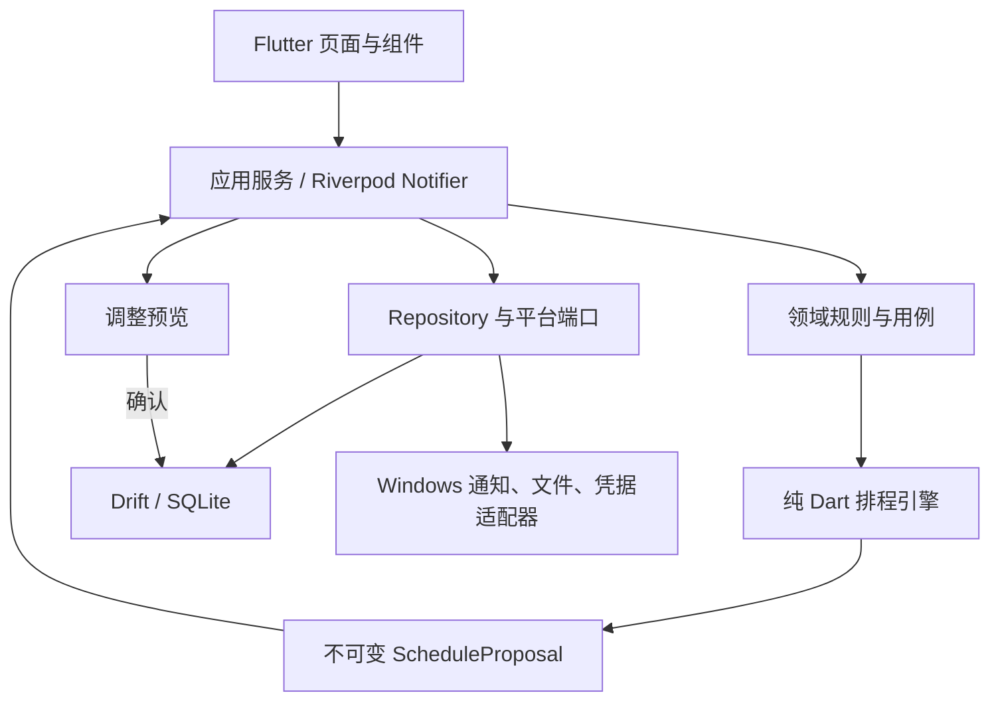

# 个人智能日程规划软件技术设计与实施计划

> **For agentic workers:** REQUIRED SUB-SKILL: Use superpowers:subagent-driven-development (recommended) or superpowers:executing-plans to implement this plan task-by-task. Steps use checkbox (`- [ ]`) syntax for tracking.

**Goal:** 构建一个本地优先、可解释、可恢复的 Windows 智能日程程序，并保留通过同一 Flutter 代码库扩展 Android/iOS 的能力。

**Architecture:** 使用单一 Flutter 应用和按功能划分的模块结构；排程核心是无 Flutter 依赖的纯 Dart 模块，数据库、系统通知和文件系统通过端口接口接入。SQLite/Drift 保存事实数据和版本化计划，任何重新排程先生成不可变提案，确认后才以事务替换当前计划。

**Tech Stack:** Flutter stable（最低 3.38.1，实施时使用并锁定当期 stable）、Dart、Riverpod、go_router、Drift/SQLite、timezone、uuid、flutter_local_notifications、fl_chart、flutter_test、fake_async、integration_test、MSIX。

**Spec:** `docs/superpowers/specs/2026-10-01-personal-intelligent-scheduling-design.md`

## Global Constraints

- 首发平台为 Windows 10/11 x64，产物包含可执行程序和 MSIX 安装包。
- 运行时不要求账号、网络、云端服务或在线 AI。
- 睡眠、用餐、固定休息、固定日程、锁定时间块、连续任务及每日任务上限属于硬约束。
- 默认详细规划未来 7 天，同时评估全部未完成任务的远期截止压力。
- 时间计算使用 5 分钟粒度；持久化瞬时时间使用 UTC 微秒，重复规则保留本地墙上时间和 IANA 时区标识。
- 默认先显示调整预览；只有用户开启“信任自动调整”后才可直接应用可行提案。
- 用户主动设置优先于确认后的学习偏好，学习偏好优先于产品默认值。
- 学习模块只能更新软约束；硬约束只能由用户明确修改或单次放宽。
- 所有核心写入使用事务；计算失败、保存失败或取消操作时保留当前已确认计划。
- `pubspec.lock`、Drift schema 快照和数据库迁移测试必须提交版本控制。
- 面向用户的中文文案保持中性，不因休息、娱乐、延期或中断进行羞辱和惩罚。

## Review Focus

- 夏令时、跨午夜和系统时区改变：固定事项与重复事项必须保持用户预期的本地时间，不产生重复或遗漏时间块；由 Task 5 的边界测试固定。
- 总需求时长大于可用时间：必须返回结构化冲突和缺口分钟数，不能给出违反硬约束的“成功”计划；由 Task 8 的不可行提案测试固定。
- 计算完成前数据再次改变：过期提案必须因输入快照哈希不匹配而拒绝应用；由 Task 9 的并发版本测试固定。
- 计时中崩溃或系统时钟跳变：恢复时要求用户确认真实结束时间，不能直接把异常间隔算作实际投入；由 Task 12 的恢复测试固定。
- 损坏、截断或来自新版本的备份：必须在临时位置验证并拒绝覆盖当前数据库；由 Task 16 的恢复测试固定。

---

## 1. 技术选择

### 1.1 为什么选择 Flutter

Flutter 官方支持从同一代码库构建 Windows、Android 和 iOS 应用，并可生成 Windows 原生桌面产物。该能力直接匹配“Windows 首发、未来手机 App”的产品路线。首版不拆分桌面端和移动端两个前端工程，避免提前承担双技术栈成本。

备选方案及未选择原因：

- Tauri + React + Rust：体积小且桌面能力强，但会引入 TypeScript/Rust 双语言边界，首版排程、数据库和 UI 联调成本更高。
- .NET MAUI：Windows 集成好，但未来移动端与跨平台组件选择更受 .NET 生态约束。
- Electron：开发便利，但对本地单用户工具而言运行体积和内存开销不占优势。

技术依据：

- Flutter 支持平台：https://docs.flutter.dev/reference/supported-platforms
- Flutter 桌面支持与 Windows 构建：https://docs.flutter.dev/platform-integration/desktop
- Flutter Windows 发布方式：https://docs.flutter.dev/platform-integration/windows/building
- Drift 事务：https://drift.simonbinder.eu/dart_api/transactions/
- Drift 迁移与测试：https://drift.simonbinder.eu/migrations/
- Drift 后台 isolate：https://drift.simonbinder.eu/isolates/
- Windows 本地通知限制：https://pub.dev/packages/flutter_local_notifications

### 1.2 依赖策略

- 使用 Flutter stable；项目创建时记录 `flutter --version`，并在升级前通过完整测试和数据库迁移测试。
- 应用项目提交 `pubspec.lock`，确保安装包构建可复现。
- 依赖只解决明确需求；不得为了“以后可能用到”引入网络、遥测、机器学习或云 SDK。
- 排程算法不依赖平台插件，确保可通过 `flutter test` 在内存中快速验证。
- Riverpod 只管理运行时状态和依赖注入；数据库仍是唯一事实来源，不使用实验性离线状态持久化替代 Drift。

## 2. 总体结构



### 2.1 模块边界

| 模块 | 职责 | 禁止依赖 |
| --- | --- | --- |
| `domain` | 实体、值对象、枚举、业务错误和 repository 接口 | Flutter、Drift、平台插件 |
| `scheduling` | 可用时间、压力计算、候选生成、评分、验证、解释和计划 diff | Flutter、Drift、平台插件 |
| `data` | Drift 表、DAO、迁移、repository 实现和事务 | 页面组件 |
| `application` | 用例编排、提案生命周期、计时恢复、备份和通知协调 | 具体页面布局 |
| `features/*` | 页面、组件、表单和 Riverpod 状态 | 直接 SQL、排程内部实现 |
| `platform` | Windows 通知、文件、开机恢复和应用锁适配器 | 业务决策 |

### 2.2 目录结构

```text
personal_planner/
├── pubspec.yaml
├── analysis_options.yaml
├── build.yaml
├── lib/
│   ├── main.dart
│   ├── app/
│   │   ├── planner_app.dart
│   │   ├── router.dart
│   │   └── providers.dart
│   ├── core/
│   │   ├── clock.dart
│   │   ├── ids.dart
│   │   ├── result.dart
│   │   └── time_zone.dart
│   ├── domain/
│   │   ├── models/
│   │   ├── repositories/
│   │   └── services/
│   ├── scheduling/
│   │   ├── schedule_engine.dart
│   │   ├── schedule_problem.dart
│   │   ├── schedule_proposal.dart
│   │   ├── availability_builder.dart
│   │   ├── pressure_calculator.dart
│   │   ├── candidate_generator.dart
│   │   ├── candidate_scorer.dart
│   │   ├── plan_validator.dart
│   │   ├── plan_differ.dart
│   │   └── explanations.dart
│   ├── data/
│   │   ├── database/
│   │   │   ├── app_database.dart
│   │   │   ├── tables/
│   │   │   ├── daos/
│   │   │   └── migrations/
│   │   └── repositories/
│   ├── application/
│   │   ├── planning_service.dart
│   │   ├── plan_application_service.dart
│   │   ├── focus_service.dart
│   │   ├── analytics_service.dart
│   │   ├── preference_service.dart
│   │   └── backup_service.dart
│   ├── platform/
│   │   ├── notifications/
│   │   ├── files/
│   │   └── app_lock/
│   └── features/
│       ├── onboarding/
│       ├── today/
│       ├── tasks/
│       ├── calendar/
│       ├── planning/
│       ├── focus/
│       ├── analytics/
│       └── settings/
├── test/
│   ├── domain/
│   ├── scheduling/
│   ├── data/
│   ├── application/
│   ├── features/
│   └── fixtures/
├── integration_test/
├── drift_schemas/
└── windows/
```

## 3. 核心领域接口

以下接口名和字段名是后续实现的稳定边界。UI、数据库和排程模块不得各自定义一套同义模型。

```dart
typedef EntityId = String;
typedef Minutes = int;

abstract interface class Clock {
  DateTime nowUtc();
}

abstract interface class IdGenerator {
  EntityId next();
}

abstract interface class TaskRepository {
  Stream<List<PlannerTask>> watchOpenTasks();
  Future<PlannerTask?> getById(EntityId id);
  Future<void> save(PlannerTask task);
}

abstract interface class CalendarRepository {
  Future<List<CalendarOccurrence>> occurrencesBetween(
    DateTime startUtc,
    DateTime endUtc,
  );
  Future<void> save(CalendarEvent event);
}

abstract interface class PlanRepository {
  Future<ConfirmedPlan?> current();
  Future<ApplyPlanResult> applyProposal(
    ScheduleProposal proposal,
    String expectedInputHash,
  );
}

abstract interface class ScheduleEngine {
  ScheduleProposal generate(ScheduleProblem problem);
}
```

关键值对象：

- `TimeRange(startUtc, endUtc)`：半开区间 `[start, end)`，结束必须晚于开始。
- `LocalTimeRange(startMinute, endMinute)`：0–1440 分钟；跨午夜规则拆成两个日期片段。
- `PlanningRules`：睡眠、用餐、休息、每日上限、周末规则、生活配额和 5 分钟粒度。
- `TaskConstraints`：允许拆分、最短/最长片段、必须连续、期望时段和脑力强度。
- `InputSnapshot`：任务、日程、设置和当前计划的规范化 JSON 计算 SHA-256，形成 `inputHash`。
- `ScheduleProposal`：只读结果；包含 `blocks`、`unscheduled`、`conflicts`、`explanations`、`inputHash` 和 `algorithmVersion`。

## 4. 数据模型

### 4.1 表结构

| 表 | 关键字段 | 说明 |
| --- | --- | --- |
| `areas` | `id`, `name`, `color`, `sort_order` | 学业、科研、生活等领域，可自定义。 |
| `projects` | `id`, `area_id`, `name`, `archived_at_utc` | 项目归属领域。 |
| `tasks` | `id`, `project_id`, `title`, `notes`, `priority`, `estimated_minutes`, `remaining_minutes`, `due_at_utc`, `energy_level`, `split_mode`, `min_chunk_minutes`, `max_chunk_minutes`, `status`, `created_at_utc`, `updated_at_utc` | 任务事实数据，不直接保存派生日程。 |
| `calendar_events` | `id`, `title`, `start_at_utc`, `end_at_utc`, `time_zone_id`, `recurrence_rule_id`, `exception_of_id`, `locked`, `area_id`, `updated_at_utc` | 一次性事件和重复事件实例例外。 |
| `recurrence_rules` | `id`, `weekdays_mask`, `local_start_minute`, `duration_minutes`, `valid_from_local_date`, `valid_until_local_date`, `time_zone_id` | 首版只实现按周重复。 |
| `energy_windows` | `id`, `day_kind`, `start_minute`, `end_minute`, `energy_level`, `source` | 工作日、周末或指定日期精力段。 |
| `settings` | `key`, `json_value`, `updated_at_utc` | 带 schema 的设置值；不保存无法验证的任意对象。 |
| `plan_versions` | `id`, `created_at_utc`, `input_hash`, `algorithm_version`, `status`, `summary_json` | 已确认、已被替代和已撤销的持久化计划版本；未确认提案只保存在内存。 |
| `schedule_blocks` | `id`, `plan_version_id`, `task_id`, `start_at_utc`, `end_at_utc`, `locked`, `explanation_code` | 每个计划版本的任务块。 |
| `time_entries` | `id`, `task_id`, `started_at_utc`, `ended_at_utc`, `paused_minutes`, `source`, `recovery_state` | 实际投入；未确认恢复记录不计入统计。 |
| `preference_evidence` | `id`, `kind`, `subject_key`, `observed_at_utc`, `numeric_value`, `special_day`, `metadata_json` | 原始偏好证据，可追溯。 |
| `preference_rules` | `id`, `kind`, `subject_key`, `value_json`, `confidence`, `status`, `source`, `updated_at_utc` | 建议、已确认、自动采用、停用状态。 |
| `change_log` | `id`, `entity_type`, `entity_id`, `operation`, `changed_at_utc`, `revision` | 为撤销、诊断和未来同步保留最小变更历史。 |

### 4.2 数据约束

- 所有实体 ID 使用 UUID v4 字符串；未来同步不依赖数据库自增 ID。
- `estimated_minutes`、`remaining_minutes` 和片段长度必须是正整数，且按 5 分钟向上取整用于排程；原始输入仍保留。
- `due_at_utc` 可为空；没有截止日期的任务由优先级、生活配额和用户期望时段参与排序。
- `schedule_blocks` 必须引用存在的 `plan_versions` 和 `tasks`，外键在每次连接打开时启用。
- 删除任务默认采用状态转换而非物理删除；永久清除数据除外。
- 日期实例使用 UTC；重复规则使用本地日期、墙上时间和时区 ID，展开后生成 UTC occurrence。
- Drift schema 每次变化都提高 `schemaVersion`、导出 schema 快照并运行生成的迁移测试。

## 5. 排程引擎设计

### 5.1 输入与输出

```dart
final class ScheduleProblem {
  final DateTime planningStartUtc;
  final DateTime planningEndUtc;
  final String timeZoneId;
  final List<SchedulableTask> tasks;
  final List<BusyInterval> fixedIntervals;
  final List<BusyInterval> protectedIntervals;
  final List<PlannedBlock> lockedBlocks;
  final PlanningRules rules;
  final PreferenceProfile preferences;
  final String inputHash;
}

final class ScheduleProposal {
  final String proposalId;
  final String inputHash;
  final String algorithmVersion;
  final List<PlannedBlock> blocks;
  final List<UnscheduledTask> unscheduled;
  final List<PlanningConflict> conflicts;
  final List<PlanExplanation> explanations;
  final ProposalMetrics metrics;
}
```

`ScheduleEngine.generate` 是纯函数：不读数据库、不调用当前时间、不产生随机结果。当前时间和 ID 在应用层注入，候选排序的最终平局依次使用开始时间、任务 ID 和候选 ID，保证可复现。

### 5.2 处理管线

1. **规范化**：校验输入，按 5 分钟粒度标准化可调度时长，合并重叠的忙碌区间。
2. **构造可用时间**：从 7 个本地日中扣除固定事件、保护时间和锁定时间块，再按每日上限裁剪。
3. **远期压力**：对全部开放任务估算截止日前容量；计算“七日内必须完成量”和“均匀推进量”。
4. **任务排序**：先按不可行风险和有效松弛时间，再按用户优先级、可用候选数量和稳定 ID 排序。
5. **候选生成**：按任务拆分规则，在可用区间中以 5 分钟步长生成候选时间块。
6. **候选评分**：对精力匹配、期望时段、连续性、生活配额、切换成本、碎片化和移动成本计分。
7. **初始分配**：选择最高分且不破坏硬约束的候选。
8. **局部改进**：限定次数地尝试交换或移动两个可移动块，只接受总分提高且仍通过验证的结果。
9. **最终验证**：重新验证重叠、硬约束、片段总量、每日上限和生活配额。
10. **差异与解释**：与当前计划比较，生成新增、移动、拆分、删除、逾期和冲突说明。

### 5.3 远期压力

对截止日期在规划窗口之外的任务：

- `requiredNow = max(0, remaining - estimatedCapacityAfterHorizonBeforeDue)`；
- `pacedNow = ceil(remaining * horizonCapacity / estimatedCapacityUntilDue)`；
- 七日目标为 `max(requiredNow, pacedNow)`，但不得超过任务剩余时长。

未来容量根据已知重复日程、长期保护规则、工作日/周末上限估算；一次性未来固定事项存在时必须扣除。截止日期超过 180 天时，以未来 180 天容量和周均推进量估算，避免无界展开重复日程。

### 5.4 评分

评分全部使用整数，初始权重集中定义在 `SchedulingWeights.v1`：

| 因素 | 分值范围 |
| --- | --- |
| 截止与负松弛风险 | 0 至 +3000 |
| 用户优先级 | 0 至 +1500 |
| 远期均匀推进 | 0 至 +500 |
| 精力匹配 | -800 至 +800 |
| 用户期望时段 | -300 至 +500 |
| 生活娱乐配额缺口 | 0 至 +1000 |
| 同任务连续性 | 0 至 +400 |
| 类别切换 | 0 至 -300 |
| 过度碎片化 | 0 至 -600 |
| 移动已确认但未锁定的时间块 | 0 至 -700 |

分值只决定软约束候选之间的优先顺序。任何高分都不能突破硬约束。每个解释使用稳定的 `explanationCode` 和参数生成中文文案，不把不可测试的自由文本写入引擎。

### 5.5 冲突模型

```dart
enum ConflictCode {
  insufficientCapacity,
  fixedEventOverlap,
  protectedTimeOverlap,
  continuousBlockUnavailable,
  dailyLimitExceeded,
  minimumSleepConflict,
  staleProposal,
  invalidInput,
}

final class PlanningConflict {
  final ConflictCode code;
  final EntityId? taskId;
  final Minutes shortageMinutes;
  final List<EntityId> relatedEntityIds;
  final Map<String, Object?> details;
}
```

不可行计划仍返回 `ScheduleProposal`，但 `metrics.isFullyFeasible` 为 `false`，并为每个未安排任务提供缺口分钟数和可选处理动作。引擎绝不自行修改原始截止时间、预计时长或硬约束。

## 6. 提案、确认与并发一致性

```mermaid
sequenceDiagram
    participant UI as 调整预览
    participant PS as PlanningService
    participant E as ScheduleEngine
    participant DB as Drift
    UI->>PS: createProposal()
    PS->>DB: load snapshot
    PS->>E: generate(problem + inputHash)
    E-->>PS: immutable proposal
    PS-->>UI: diff + explanations
    UI->>PS: apply(proposalId)
    PS->>DB: recompute current inputHash
    alt hash matches
      DB->>DB: transaction: version + blocks + log
      DB-->>UI: applied
    else stale
      DB-->>UI: staleProposal; request recalculation
    end
```

- 提案在应用前不替换当前计划。
- 用户编辑任何排程输入后，旧提案仍可查看，但不能应用。
- 开启自动调整时也必须执行哈希检查、完整验证和事务写入。
- 每次成功应用创建新的 `plan_versions` 记录；保留上一已确认版本用于撤销。
- 计划版本只保存必要快照摘要和块，不复制任务全文。

## 7. 偏好学习设计

首版不训练黑盒模型，使用可解释的统计规则：

- 完成一次专注，记录任务领域、脑力强度、计划/实际时段、计划/实际长度、完成状态和是否特殊日。
- 手动移动任务，记录原时段、新时段和移动方向。
- 接受、修改或拒绝提案，记录解释代码和用户动作。
- 特殊日、生病、考试周和明确标记的异常记录不参与长期偏好计算。

生成建议的最低门槛：相关领域至少 20 个有效完成记录，覆盖至少 14 个活跃日期；或同一种手动调整在非特殊日出现至少 5 次。时段效果差异低于 15% 时不生成“更适合”结论。

```dart
abstract interface class PreferenceAnalyzer {
  List<PreferenceSuggestion> analyze(
    List<PreferenceEvidence> evidence,
    PreferenceProfile current,
  );
}
```

建议包含证据数量、观察时间范围、效果差异、建议值和预计影响。默认状态是 `suggested`；用户确认后变为 `confirmed`。开启自动采用时只能把达到同一门槛的软偏好变为 `autoApplied`，并写入变更历史以便撤销。

## 8. 统计设计

统计数据直接来自任务、计划块和已确认实际时间记录：

- 计划时长：所选范围内已确认计划块与范围的交集分钟数。
- 实际时长：所选范围内已确认 `time_entries` 的有效分钟数。
- 完成率：范围内到期或完成任务中已完成数量占比；界面必须显示分母。
- 按期完成率：完成时间不晚于截止时间的已完成任务占比。
- 预估偏差：`(实际 - 预计) / 预计`，预计为零或数据缺失时不计算。
- 生活配额：生活娱乐实际或计划分钟数与目标分钟数分别展示，不互相冒充。

首版使用 Drift 聚合查询按需计算，不提前建立复杂数据仓库。只有性能测试证明跨一年查询不能满足交互要求时，才增加可重建的日汇总缓存。

## 9. 计时、恢复与系统时间

- 计时开始后立即保存 `startedAtUtc` 和 `recoveryState=running`。
- 暂停和继续都持久化累计暂停分钟及最后状态时间。
- 正常结束写入 `endedAtUtc` 和 `recoveryState=confirmed`。
- 程序启动发现 `running` 记录时，不自动把整个离线间隔计入实际时间；显示恢复对话框让用户确认结束时间或丢弃异常部分。
- `Clock` 同时提供 UTC 墙上时间和单调计时来源；单次运行中的持续时长优先使用单调时钟，落库时再转换为 UTC 边界。
- 检测到系统时间向前或向后跳变超过 5 分钟时暂停自动结束计算并要求确认。

## 10. 通知设计

- 只预排未来 7 天的一次性 Windows 通知，不使用 Windows 不支持的重复通知接口。
- 每次计划确认后，比较通知计划并重新安排受影响的一次性通知。
- MSIX 作为正式安装方式，以获得 Windows 包身份和可靠的通知取消/查询能力。
- 通知 payload 只包含实体 ID 和动作，不包含任务备注等敏感内容。
- 睡眠免打扰期间推迟普通通知；固定事件冲突等需要用户处理的提醒在下次允许时段汇总显示。

## 11. 备份、恢复与应用锁

### 11.1 备份

备份格式为带版本的 ZIP：

```text
backup.zip
├── manifest.json
├── planner.sqlite
└── exports/settings.json
```

`manifest.json` 包含格式版本、数据库 schema 版本、应用版本、创建时间、文件长度和 SHA-256。创建备份前执行 WAL checkpoint，并在禁止写入的短事务窗口中生成一致快照。

### 11.2 恢复

恢复流程先解压到应用专用临时目录，验证路径安全、manifest、哈希、SQLite integrity check 和 schema 兼容性。验证通过后关闭数据库，把当前数据库移动为可恢复副本，再原子替换并重新打开。任何一步失败都恢复原数据库。

### 11.3 应用锁

首版应用锁只阻止通过正常 UI 打开程序，不宣称数据库加密。密码使用 `PBKDF2-HMAC-SHA256` 保存验证值，每次安装生成独立随机盐，迭代次数固定为 600,000；数据库中不保存明文密码。连续失败采用递增等待，不提供不可恢复的数据加密承诺。

## 12. UI 与状态管理

- 每个 feature 对外暴露一个页面入口和少量 provider；页面不直接访问 DAO。
- 表单状态与持久化状态分开，取消编辑不会污染数据库。
- 长时排程在独立 Dart isolate 中运行，提供取消 token；取消不保存半成品。
- 所有页面覆盖 loading、empty、content、recoverable error 四种状态。
- 周视图使用虚拟化或裁剪绘制，固定日程、保护时间、任务块和生活时间使用不同纹理或图标，不能只依赖颜色区分。
- 调整预览按“新增、移动、拆分、移除、冲突”分组，可展开查看原因；确认按钮在提案过期后禁用。

主要路由：

```text
/onboarding
/today
/tasks
/tasks/:id
/calendar
/planning/preview/:proposalId
/focus/:taskId
/analytics
/settings
/settings/preferences
/settings/data
```

## 13. 分阶段实施

由于完整需求包含多个可独立验收的子系统，实施分为三个发布增量：

1. **基础排程版**：Task 1–10。交付任务、固定日程、规则设置、七日排程、预览确认、今日页和周视图。
2. **可靠执行版**：Task 11–16。交付特殊日、恢复保护、计时、通知、备份、导出和应用锁。
3. **洞察个性化版**：Task 17–20。交付统计、正向反馈、偏好学习、完整验收和 Windows 发布包。

每个增量都必须能独立运行和测试；不得等到第三阶段才验证排程正确性或数据恢复。Task 10A 属于基础排程版。

---

### Task 1: 创建可运行的 Windows Flutter 外壳

**Files:**
- Create: `pubspec.yaml`
- Create: `analysis_options.yaml`
- Create: `lib/main.dart`
- Create: `lib/app/planner_app.dart`
- Create: `lib/app/router.dart`
- Create: `test/app/app_smoke_test.dart`
- Modify: `windows/runner/Runner.rc`
- Modify: `windows/CMakeLists.txt`

**Interfaces:**
- Consumes: 无。
- Produces: `PlannerApp`、根 `ProviderScope`、稳定路由和显示名“智能日程”。

- [ ] **Step 1: 初始化 Git 和 Flutter Windows 项目**

Run: `git init`，然后 `flutter create --platforms=windows --org app.personalplanner --project-name personal_planner .`

Expected: `flutter doctor -v` 的 Windows toolchain 无阻塞错误，`flutter run -d windows` 可启动默认窗口。

- [ ] **Step 2: 添加并锁定首阶段依赖**

添加 `flutter_riverpod`、`go_router`、`drift`、`drift_flutter`、`uuid`、`timezone`、`intl`，以及开发依赖 `drift_dev`、`build_runner`、`flutter_lints`；提交 `pubspec.lock`。SQLite 原生运行库由 `drift_flutter` 的当前推荐配置提供，不重复引入旧式平台依赖。

- [ ] **Step 3: 写失败的应用冒烟测试**

`app_smoke_test.dart` 中验证启动后显示“今日”，并能通过路由进入“任务”和“日历”。

Run: `flutter test test/app/app_smoke_test.dart`

Expected: FAIL，因为 `PlannerApp` 和路由尚未实现。

- [ ] **Step 4: 实现最小应用外壳和骨架页面**

实现 `PlannerApp` 与路由；将 Windows 标题、二进制名和资源显示名改为“智能日程”/`personal_planner`。

- [ ] **Step 5: 验证外壳**

Run: `flutter analyze`，`flutter test test/app/app_smoke_test.dart`，`flutter build windows --debug`

Expected: 无分析错误、测试 PASS、生成 Windows debug 可执行程序。

- [ ] **Step 6: Commit**

```bash
git add .
git commit -m "build: scaffold Windows planner app"
```

### Task 2: 领域模型、默认值与输入校验

**Files:**
- Create: `lib/core/clock.dart`
- Create: `lib/core/ids.dart`
- Create: `lib/core/result.dart`
- Create: `lib/domain/models/task.dart`
- Create: `lib/domain/models/calendar_event.dart`
- Create: `lib/domain/models/planning_rules.dart`
- Create: `lib/domain/models/time_range.dart`
- Create: `lib/domain/models/preferences.dart`
- Create: `lib/domain/services/default_settings.dart`
- Test: `test/domain/default_settings_test.dart`
- Test: `test/domain/time_range_test.dart`
- Test: `test/domain/task_validation_test.dart`

**Interfaces:**
- Consumes: Dart SDK。
- Produces: `PlannerTask`、`CalendarEvent`、`PlanningRules`、`TimeRange`、`PreferenceProfile`、`DefaultSettings.v1()`、`Clock`、`IdGenerator`。

- [ ] **Step 1: 写默认值和优先级失败测试**

断言 `DefaultSettings.v1()` 包含高精力 09:00–12:00、中精力 14:00–17:00、低精力 19:00–22:00、睡眠 23:30–07:30、最低睡眠 420 分钟、默认片段 50 分钟、休息 10 分钟、每日可移动任务上限 360 分钟、生活配额 360 分钟，且临时例外 > 用户设置 > 已确认偏好 > 产品默认。

Run: `flutter test test/domain/default_settings_test.dart`

Expected: FAIL，因为模型不存在。

- [ ] **Step 2: 写时间和值校验失败测试**

覆盖半开区间、零/负时长拒绝、跨午夜本地范围拆分、任务排程时长向上取整到 5 分钟但保留原始分钟数。

- [ ] **Step 3: 实现领域模型和默认值**

使用不可变 Dart 类和显式 `copyWith`；业务模型不得导入 `package:flutter` 或 Drift。

- [ ] **Step 4: 验证领域层**

Run: `flutter test test/domain`

Expected: 全部 PASS。

- [ ] **Step 5: Commit**

```bash
git add lib/core lib/domain test/domain
git commit -m "feat: define planner domain and defaults"
```

### Task 3: Drift 数据库、DAO 与迁移基线

**Files:**
- Create: `build.yaml`
- Create: `lib/data/database/app_database.dart`
- Create: `lib/data/database/tables/*.dart`
- Create: `lib/data/database/daos/*.dart`
- Create: `lib/domain/repositories/*.dart`
- Create: `lib/data/repositories/*.dart`
- Create: `drift_schemas/`
- Test: `test/data/database_schema_test.dart`
- Test: `test/data/repository_round_trip_test.dart`

**Interfaces:**
- Consumes: Task 2 的领域模型。
- Produces: `AppDatabase.openDefault()`、`AppDatabase.forTesting(QueryExecutor)` 和 `TaskRepository`、`CalendarRepository`、`PlanRepository` 的 Drift 实现。

- [ ] **Step 1: 写内存数据库失败测试**

验证 13 张核心表存在、外键启用、任务 round-trip 不丢字段、删除项目时不能留下悬空任务。

- [ ] **Step 2: 定义 Drift 表和 DAO**

按第 4 节表结构实现；所有 UTC 时间显式保存为 `int` 微秒，重复规则墙上时间保存为分钟整数。

- [ ] **Step 3: 实现 repository 映射**

DAO row 不得越过 data 层；repository 返回 Task 2 的领域模型。

- [ ] **Step 4: 生成代码和 schema 基线**

Run: `dart run build_runner build --delete-conflicting-outputs`，`dart run drift_dev make-migrations`

Expected: 生成代码、schema v1 快照和迁移测试文件。

- [ ] **Step 5: 验证事务和迁移基线**

Run: `flutter test test/data`

Expected: 全部 PASS，`PRAGMA foreign_key_check` 无结果。

- [ ] **Step 6: Commit**

```bash
git add build.yaml lib/data lib/domain/repositories test/data drift_schemas
git commit -m "feat: add local planner database"
```

### Task 4: 任务、项目和固定日程 CRUD

**Files:**
- Create: `lib/application/task_service.dart`
- Create: `lib/application/calendar_service.dart`
- Create: `lib/features/tasks/*`
- Create: `lib/features/calendar/event_editor/*`
- Test: `test/application/task_service_test.dart`
- Test: `test/features/tasks/quick_add_test.dart`
- Test: `test/features/calendar/event_editor_test.dart`

**Interfaces:**
- Consumes: `TaskRepository`、`CalendarRepository`、`Clock`、`IdGenerator`。
- Produces: `TaskService.quickAdd(title, estimatedMinutes)`、`TaskService.saveDraft(TaskDraft)`、`CalendarService.save(EventDraft)`。

- [ ] **Step 1: 写快速录入失败测试**

验证只填写标题和预计时长即可创建收集箱任务，空标题和非正时长显示字段错误而不写数据库。

- [ ] **Step 2: 实现应用服务**

应用服务负责校验、默认值、ID 和时间戳；Notifier 只转换 UI 事件。

- [ ] **Step 3: 实现任务列表、详情和固定日程表单**

覆盖领域与项目维护、搜索、筛选、批量调整、状态变更、一次性事件以及“修改单次/修改系列”入口。

- [ ] **Step 4: 验证 CRUD 与键盘操作**

Run: `flutter test test/application/task_service_test.dart test/features/tasks test/features/calendar`

Expected: 全部 PASS；快速录入可只用键盘完成。

- [ ] **Step 5: Commit**

```bash
git add lib/application lib/features/tasks lib/features/calendar test/application test/features
git commit -m "feat: add task and calendar editing"
```

### Task 5: 重复日程与可用时间构造

**Files:**
- Create: `lib/core/time_zone.dart`
- Create: `lib/domain/services/recurrence_expander.dart`
- Create: `lib/scheduling/availability_builder.dart`
- Test: `test/domain/recurrence_expander_test.dart`
- Test: `test/scheduling/availability_builder_test.dart`

**Interfaces:**
- Consumes: `RecurrenceRule`、`CalendarEvent`、`PlanningRules`、`TimeRange`。
- Produces: `RecurrenceExpander.expand(rule, window, exceptions)`、`AvailabilityInput` 和 `AvailabilityBuilder.build(input) -> List<AvailabilitySlot>`。

- [ ] **Step 1: 写重复展开失败测试**

覆盖按周重复、修改单次、删除单次、有效起止日期、跨午夜以及夏令时跳变；本地 09:00 的重复事项在时区变化后仍保持本地 09:00。

- [ ] **Step 2: 实现重复规则展开**

使用 `timezone` 的 IANA location 做本地日期到 UTC 的转换；不得用固定 UTC offset 模拟时区。

- [ ] **Step 3: 写可用时间失败测试**

输入睡眠、午餐、课程、锁定块和每日 360 分钟上限，断言输出无重叠、均落在允许窗口、总可移动容量正确。

- [ ] **Step 4: 实现区间合并和可用时间构造**

所有区间采用 `[start, end)`；先合并忙碌区间，再求补集，最后应用每日上限。

- [ ] **Step 5: 验证边界**

Run: `flutter test test/domain/recurrence_expander_test.dart test/scheduling/availability_builder_test.dart`

Expected: 全部 PASS，包含 Review Focus 的时区、跨午夜测试。

- [ ] **Step 6: Commit**

```bash
git add lib/core/time_zone.dart lib/domain/services lib/scheduling test/domain test/scheduling
git commit -m "feat: build recurring availability windows"
```

### Task 6: 排程输入、输出和最终验证器

**Files:**
- Create: `lib/scheduling/schedule_problem.dart`
- Create: `lib/scheduling/schedule_proposal.dart`
- Create: `lib/scheduling/plan_validator.dart`
- Create: `lib/scheduling/explanations.dart`
- Test: `test/scheduling/plan_validator_test.dart`

**Interfaces:**
- Consumes: Task 2 和 Task 5 的值对象。
- Produces: `ScheduleProblem`、`ScheduleProposal`、`PlanningConflict`、`PlanValidator.validate(problem, blocks)`。

- [ ] **Step 1: 写硬约束验证失败测试**

分别构造固定日程重叠、保护时间重叠、锁定块移动、连续任务拆分、每日上限超出和片段总量超出，断言返回稳定 `ConflictCode`。

- [ ] **Step 2: 实现不可变输入输出模型**

为所有列表做不可变封装；`ScheduleProposal` 显式包含 `inputHash` 和 `algorithmVersion`。

- [ ] **Step 3: 实现最终验证器和解释代码映射**

验证器不修复结果，只报告冲突；中文解释由代码和参数在 UI 层格式化。

- [ ] **Step 4: 验证模型和约束**

Run: `flutter test test/scheduling/plan_validator_test.dart`

Expected: 全部 PASS。

- [ ] **Step 5: Commit**

```bash
git add lib/scheduling test/scheduling/plan_validator_test.dart
git commit -m "feat: define schedule proposal contract"
```

### Task 7: 远期压力、候选生成与评分

**Files:**
- Create: `lib/scheduling/pressure_calculator.dart`
- Create: `lib/scheduling/candidate_generator.dart`
- Create: `lib/scheduling/candidate_scorer.dart`
- Create: `lib/scheduling/scheduling_weights.dart`
- Test: `test/scheduling/pressure_calculator_test.dart`
- Test: `test/scheduling/candidate_generator_test.dart`
- Test: `test/scheduling/candidate_scorer_test.dart`

**Interfaces:**
- Consumes: `ScheduleProblem`、`AvailabilitySlot`。
- Produces: `PressureCalculator.calculate(task, capacityModel)`、`CandidateGenerator.generate(task, slots)`、`CandidateScorer.score(candidate, context)`。

- [ ] **Step 1: 写远期压力失败测试**

验证 6 小时任务在 21 天后截止时会在七日内获得均匀推进量；未来容量不足时提高七日必须完成量；无截止任务不虚构截止压力。

- [ ] **Step 2: 实现容量估算和压力公式**

按第 5.3 节公式实现，重复日程最多展开 180 天。

- [ ] **Step 3: 写候选和评分失败测试**

验证 6 小时可拆分任务生成 30–90 分钟片段，高脑力任务优先高精力时段，生活配额缺口提高娱乐任务得分，但任何评分不绕过硬约束。

- [ ] **Step 4: 实现候选与 `SchedulingWeights.v1`**

候选以 5 分钟步长生成；所有分数为整数并返回逐因素明细。

- [ ] **Step 5: 验证算法组件**

Run: `flutter test test/scheduling/pressure_calculator_test.dart test/scheduling/candidate_generator_test.dart test/scheduling/candidate_scorer_test.dart`

Expected: 全部 PASS。

- [ ] **Step 6: Commit**

```bash
git add lib/scheduling test/scheduling
git commit -m "feat: score schedule candidates"
```

### Task 8: 确定性排程引擎与不可行报告

**Files:**
- Create: `lib/scheduling/schedule_engine.dart`
- Create: `lib/scheduling/plan_differ.dart`
- Test: `test/scheduling/schedule_engine_test.dart`
- Test: `test/scheduling/infeasible_schedule_test.dart`
- Create: `test/fixtures/scheduling/*.json`

**Interfaces:**
- Consumes: Tasks 5–7 的构件。
- Produces: `DeterministicScheduleEngine implements ScheduleEngine`、`PlanDiffer.diff(current, proposed)`。

- [ ] **Step 1: 写黄金场景失败测试**

用固定 JSON fixture 覆盖课程、科研、娱乐配额、6 小时拆分任务和连续任务；断言时间块、顺序、解释代码和 `algorithmVersion='1'`。

- [ ] **Step 2: 写不可行与确定性失败测试**

断言总需求大于容量时不违反睡眠且报告精确缺口分钟；相同输入连续运行 100 次输出相同；输入列表顺序变化不改变结果。

- [ ] **Step 3: 实现贪心分配和有界局部改进**

局部改进使用确定性的 200 次操作预算，并按稳定候选顺序尝试交换或移动。不得以墙上运行时间作为停止条件，否则同一输入可能在不同机器上产生不同结果。

- [ ] **Step 4: 每次改进后调用验证器**

最终结果只在 `PlanValidator` 无硬冲突时标记完全可行；否则保留可行部分并生成冲突。

- [ ] **Step 5: 验证引擎**

Run: `flutter test test/scheduling`

Expected: 全部 PASS，包含 Review Focus 的容量不足场景。

- [ ] **Step 6: Commit**

```bash
git add lib/scheduling test/scheduling test/fixtures
git commit -m "feat: generate deterministic weekly plans"
```

### Task 9: 排程服务、快照哈希与原子应用

**Files:**
- Create: `lib/application/planning_service.dart`
- Create: `lib/application/plan_application_service.dart`
- Create: `lib/application/input_snapshot_builder.dart`
- Test: `test/application/planning_service_test.dart`
- Test: `test/application/plan_application_service_test.dart`

**Interfaces:**
- Consumes: repositories、`ScheduleEngine`、`Clock`。
- Produces: `PlanningService.createProposal()`、`PlanApplicationService.apply(proposal)`、`InputSnapshotBuilder.hash(snapshot)`。

- [ ] **Step 1: 写快照和过期提案失败测试**

生成提案后修改任务，断言 `apply` 返回 `staleProposal` 且当前计划未改变；只改变无关 UI 状态不应改变哈希。

- [ ] **Step 2: 实现规范化快照和 SHA-256**

JSON key 和列表按稳定规则排序；哈希只包含会影响排程的事实数据与设置。此任务加入 `crypto` 依赖并提交更新后的 `pubspec.lock`。

- [ ] **Step 3: 写事务回滚失败测试**

模拟写入第三个时间块失败，断言计划版本、时间块和 change log 全部回滚。

- [ ] **Step 4: 实现提案创建和原子应用**

排程在独立 isolate 中运行；确认前仅内存保存提案，应用时重新计算哈希并再次运行验证器。

- [ ] **Step 5: 验证服务**

Run: `flutter test test/application/planning_service_test.dart test/application/plan_application_service_test.dart`

Expected: 全部 PASS，包含 Review Focus 的过期提案测试。

- [ ] **Step 6: Commit**

```bash
git add lib/application test/application
git commit -m "feat: preview and atomically apply plans"
```

### Task 10: 七日周视图、今日页和调整预览

**Files:**
- Create: `lib/features/calendar/week_view/*`
- Create: `lib/features/today/*`
- Create: `lib/features/planning/*`
- Modify: `lib/app/router.dart`
- Test: `test/features/calendar/week_view_test.dart`
- Test: `test/features/today/today_page_test.dart`
- Test: `test/features/planning/plan_preview_test.dart`

**Interfaces:**
- Consumes: Task 9 应用服务及 repository watch streams。
- Produces: 可操作的 `/today`、`/calendar`、`/planning/preview/:proposalId` 页面。

- [ ] **Step 1: 写页面状态失败测试**

分别覆盖 loading、empty、content、recoverable error；周视图不只通过颜色区分类别。

- [ ] **Step 2: 实现今日页和周视图**

显示固定日程、保护时间、任务块和生活时间；拖动任务后调用应用服务创建新提案，而不是直接改数据库。

- [ ] **Step 3: 写调整预览失败测试**

验证新增、移动、拆分、移除和冲突分组；每项可展开原因；过期提案禁用确认按钮。

- [ ] **Step 4: 实现预览确认和自动调整设置**

自动调整默认关闭；开启后仍保存 diff 和解释历史。

- [ ] **Step 5: 验证基础排程版**

Run: `flutter analyze`，`flutter test`，`flutter build windows --debug`

Expected: 全部通过，可从录入任务走通到确认七日计划。

- [ ] **Step 6: Commit**

```bash
git add lib/features lib/app/router.dart test/features
git commit -m "feat: deliver weekly planning workflow"
```

### Task 10A: 规划规则与默认值设置页面

**Files:**
- Create: `lib/application/settings_service.dart`
- Create: `lib/features/settings/planning_rules/*`
- Create: `lib/features/settings/notifications/*`
- Modify: `lib/app/router.dart`
- Test: `test/application/settings_service_test.dart`
- Test: `test/features/settings/planning_rules_page_test.dart`

**Interfaces:**
- Consumes: `PlanningRules`、`DefaultSettings.v1()`、settings repository。
- Produces: `SettingsService.resolveForDate(localDate)`、`saveUserRules(rules)`、`saveDateOverride(date, override)`、完整规划规则设置页面。

- [ ] **Step 1: 写规则优先级失败测试**

断言指定日期例外 > 用户长期设置 > 已确认学习偏好 > 产品默认值；未标记精力时段返回中性权重而不是低精力。

- [ ] **Step 2: 写硬约束修改失败测试**

验证最低睡眠、用餐、每日上限和生活配额只有明确保存用户表单时才改变；偏好学习写入不能修改这些字段。

- [ ] **Step 3: 实现设置服务和页面**

页面覆盖工作日/周末睡眠、用餐、休息、多个精力区间、默认专注片段、拆分片段范围、每日任务上限、生活娱乐配额、通知提前量、免打扰和自动调整开关。

- [ ] **Step 4: 写并实现输入校验**

拒绝重叠且级别冲突的精力区间、负时长、零长度区间和超过 24 小时的单日上限；保存前显示字段级错误。

- [ ] **Step 5: 验证设置流程**

Run: `flutter test test/application/settings_service_test.dart test/features/settings/planning_rules_page_test.dart`

Expected: 全部 PASS；重新启动内存测试容器后用户设置仍优先于默认值。

- [ ] **Step 6: Commit**

```bash
git add lib/application/settings_service.dart lib/features/settings lib/app/router.dart test/application test/features/settings
git commit -m "feat: configure planning rules and defaults"
```

### Task 11: 特殊日与次日恢复保护

**Files:**
- Create: `lib/application/recovery_planning_service.dart`
- Create: `lib/features/calendar/special_day/*`
- Test: `test/application/recovery_planning_service_test.dart`
- Test: `test/features/calendar/special_day_test.dart`

**Interfaces:**
- Consumes: `PlanningRules`、固定事件、`PlanningService`。
- Produces: `RecoveryPlanningService.createOverride(SpecialDayDraft)` 和次日最早可安排时间计算。

- [ ] **Step 1: 写晚归恢复失败测试**

活动延长到 01:00、最低睡眠 420 分钟时，断言次日 08:00 前不可安排；若 07:30 有早课，返回 `minimumSleepConflict` 而非移动早课。

- [ ] **Step 2: 实现单日覆盖和恢复服务**

特殊日只写日期范围例外，不修改常规睡眠和学习偏好。

- [ ] **Step 3: 实现特殊日 UI 和处理选项**

提供取消可移动任务、安排补觉、单次接受较短睡眠，并展示每项影响。

- [ ] **Step 4: 验证恢复流程**

Run: `flutter test test/application/recovery_planning_service_test.dart test/features/calendar/special_day_test.dart`

Expected: 全部 PASS。

- [ ] **Step 5: Commit**

```bash
git add lib/application lib/features/calendar/special_day test
git commit -m "feat: protect recovery after late events"
```

### Task 12: 专注计时与崩溃恢复

**Files:**
- Create: `lib/application/focus_service.dart`
- Create: `lib/platform/monotonic_clock.dart`
- Create: `lib/features/focus/*`
- Test: `test/application/focus_service_test.dart`
- Test: `test/features/focus/recovery_dialog_test.dart`

**Interfaces:**
- Consumes: `Clock`、单调时钟、time entry DAO。
- Produces: `FocusService.start(taskId)`、`pause()`、`resume()`、`finish()`、`recoverOpenEntry()`。

本任务加入开发依赖 `fake_async` 并提交更新后的 `pubspec.lock`。

- [ ] **Step 1: 用 `fake_async` 写状态机失败测试**

覆盖运行、暂停、继续、完成、重复点击幂等和非法转换。

- [ ] **Step 2: 写崩溃与时钟跳变失败测试**

断言重启发现 running 记录时要求确认；墙上时间跳变超过 5 分钟不直接计入实际时长。

- [ ] **Step 3: 实现持久化状态机**

每次状态转换先落库再更新 UI；统计只读取 `confirmed` 记录。

- [ ] **Step 4: 实现专注页和恢复对话框**

用户可修正结束时间、实际时长和完成备注。

- [ ] **Step 5: 验证计时**

Run: `flutter test test/application/focus_service_test.dart test/features/focus`

Expected: 全部 PASS，包含 Review Focus 的崩溃恢复测试。

- [ ] **Step 6: Commit**

```bash
git add lib/application/focus_service.dart lib/platform lib/features/focus test
git commit -m "feat: record recoverable focus sessions"
```

### Task 13: 重新排程触发和撤销

**Files:**
- Create: `lib/application/replanning_coordinator.dart`
- Create: `lib/application/plan_undo_service.dart`
- Test: `test/application/replanning_coordinator_test.dart`
- Test: `test/application/plan_undo_service_test.dart`

**Interfaces:**
- Consumes: task/calendar/focus changes、`PlanningService`、`PlanRepository`。
- Produces: `ReplanningCoordinator.onDomainChange(change)`、`PlanUndoService.undoLastAppliedPlan()`。

- [ ] **Step 1: 写触发矩阵失败测试**

新增、修改、完成、跳过、延期任务和新增固定事件应触发；纯备注修改不触发；短时间连续变化合并为一次请求。

- [ ] **Step 2: 实现 500 毫秒去抖和取消旧计算**

新输入到达时取消仍在运行的旧提案；已完成的旧提案因哈希不匹配不可应用。

- [ ] **Step 3: 写撤销失败测试**

应用计划 B 后撤销，恢复计划 A 的块并创建新的审计记录，不删除历史版本。

- [ ] **Step 4: 实现协调器与撤销服务**

- [ ] **Step 5: 验证重排生命周期**

Run: `flutter test test/application/replanning_coordinator_test.dart test/application/plan_undo_service_test.dart`

Expected: 全部 PASS。

- [ ] **Step 6: Commit**

```bash
git add lib/application test/application
git commit -m "feat: coordinate and undo replanning"
```

### Task 14: Windows 本地通知

**Files:**
- Create: `lib/domain/repositories/notification_port.dart`
- Create: `lib/platform/notifications/windows_notification_adapter.dart`
- Create: `lib/application/notification_service.dart`
- Test: `test/application/notification_service_test.dart`

**Interfaces:**
- Consumes: 当前确认计划、通知设置、免打扰规则。
- Produces: `NotificationPort.scheduleOneShot`、`cancel`、`NotificationService.syncNextSevenDays()`。

本任务加入 `flutter_local_notifications` 依赖并提交更新后的 `pubspec.lock`。

- [ ] **Step 1: 写通知计划失败测试**

验证只安排未来 7 天一次性通知、免打扰推迟普通提醒、payload 不包含标题和备注、计划变更取消旧通知。

- [ ] **Step 2: 实现可 mock 的端口和协调服务**

- [ ] **Step 3: 接入 `flutter_local_notifications` Windows 适配器**

不得调用 Windows 不支持的 repeating API；无包身份时显示功能限制诊断。

- [ ] **Step 4: 验证通知服务**

Run: `flutter test test/application/notification_service_test.dart`

Expected: 全部 PASS；在 Windows debug 环境手动验证一条 2 分钟后通知。

- [ ] **Step 5: Commit**

```bash
git add pubspec.yaml pubspec.lock lib/platform/notifications lib/application lib/domain/repositories test
git commit -m "feat: schedule Windows planner notifications"
```

### Task 15: 数据导出

**Files:**
- Create: `lib/application/export_service.dart`
- Create: `lib/platform/files/file_selector_adapter.dart`
- Create: `lib/features/settings/data/export_page.dart`
- Test: `test/application/export_service_test.dart`

**Interfaces:**
- Consumes: repositories、文件选择端口。
- Produces: `ExportService.exportJson(directory)`、`exportCsv(directory)`。

本任务加入 Flutter 官方维护的 `file_selector` 依赖并提交更新后的 `pubspec.lock`。

- [ ] **Step 1: 写导出失败测试**

验证 JSON 包含 schema 版本和所有用户事实数据；CSV 使用 UTF-8 BOM 供常见 Windows 表格工具读取；计划与实际字段明确区分。

- [ ] **Step 2: 实现流式导出和临时文件原子改名**

取消或失败时删除临时文件，不覆盖既有同名文件。

- [ ] **Step 3: 实现导出 UI 和完成摘要**

- [ ] **Step 4: 验证导出**

Run: `flutter test test/application/export_service_test.dart`

Expected: 全部 PASS。

- [ ] **Step 5: Commit**

```bash
git add lib/application/export_service.dart lib/platform/files lib/features/settings/data test
git commit -m "feat: export local planner data"
```

### Task 16: 备份、恢复、永久清除与应用锁

**Files:**
- Create: `lib/application/backup_service.dart`
- Create: `lib/application/data_erasure_service.dart`
- Create: `lib/platform/app_lock/app_lock_service.dart`
- Create: `lib/features/settings/data/backup_page.dart`
- Create: `lib/features/settings/app_lock/*`
- Test: `test/application/backup_service_test.dart`
- Test: `test/application/data_erasure_service_test.dart`
- Test: `test/platform/app_lock_service_test.dart`

**Interfaces:**
- Consumes: database lifecycle port、文件端口、hash adapter。
- Produces: `BackupService.create(destination)`、`validate(source)`、`restore(source)`、`DataErasureService.eraseAll(confirmation)`、`AppLockService.verify(password)`。

本任务加入 ZIP 与 PBKDF2-HMAC-SHA256 所需的最小维护依赖并提交 `pubspec.lock`；依赖选择需通过 Windows 支持、许可证和最近维护状态检查。

- [ ] **Step 1: 写备份 round-trip 失败测试**

创建包含任务、计划和计时的数据库，备份后恢复到新数据库，断言业务数据和 schema 版本一致。

- [ ] **Step 2: 写恶意或损坏备份失败测试**

覆盖错误哈希、截断 SQLite、新版本 schema 和 ZIP 路径穿越，断言全部在临时目录被拒绝且当前数据库字节不变。

- [ ] **Step 3: 实现 manifest、哈希、integrity check 和原子恢复**

- [ ] **Step 4: 写并实现永久清除测试**

要求用户输入明确确认短语；清除数据库、备份索引、通知和应用锁凭据，但不删除用户自行导出的外部文件。

- [ ] **Step 5: 写并实现应用锁测试**

验证密码不明文保存、错误尝试递增等待、关闭锁需再次验证；界面明确说明数据库未加密。

- [ ] **Step 6: 验证数据安全功能**

Run: `flutter test test/application/backup_service_test.dart test/application/data_erasure_service_test.dart test/platform/app_lock_service_test.dart`

Expected: 全部 PASS，包含 Review Focus 的损坏备份测试。

- [ ] **Step 7: Commit**

```bash
git add pubspec.yaml pubspec.lock lib/application lib/platform/app_lock lib/features/settings test
git commit -m "feat: protect and recover local planner data"
```

### Task 17: 自选时间范围统计

**Files:**
- Create: `lib/application/analytics_service.dart`
- Create: `lib/domain/models/analytics.dart`
- Create: `lib/data/database/daos/analytics_dao.dart`
- Create: `lib/features/analytics/*`
- Test: `test/application/analytics_service_test.dart`
- Test: `test/features/analytics/analytics_page_test.dart`

**Interfaces:**
- Consumes: tasks、confirmed plan blocks、confirmed time entries。
- Produces: `AnalyticsService.query(AnalyticsFilter)` -> `AnalyticsReport`。

本任务加入 `fl_chart` 依赖并提交更新后的 `pubspec.lock`。

- [ ] **Step 1: 写统计口径失败测试**

覆盖跨范围边界的时间块交集、计划与实际区分、完成率分母、按期完成、预估为零、生活配额、常见中断、重排原因、建议接受行为和自定义日期范围。

- [ ] **Step 2: 实现 Drift 聚合查询和应用服务**

所有百分比模型同时返回 numerator、denominator 和 `isAvailable`，避免 UI 猜测口径。

- [ ] **Step 3: 实现统计页面**

使用 `fl_chart` 展示领域分布、趋势和计划/实际对比；图表同时提供文本摘要和可访问标签。

- [ ] **Step 4: 写性能基准测试**

生成 10,000 条 time entries，查询一年范围；记录基准结果。只有结果在目标设备上超过 300 毫秒才引入日汇总缓存。

- [ ] **Step 5: 验证统计**

Run: `flutter test test/application/analytics_service_test.dart test/features/analytics`

Expected: 口径测试全部 PASS，基准结果记录在测试输出。

- [ ] **Step 6: Commit**

```bash
git add pubspec.yaml pubspec.lock lib/application/analytics_service.dart lib/domain/models/analytics.dart lib/data lib/features/analytics test
git commit -m "feat: visualize planned and actual time"
```

### Task 18: 正向反馈与改善建议

**Files:**
- Create: `lib/application/feedback_service.dart`
- Create: `lib/domain/models/feedback_message.dart`
- Create: `lib/features/analytics/feedback_cards.dart`
- Test: `test/application/feedback_service_test.dart`

**Interfaces:**
- Consumes: `AnalyticsReport` 当前期和对比期。
- Produces: `FeedbackService.generate(current, previous)` -> 最多 3 条 `FeedbackMessage`。

- [ ] **Step 1: 写文案规则失败测试**

验证只根据真实可用指标生成反馈、最多三条、包含证据值；休息增加、娱乐达标、延期和低完成率不生成羞辱或惩罚文案。

- [ ] **Step 2: 实现稳定规则和文案代码**

规则输出 message code、参数和证据，不在服务中拼接不可测试长文本。

- [ ] **Step 3: 实现统计页反馈卡片**

允许用户隐藏单条建议，并说明统计范围。

- [ ] **Step 4: 验证反馈**

Run: `flutter test test/application/feedback_service_test.dart test/features/analytics`

Expected: 全部 PASS。

- [ ] **Step 5: Commit**

```bash
git add lib/application/feedback_service.dart lib/domain/models/feedback_message.dart lib/features/analytics test
git commit -m "feat: add evidence-based positive feedback"
```

### Task 19: 可解释偏好学习

**Files:**
- Create: `lib/application/preference_service.dart`
- Create: `lib/domain/services/preference_analyzer.dart`
- Create: `lib/features/settings/preferences/*`
- Test: `test/domain/preference_analyzer_test.dart`
- Test: `test/application/preference_service_test.dart`
- Test: `test/features/settings/preferences_page_test.dart`

**Interfaces:**
- Consumes: `PreferenceEvidence`、当前 `PreferenceProfile`。
- Produces: `PreferenceAnalyzer.analyze`、`PreferenceService.confirm`、`reject`、`disable`、`clearLearned`、`undoLastAutoApply`。

- [ ] **Step 1: 写门槛和异常排除失败测试**

19 条记录不建议，20 条且覆盖 14 个活跃日并有至少 15% 效果差异才建议；特殊日全部排除；同向手动移动 5 次可建议时段偏好。

- [ ] **Step 2: 实现统计分析器**

每条建议返回证据数、日期范围、差异、建议值和 explanation code。

- [ ] **Step 3: 写优先级和自动采用失败测试**

断言临时例外 > 用户设置 > confirmed/autoApplied 偏好 > 默认；自动采用不能修改最低睡眠、用餐和每日上限。

- [ ] **Step 4: 实现偏好服务与审计撤销**

- [ ] **Step 5: 实现偏好页面**

用户可查看依据、确认、拒绝、停用、清除和撤销自动更新。

- [ ] **Step 6: 验证偏好学习**

Run: `flutter test test/domain/preference_analyzer_test.dart test/application/preference_service_test.dart test/features/settings/preferences_page_test.dart`

Expected: 全部 PASS。

- [ ] **Step 7: Commit**

```bash
git add lib/application/preference_service.dart lib/domain/services lib/features/settings/preferences test
git commit -m "feat: learn explainable scheduling preferences"
```

### Task 20: 首次引导、端到端验收与 Windows 发布

**Files:**
- Create: `lib/features/onboarding/*`
- Create: `integration_test/first_plan_flow_test.dart`
- Create: `integration_test/emergency_replan_flow_test.dart`
- Create: `integration_test/backup_restore_flow_test.dart`
- Create: `docs/testing/manual-windows-checklist.md`
- Create: `docs/release/windows-release.md`
- Modify: `pubspec.yaml`
- Modify: `windows/runner/Runner.rc`

**Interfaces:**
- Consumes: 全部前序模块。
- Produces: 完整首次体验、自动化验收、版本化 Windows release 和 MSIX。

本任务加入 MSIX 打包依赖，锁定应用版本、包标识和升级策略，并提交 `pubspec.lock`。

- [ ] **Step 1: 写首次引导 widget 失败测试**

验证展示关键默认值、允许一键采用或修改、允许稍后设置；不开启自动调整和应用锁。

- [ ] **Step 2: 实现首次引导和空状态示例**

完成后写入 onboarding schema 版本，未来新增关键设置时可增量提示而不重复整个引导。

- [ ] **Step 3: 写三个端到端流程**

`first_plan_flow_test`：录入课程和任务、生成并确认首个七日计划；`emergency_replan_flow_test`：新增晚归活动、出现恢复保护和预览；`backup_restore_flow_test`：备份、修改、恢复并验证数据。

- [ ] **Step 4: 运行完整自动化验证**

Run: `dart run build_runner build --delete-conflicting-outputs`，`flutter analyze`，`flutter test`，`flutter test integration_test -d windows`

Expected: 生成代码无差异、分析无错误、全部单元、widget 和 integration 测试 PASS。

- [ ] **Step 5: 构建并验证 Windows 产物**

Run: `flutter build windows --release`，然后运行 `dart run msix:create` 生成 MSIX。

Expected: release EXE 启动成功，MSIX 可安装和卸载，本地通知、备份恢复和异常重启按手工清单通过。

- [ ] **Step 6: 核对需求验收清单**

逐项执行需求规格第 18 节；每项附自动化测试或手工证据，任何未通过项不得标记首版完成。

- [ ] **Step 7: Commit**

```bash
git add .
git commit -m "release: complete personal planner MVP"
```

## 14. 完成定义

一个任务只有在以下条件全部满足时才算完成：

1. 该任务列出的失败测试已先观察到预期失败。
2. 实现后相关测试、`flutter analyze` 和受影响的迁移测试通过。
3. 没有把领域规则复制到页面或 DAO。
4. 新增用户可见行为有错误、空状态和可访问性处理。
5. 数据模型变化包含 schema 快照和迁移测试。
6. 文档和测试使用的接口名与实现一致。
7. 改动以任务为单位提交，提交不混入无关修改。

## 15. 技术风险与控制

| 风险 | 控制措施 |
| --- | --- |
| 排程组合数量增长 | 5 分钟粒度、候选剪枝、有界局部改进、独立 isolate 和取消能力。 |
| 时区或重复事项错误 | 本地墙上时间 + IANA 时区、半开区间、DST 和跨午夜专门测试。 |
| 提案覆盖新数据 | 输入快照 SHA-256、应用前重算、事务与计划版本。 |
| 数据库升级丢数据 | Drift schema 快照、生成迁移、外键检查和真实旧版本迁移测试。 |
| Windows 通知行为受包身份限制 | 正式版使用 MSIX；只安排一次性通知；适配器可诊断能力。 |
| 偏好学习形成错误结论 | 明确样本门槛、排除特殊日、默认建议确认、可撤销和用户设置最高优先。 |
| 备份覆盖正常数据 | 临时目录验证、哈希、integrity check、schema 检查和原子替换。 |
| 未来移动端被桌面代码绑定 | 领域与排程无 Flutter 或平台依赖，平台能力走端口，页面使用响应式布局。 |

## 16. 暂不实施的技术项

- 账号、服务器 API、云同步和冲突解决；
- 数据库加密和加密备份；
- Android/iOS 打包与商店发布；
- 第三方日历双向同步；
- 大模型任务拆解或自然语言输入；
- 黑盒机器学习模型；
- 多用户、团队空间和实时协作。

这些能力需要独立需求、威胁模型和实施计划，不能在首版任务中顺手加入。

## 17. 需求覆盖映射

| 需求规格范围 | 主要实施任务 | 核心验证 |
| --- | --- | --- |
| FR-TODAY-01 至 04 | Task 10、12、13 | 今日页状态、快捷操作、完成后重排。 |
| FR-TASK-01 至 05 | Task 2、4 | 快速录入、完整编辑、筛选、批量调整和剩余时长。 |
| FR-CAL-01 至 06 | Task 4、5、10 | 一次性/重复日程、单次例外、周视图、拖动与冲突。 |
| FR-RULE-01 至 06 | Task 2、10A、11 | 作息、精力、配额、工作日/周末和指定日期例外。 |
| FR-DEFAULT-01 至 08 | Task 2、10A、19、20 | 默认值、中性回退、首次引导、优先级、记录与撤销。 |
| FR-SCHED-01 至 09 | Task 5 至 9 | 七日窗口、远期压力、硬约束、评分、拆分、连续性和可复现。 |
| FR-REPLAN-01 至 08 | Task 9、10、13 | 提案、diff、确认/自动应用、过期拒绝、冲突和撤销。 |
| FR-RECOVERY-01 至 06 | Task 11 | 晚归、最低睡眠、早课冲突、补觉和单次放宽。 |
| FR-FOCUS-01 至 05 | Task 12 | 计时状态机、异常恢复、补录与剩余时长更新。 |
| FR-STAT-01 至 09 | Task 17、18 | 自选范围、指标口径、趋势、计划/实际区分和温和反馈。 |
| FR-PREF-01 至 08 | Task 7、19 | 证据采集、门槛、解释、确认、自动采用、异常排除和清除。 |
| FR-NOTIFY-01 至 04 | Task 10A、14 | 一次性通知、分类设置、免打扰和快捷入口。 |
| FR-DATA-01 至 08 | Task 3、15、16 | 本地存储、备份校验、导出、清除、应用锁和同步预留字段。 |
| 非功能与发布 | Task 1、3、8、9、16、20 | Windows 构建、性能、迁移、事务、恢复、可访问性和 MSIX。 |
