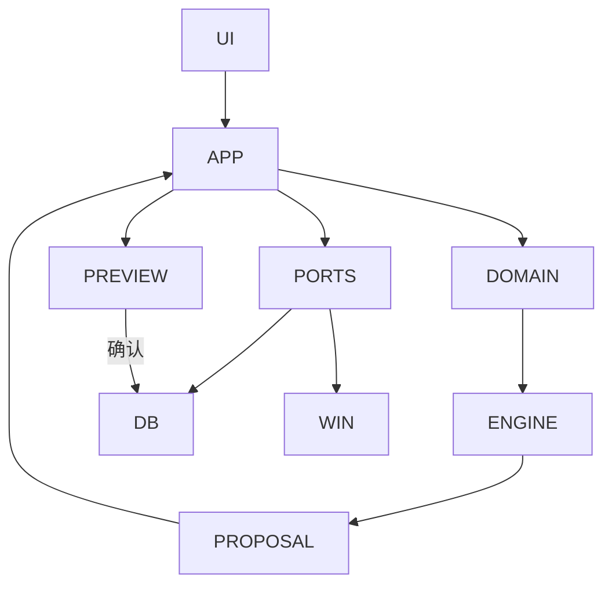

# 流程图 × 可执行证据 核对记录

目的：**确认技术设计文档里描述的每一条流程，在程序里都真的能走通**，并逐条留下可当场重跑的
证据。与 `spec-18-acceptance.md` 的分工：那一份核对的是**需求条目**（FR-*），这一份核对的是
**流程**（文档里的图与逐步描述）。两者交叉但不等价——一条需求可以有多个流程，一个流程也可以
兑现多条需求。

**判定口径**（沿用仓库既有约定，避免"代码写了"被当成"流程通了"）：

| 结论 | 含义 |
| --- | --- |
| **可走通** | 有可执行证据，且证据**能失败**（有测试覆盖真正的判断，不是只跑不断言） |
| **已修** | 核对时发现走不通，本轮修通并留了测试/变异验证 |
| **登记为缺口** | 确实走不通或未验证，写明原因，**不计入可走通** |

核对日期：2026-10-03。基线：`flutter analyze` 无问题、`flutter test` **494 项通过**。

---

## 一、图 1：架构分层流程图（技术设计 §3 起）



**结论：可走通。** 依赖方向实测与图一致，未发现反向依赖：

| 层 | 实际 import 到的本仓层 | 是否符合 |
| --- | --- | --- |
| `domain` | `core`, `domain`, `scheduling` | ✅（图：DOMAIN→ENGINE） |
| `scheduling` | `core`, `domain`, `scheduling` | ✅（引擎是纯 Dart，不依赖 Flutter/数据层） |
| `application` | `application`, `core`, `domain`, `platform`, `scheduling` | ⚠️ 见下 |
| `data` | `application`, `core`, `data`, `domain`, `scheduling` | ⚠️ 见下 |

### 两处"图与代码不完全对应"（不影响走通，但图会误导人）

1. **图上的 `PORTS` 方块不对应任何一个目录。** 端口接口实际声明在三处：`domain/repositories/`、
   `application/`（消费者自己声明，如 `ExportDataSource`、`AnalyticsDataSource`、
   `FocusEntryStore`）、以及 `platform/`（与适配器同址，如 `MonotonicClock`、
   `AppLockCredentialStore`）。
2. **`data → application` 与 `application → platform` 是"适配器实现端口"，方向本身没错，但图里
   画不出来。** 实测的 5 处跨层 import 全部是**端口接口**而非用例：
   `DriftExportDataSource implements ExportDataSource`、
   `AnalyticsDao implements AnalyticsDataSource`、
   `DriftFocusEntryStore implements FocusEntryStore`、
   `data_erasure_service` 取 `AppLockCredentialStore`、`focus_service` 取 `MonotonicClock`。
   也就是六边形架构里正常的**依赖倒置箭头**（适配器依赖端口），而图只画了 `PORTS --> DB`。

### 一处真实的层级偏位（已登记，未修）

`FocusSession`、`FocusPhase`、`FocusRecoveryState` 这三个**模型类型声明在
`application/focus_service.dart`**，却被数据层（`drift_focus_entry_store.dart`）依赖。
按图 1 的分工，领域模型应属于 `DOMAIN`。影响有限（不改行为），但它是"模型放错层"的真实例子，
登记为 **R14**，未修（移动会牵动多层 import，宜与其它重构一起做）。

---

## 二、图 2：createProposal → apply 时序图（技术设计 §6 起）

```mermaid
sequenceDiagram
    UI->>PS: createProposal()
    PS->>DB: load snapshot
    PS->>E: generate(problem + inputHash)
    E-->>PS: immutable proposal
    PS-->>UI: diff + explanations
    UI->>PS: apply(proposalId)
    PS->>DB: recompute current inputHash
    alt hash matches
      DB->>DB: transaction: version + blocks + log
      DB-->>UI: applied
    else stale
      DB-->>UI: staleProposal; request recalculation
    end
```

**结论：可走通（`else stale` 分支本轮修通）。**

| 图里的步骤 | 代码落点 | 可执行证据 | 状态 |
| --- | --- | --- | --- |
| `UI->>PS: createProposal()` | `PlanningService.createProposal` | `test/application/planning_service_test.dart`（8 处涉及 inputHash） | 可走通 |
| `PS->>DB: load snapshot` | `ScheduleProblemSource.load` | `test/application/repository_schedule_problem_source_test.dart`（6 处） | 可走通 |
| `PS->>E: generate(problem + inputHash)` | `ScheduleEngine.generate`（在 `Isolate.run` 里） | `test/scheduling/schedule_engine_test.dart`、`schedule_engine_time_zone_test.dart` | 可走通 |
| `E-->>PS: immutable proposal` | `ScheduleProposal`（`blocks`/`conflicts`/`unexplained` 全为不可变集合） | 同上 + `plan_validator_test.dart` | 可走通 |
| `PS-->>UI: diff + explanations` | `PlanDiffer`、`explanationLabel` | `test/features/planning/plan_preview_test.dart` | 可走通 |
| `UI->>PS: apply(proposalId)` | `PlanApplicationService.apply` | `test/application/plan_application_service_test.dart`（12 处） | 可走通 |
| `PS->>DB: recompute current inputHash` | 同上（应用前重算并与提案比对） | 同上 | 可走通 |
| `alt hash matches` → `transaction: version + blocks + log` | `DriftPlanRepository.applyProposal`：把旧 `confirmed` 版本置为 `superseded`、插入新版本、写 `changeLog`、落块，全部在**一个事务**内 | 同上 | 可走通 |
| `else stale` → `staleProposal; request recalculation` | **此前只有提示、没有入口** | **已修**：`8749b86`（见 W11） | **已修** |

### W11：`else stale` 分支此前在界面里走不通（已修）

页面在过期时只显示「提案已过期，请重新计算」，**同时禁用了确认按钮、卡片也不可点**——流程
要求用户重新计算，界面上却没有地方能做这件事。这条路径**真的会走到**：提案只存在内存里
（`PlanningService._previews`），应用重启或重新生成后旧链接必然失效。

修法：页面新增 `onRecalculate` 回调与「重新生成计划」按钮，路由复用既有的 `_generatePlan`；
未装配排程服务时传 `null`、不显示按钮。**顺带修掉一个陷阱**：loader 用
`late final _model = _build()` 只算一次，而重新生成会 `go` 到同一路由的不同 `proposalId`，
Flutter 会复用 State 导致 `_build()` 不重跑（按钮看着没反应）——已加 `ValueKey(proposalId)`。

证据：三条 widget 用例（给出入口并真的调用回调／未装配时不给按钮／未过期时不显示），
**变异验证**：把显示条件改成 `false`，恰好"给出入口"那条失败。
**未覆盖**：路由级接线与 State 重建没有自动化覆盖（`PlanningService` 是 `final class` 无法伪造，
且它在 `Isolate.run` 里排程，widget 测试等不到）。

---

## 三、散文描述的流程

| 流程 | 可执行证据 | 状态 |
| --- | --- | --- |
| 首次引导门控 | `test/features/onboarding/onboarding_page_test.dart` | 可走通 |
| 生成计划（含首周计划端到端） | `integration_test/first_plan_flow_test.dart`（**逐条在 Windows 上实跑**） | 可走通 |
| 临时晚归后的紧急重排（端到端） | `integration_test/emergency_replan_flow_test.dart`（同上） | 可走通 |
| 备份与恢复（端到端） | `integration_test/backup_restore_flow_test.dart`（同上） | 可走通 |
| 恢复保护（特殊日 → 提案 → 确认） | `recovery_planning_service_test.dart`、`recovery_dialog_test.dart`、`recovery_wiring_test.dart`、`test/app/special_day_route_test.dart` | 可走通 |
| 备份校验与待恢复/待清除标记 | `backup_service_test.dart`、`backup_pending_restore_test.dart`、`pending_erasure_test.dart` | 可走通 |
| 永久清除（入口 → 下次启动生效） | `data_erasure_service_test.dart`、`backup_erasure_entry_test.dart`（§18 第 18 项） | 可走通 |
| 导出（页面 → 服务 → 路由） | `export_service_test.dart`、`export_page_test.dart`、`export_route_test.dart` | 可走通 |
| 专注（含中断原因分类、剩余时长重算） | `focus_service_test.dart`、`focus_interruption_test.dart`、`focus_recompute_test.dart`、`test/app/focus_route_test.dart` | 可走通 |
| 偏好学习与建议（含接受/拒绝/停用/清除） | `preference_evidence_loop_test.dart`、`preference_service_test.dart`、`learned_preference_storage_test.dart`、`preferences_route_test.dart` | 可走通 |
| 应用锁（门控 → 解锁） | `app_lock_service_test.dart`、`app_lock_page_test.dart`、`app_lock_gate_test.dart`、`app_lock_unlock_test.dart` | 可走通 |
| 通知安排与点击导航 | `notification_service_test.dart`、`notification_kinds_test.dart`、`notification_payload_test.dart`、`notification_tap_navigation_test.dart` | 可走通（**真实 toast 交互未验证**，见下） |
| 撤销上一次已确认的计划 | `plan_undo_service_test.dart` | 可走通 |
| 日历事件创建/删除/按周重复与重排原因 | `calendar_event_route_test.dart`、`calendar_event_deletion_test.dart`、`calendar_replan_events_test.dart` | 可走通 |
| 手动拖动改期（FR-CAL-05/06） | `requested_move_test.dart` + 引擎 pin 相关用例 | 可走通 |

---

## 四、明确不计入"可走通"的项

| 项 | 原因 |
| --- | --- |
| **通知点击的真实 toast 交互** | 需要人真的点一下通知。自动化只覆盖到端口（`onTapped` 与冷启动 `launchPayload()` 两条路径都有测试），但平台的真实回调从未执行 |
| **`didNotificationLaunchApp` 的真实读取路径** | 只有 Windows 真的由 toast 拉起进程时才为 true，本机无法构造（§13.0 的 W6 已登记） |
| **手工验收清单** | 尚未执行；§18 唯一未勾选的"一分钟内快速录入"需要人工计时 |
| **`interruption:` 口径** | 默认选定、待产品确认（不影响"流程能走通"，但口径本身未定） |

---

## 五、本轮发现汇总

| 编号 | 内容 | 状态 |
| --- | --- | --- |
| **W11** | 时序图 `else stale` 分支在界面里走不通（只有提示、没有入口） | **已修** `8749b86` |
| **R14** | `FocusSession`/`FocusPhase`/`FocusRecoveryState` 声明在 `application` 而非 `domain`，数据层反向依赖它们 | 已登记，未修 |
| — | 图 1 的 `PORTS` 方块不对应任何单一目录；`data→application`／`application→platform` 是依赖倒置箭头，图里未画出 | 已登记（本文件），未改图 |

---

## 六、安装版实测（本轮顺带问清的两件事）

启动已安装的 MSIX（`ShuoZhuang.PersonalPlanner_1.0.0.0_x64__v9555qkaxdyym`）并做核对，
把两个此前只能猜的问题问清楚了。

### 1. 数据落点：`F:\Documents\personal_planner.sqlite`，**没有** MSIX 文件系统重定向

代码里数据库路径是 `getApplicationDocumentsDirectory()` + `personal_planner.sqlite`
（`lib/app/backup_assembly.dart:46`）。用包内探针（`Invoke-CommandInDesktopPackage`）问**包内进程**
自己看到的目录：

```text
MyDocuments : F:\Documents          ← 本机的"文档"已知文件夹被重定向到 F:，不是 C:\Users\zs200\Documents
USERPROFILE : C:\Users\zs200
EXPECTED-DB : F:\Documents\personal_planner.sqlite
DB-EXISTS   : True
```

**结论**：打包版**没有**把文档目录重定向进包私有目录，它写的就是真实的文档目录。因此
**绿色版（release EXE）与安装版共用同一个数据库文件**——此前担心"安装版看不到已有数据"是
**多虑**，现已实测排除。另外：判定数据库位置时不要假设它一定在 `C:\Users\<用户>\Documents`，
应当读已知文件夹（本机就被搬到了 F:）。

### 2. 崩溃：`0xc0000409`，且 `92efcf3` 修的正是它

Windows 应用程序日志里有两条 `personal_planner.exe`（版本 `1.0.0.1`）的崩溃记录，时间
**20:56**，异常代码 **`0xc0000409`**（BEX64，故障模块 `ucrtbase.dll`）。而本仓库随后的提交
`92efcf3 fix(windows): initialize notifications after first frame` 说明的正是同一件事：
在 `initState` 的 `persistentCallbacks` 阶段进入原生通知初始化，插件会同步回调 Dart，使渲染器在
首帧尚未就绪时 `compositeFrame`，**Release 随后以 `0xc0000409` 退出**；修法是等首帧结束后再读
启动详情。

**这意味着已安装的 `1.0.0.0` 早于该修复，仍然暴露在这个首帧竞态里。** 本轮 21:57 的那次启动
存活了下来（进程响应、窗口标题正常、数据库已创建），因此**它不是必现**——这正是竞态的特征，
也说明"起得来一次"不能当作"不再崩"。**结论：做通知 toast 的人工验证之前，应当先重新打包
（`msix_version` 需大于已安装的 `1.0.0.0`）并安装带该修复的版本**，否则验证可能只是在测一个
会崩的构建。
