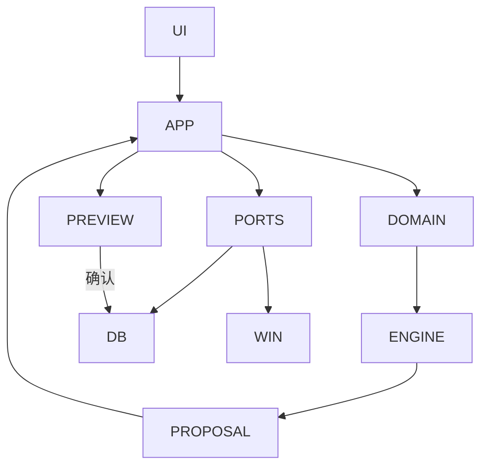

# 流程图 × 可执行证据 核对记录

目的：**确认技术设计文档里描述的每一条流程，在程序里都真的能走通**，并逐条留下可当场重跑的
证据。与 `spec-18-acceptance.md` 的分工：那一份核对的是**需求条目**（FR-*），这一份核对的是
**流程**（文档里的图与逐步描述）。两者交叉但不等价——一条需求可以有多个流程，一个流程也可以
兑现多条需求。

**判定口径**（沿用仓库既有约定，避免"代码写了"被当成"流程通了"）：

| 结论 | 含义 |
| --- | --- |
| **可走通** | 有可执行证据，且证据**能失败**（有测试覆盖真正的判断，不是只跑不断言） |
| **已修** | 核对时发现走不通，本轮修通并留了测试/变异验证 |
| **登记为缺口** | 确实走不通或未验证，写明原因，**不计入可走通** |

核对日期：2026-10-03。基线：`flutter analyze` 无问题、`flutter test` **494 项通过**。

---

## 一、图 1：架构分层流程图（技术设计 §3 起）



**结论：可走通。** 依赖方向实测与图一致，未发现反向依赖：

| 层 | 实际 import 到的本仓层 | 是否符合 |
| --- | --- | --- |
| `domain` | `core`, `domain`, `scheduling` | ✅（图：DOMAIN→ENGINE） |
| `scheduling` | `core`, `domain`, `scheduling` | ✅（引擎是纯 Dart，不依赖 Flutter/数据层） |
| `application` | `application`, `core`, `domain`, `platform`, `scheduling` | ⚠️ 见下 |
| `data` | `application`, `core`, `data`, `domain`, `scheduling` | ⚠️ 见下 |

### 两处"图与代码不完全对应"（不影响走通，但图会误导人）

1. **图上的 `PORTS` 方块不对应任何一个目录。** 端口接口实际声明在三处：`domain/repositories/`、
   `application/`（消费者自己声明，如 `ExportDataSource`、`AnalyticsDataSource`、
   `FocusEntryStore`）、以及 `platform/`（与适配器同址，如 `MonotonicClock`、
   `AppLockCredentialStore`）。
2. **`data → application` 与 `application → platform` 是"适配器实现端口"，方向本身没错，但图里
   画不出来。** 实测的 5 处跨层 import 全部是**端口接口**而非用例：
   `DriftExportDataSource implements ExportDataSource`、
   `AnalyticsDao implements AnalyticsDataSource`、
   `DriftFocusEntryStore implements FocusEntryStore`、
   `data_erasure_service` 取 `AppLockCredentialStore`、`focus_service` 取 `MonotonicClock`。
   也就是六边形架构里正常的**依赖倒置箭头**（适配器依赖端口），而图只画了 `PORTS --> DB`。

### 一处真实的层级偏位（已登记，未修）

`FocusSession`、`FocusPhase`、`FocusRecoveryState` 这三个**模型类型声明在
`application/focus_service.dart`**，却被数据层（`drift_focus_entry_store.dart`）依赖。
按图 1 的分工，领域模型应属于 `DOMAIN`。影响有限（不改行为），但它是"模型放错层"的真实例子，
登记为 **R14**，未修（移动会牵动多层 import，宜与其它重构一起做）。

---

## 二、图 2：createProposal → apply 时序图（技术设计 §6 起）

```mermaid
sequenceDiagram
    UI->>PS: createProposal()
    PS->>DB: load snapshot
    PS->>E: generate(problem + inputHash)
    E-->>PS: immutable proposal
    PS-->>UI: diff + explanations
    UI->>PS: apply(proposalId)
    PS->>DB: recompute current inputHash
    alt hash matches
      DB->>DB: transaction: version + blocks + log
      DB-->>UI: applied
    else stale
      DB-->>UI: staleProposal; request recalculation
    end
```

**结论：可走通（`else stale` 分支本轮修通）。**

| 图里的步骤 | 代码落点 | 可执行证据 | 状态 |
| --- | --- | --- | --- |
| `UI->>PS: createProposal()` | `PlanningService.createProposal` | `test/application/planning_service_test.dart`（8 处涉及 inputHash） | 可走通 |
| `PS->>DB: load snapshot` | `ScheduleProblemSource.load` | `test/application/repository_schedule_problem_source_test.dart`（6 处） | 可走通 |
| `PS->>E: generate(problem + inputHash)` | `ScheduleEngine.generate`（在 `Isolate.run` 里） | `test/scheduling/schedule_engine_test.dart`、`schedule_engine_time_zone_test.dart` | 可走通 |
| `E-->>PS: immutable proposal` | `ScheduleProposal`（`blocks`/`conflicts`/`unexplained` 全为不可变集合） | 同上 + `plan_validator_test.dart` | 可走通 |
| `PS-->>UI: diff + explanations` | `PlanDiffer`、`explanationLabel` | `test/features/planning/plan_preview_test.dart` | 可走通 |
| `UI->>PS: apply(proposalId)` | `PlanApplicationService.apply` | `test/application/plan_application_service_test.dart`（12 处） | 可走通 |
| `PS->>DB: recompute current inputHash` | 同上（应用前重算并与提案比对） | 同上 | 可走通 |
| `alt hash matches` → `transaction: version + blocks + log` | `DriftPlanRepository.applyProposal`：把旧 `confirmed` 版本置为 `superseded`、插入新版本、写 `changeLog`、落块，全部在**一个事务**内 | 同上 | 可走通 |
| `else stale` → `staleProposal; request recalculation` | **此前只有提示、没有入口** | **已修**：`8749b86`（见 W11） | **已修** |

### W11：`else stale` 分支此前在界面里走不通（已修）

页面在过期时只显示「提案已过期，请重新计算」，**同时禁用了确认按钮、卡片也不可点**——流程
要求用户重新计算，界面上却没有地方能做这件事。这条路径**真的会走到**：提案只存在内存里
（`PlanningService._previews`），应用重启或重新生成后旧链接必然失效。

修法：页面新增 `onRecalculate` 回调与「重新生成计划」按钮，路由复用既有的 `_generatePlan`；
未装配排程服务时传 `null`、不显示按钮。**顺带修掉一个陷阱**：loader 用
`late final _model = _build()` 只算一次，而重新生成会 `go` 到同一路由的不同 `proposalId`，
Flutter 会复用 State 导致 `_build()` 不重跑（按钮看着没反应）——已加 `ValueKey(proposalId)`。

证据：三条 widget 用例（给出入口并真的调用回调／未装配时不给按钮／未过期时不显示），
**变异验证**：把显示条件改成 `false`，恰好"给出入口"那条失败。
**未覆盖**：路由级接线与 State 重建没有自动化覆盖（`PlanningService` 是 `final class` 无法伪造，
且它在 `Isolate.run` 里排程，widget 测试等不到）。

---

## 三、散文描述的流程

| 流程 | 可执行证据 | 状态 |
| --- | --- | --- |
| 首次引导门控 | `test/features/onboarding/onboarding_page_test.dart` | 可走通 |
| **排程处理管线**（技术设计 §5.2：输入 → 可用时间 → 候选生成 → 远期压力 → 评分 → 最终验证 → 不可行报告） | `test/scheduling/schedule_engine_test.dart`、`schedule_engine_time_zone_test.dart`、`plan_validator_test.dart`、`infeasible_schedule_test.dart`、`preferred_time_window_test.dart` | 可走通 |
| **统计口径与聚合**（技术设计 §8／Task 17：事件 → 按窗口分桶 → 数据集 → 页面；含今天/本周/本月与休息保护、中断原因） | `test/application/analytics_service_test.dart`、`test/data/analytics_dao_test.dart`、`test/features/analytics/analytics_page_test.dart`、`test/app/analytics_route_test.dart` | 可走通 |
| 生成计划（含首周计划端到端） | `integration_test/first_plan_flow_test.dart`（**逐条在 Windows 上实跑**） | 可走通 |
| 临时晚归后的紧急重排（端到端） | `integration_test/emergency_replan_flow_test.dart`（同上） | 可走通 |
| 备份与恢复（端到端） | `integration_test/backup_restore_flow_test.dart`（同上） | 可走通 |
| 恢复保护（特殊日 → 提案 → 确认） | `recovery_planning_service_test.dart`、`recovery_dialog_test.dart`、`recovery_wiring_test.dart`、`test/app/special_day_route_test.dart` | 可走通 |
| 备份校验与待恢复/待清除标记 | `backup_service_test.dart`、`backup_pending_restore_test.dart`、`pending_erasure_test.dart` | 可走通 |
| 永久清除（入口 → 下次启动生效） | `data_erasure_service_test.dart`、`backup_erasure_entry_test.dart`（§18 第 18 项） | 可走通 |
| 导出（页面 → 服务 → 路由） | `export_service_test.dart`、`export_page_test.dart`、`export_route_test.dart` | 可走通 |
| 专注（含中断原因分类、剩余时长重算） | `focus_service_test.dart`、`focus_interruption_test.dart`、`focus_recompute_test.dart`、`test/app/focus_route_test.dart` | 可走通 |
| 偏好学习与建议（含接受/拒绝/停用/清除） | `preference_evidence_loop_test.dart`、`preference_service_test.dart`、`learned_preference_storage_test.dart`、`preferences_route_test.dart` | 可走通 |
| 应用锁（门控 → 解锁） | `app_lock_service_test.dart`、`app_lock_page_test.dart`、`app_lock_gate_test.dart`、`app_lock_unlock_test.dart` | 可走通 |
| 通知安排与点击导航 | `notification_service_test.dart`、`notification_kinds_test.dart`、`notification_payload_test.dart`、`notification_tap_navigation_test.dart` | 可走通（**真实 toast 交互未验证**，见下） |
| 撤销上一次已确认的计划 | `plan_undo_service_test.dart` | 可走通 |
| 日历事件创建/删除/按周重复与重排原因 | `calendar_event_route_test.dart`、`calendar_event_deletion_test.dart`、`calendar_replan_events_test.dart` | 可走通 |
| 手动拖动改期（FR-CAL-05/06） | `requested_move_test.dart` + 引擎 pin 相关用例 | 可走通 |

---

## 四、明确不计入"可走通"的项

| 项 | 原因 |
| --- | --- |
| **通知点击的真实 toast 交互** | 需要人真的点一下通知。自动化只覆盖到端口（`onTapped` 与冷启动 `launchPayload()` 两条路径都有测试），但平台的真实回调从未执行 |
| **`didNotificationLaunchApp` 的真实读取路径** | 只有 Windows 真的由 toast 拉起进程时才为 true，本机无法构造（§13.0 的 W6 已登记） |
| **手工验收清单** | 尚未执行；§18 唯一未勾选的"一分钟内快速录入"需要人工计时 |
| **`interruption:` 口径** | 默认选定、待产品确认（不影响"流程能走通"，但口径本身未定） |

---

## 五、本轮发现汇总

| 编号 | 内容 | 状态 |
| --- | --- | --- |
| **W11** | 时序图 `else stale` 分支在界面里走不通（只有提示、没有入口） | **已修** `8749b86` |
| **R14** | `FocusSession`/`FocusPhase`/`FocusRecoveryState` 声明在 `application` 而非 `domain`，数据层反向依赖它们 | 已登记，未修 |
| — | 图 1 的 `PORTS` 方块不对应任何单一目录；`data→application`／`application→platform` 是依赖倒置箭头，图里未画出 | 已登记（本文件），未改图 |

---

## 六、安装版实测（本轮顺带问清的两件事）

启动已安装的 MSIX（`ShuoZhuang.PersonalPlanner_1.0.0.0_x64__v9555qkaxdyym`）并做核对，
把两个此前只能猜的问题问清楚了。

### 1. 数据落点：`F:\Documents\personal_planner.sqlite`，**没有** MSIX 文件系统重定向

代码里数据库路径是 `getApplicationDocumentsDirectory()` + `personal_planner.sqlite`
（`lib/app/backup_assembly.dart:46`）。用包内探针（`Invoke-CommandInDesktopPackage`）问**包内进程**
自己看到的目录：

```text
MyDocuments : F:\Documents          ← 本机的"文档"已知文件夹被重定向到 F:，不是 C:\Users\zs200\Documents
USERPROFILE : C:\Users\zs200
EXPECTED-DB : F:\Documents\personal_planner.sqlite
DB-EXISTS   : True
```

**结论**：打包版**没有**把文档目录重定向进包私有目录，它写的就是真实的文档目录。因此
**绿色版（release EXE）与安装版共用同一个数据库文件**——此前担心"安装版看不到已有数据"是
**多虑**，现已实测排除。另外：判定数据库位置时不要假设它一定在 `C:\Users\<用户>\Documents`，
应当读已知文件夹（本机就被搬到了 F:）。

### 2. 崩溃：`0xc0000409`，且 `92efcf3` 修的正是它

Windows 应用程序日志里有两条 `personal_planner.exe`（版本 `1.0.0.1`）的崩溃记录，时间
**20:56**，异常代码 **`0xc0000409`**（BEX64，故障模块 `ucrtbase.dll`）。而本仓库随后的提交
`92efcf3 fix(windows): initialize notifications after first frame` 说明的正是同一件事：
在 `initState` 的 `persistentCallbacks` 阶段进入原生通知初始化，插件会同步回调 Dart，使渲染器在
首帧尚未就绪时 `compositeFrame`，**Release 随后以 `0xc0000409` 退出**；修法是等首帧结束后再读
启动详情。

**这意味着已安装的 `1.0.0.0` 早于该修复，仍然暴露在这个首帧竞态里。** 本轮 21:57 的那次启动
存活了下来（进程响应、窗口标题正常、数据库已创建），因此**它不是必现**——这正是竞态的特征，
也说明"起得来一次"不能当作"不再崩"。**结论：做通知 toast 的人工验证之前，应当先重新打包
（`msix_version` 需大于已安装的 `1.0.0.0`）并安装带该修复的版本**，否则验证可能只是在测一个
会崩的构建。

### 3. 重打包为 `1.0.1.0` 之后的补充观察：**崩溃不止发生在首帧**

已按上面的结论重打包并安装为 `1.0.1.0`（`version: 1.0.1+2`）。新版产物已签名，且这次
`Get-AuthenticodeSignature` 报 **`Valid`**——早先的 `UnknownError`（"证书链在不受信任的根证书中
终止"）确实只是证书未导入受信任存储所致，与签名本身无关。

**但这里必须记下一条削弱上面因果的观察**：我在 **21:57** 启动的**旧版**（包 `1.0.0.0`，exe
版本 `1.0.0.1`）当时是**存活的**，而它在 **22:05:36 崩了**（应用程序日志事件 1000，异常代码
`0xc0000409`，随后是 BEX64 报告）——**即启动约 8 分钟后崩溃，不是首帧**。

**含义**：`92efcf3` 所述的"首帧前进入原生通知初始化"最多只解释了 20:56 那两次崩溃，
**不足以解释全部**。要么还有一个更晚的触发点（例如原生回调在稍后重入 Dart），要么成因比提交
信息所写的更宽。**因此"新版已经活了几分钟"不能当作"崩溃已修好"**——旧版当时也活着。要下结论
必须在**同样的时间窗**上观察新版，并明确触发路径。

**对人工验证的影响（须先告知再动手）**：通知 toast 的验证依赖应用能持续存活，因此不要一看
"活了几分钟"就开始验证；先让新版跑过与旧版相同的观察窗（≥10 分钟），并检查应用程序日志有没有
新的 `0xc0000409`。

**观察结果（同在 2026-10-03，同一台机器）**：新版 `1.0.1.0` 启动后已连续运行 **15.5 分钟**
（约旧版崩溃点的 1.8 倍）、进程响应、**22:08 之后没有任何崩溃记录**；而旧版的时间线是
`20:56:01`、`20:56:10`、`22:05:34/35/36`（同一秒内三条，形似崩溃后反复重启）——**旧版每次都没
活过约 8.4 分钟，新版把这个点越过了 7 分钟以上且无崩溃**。

**因此结论从"未验证"上调为"有支持证据"**：`92efcf3` 对这条路径看来确实有效。**但仍只是单次
观察**，不足以断言"不再崩"——旧版的崩溃本身也不是每次都在同一时刻（20:56 与 22:05 两批之间
相差一小时）。所以做通知验证时**仍然要留意应用程序日志**：若验证期间出现 `0xc0000409`，那是
新信息（说明还有一条更晚的触发路径），而不是"已知的老问题"。

---

## 七、通知 toast 人工验证：第一次尝试失败的原因（**是给指令的人错了**）

给的操作步骤是"建一个截止时间在 24 小时内的任务 → 重启应用 → 约 1 分钟后应弹出截止提醒"。
**没有弹出。** 排查如下。

**先排除的项**（都有实测依据）：

| 检查 | 结果 |
| --- | --- |
| 应用是否在跑、是否崩 | 在跑、响应正常、无崩溃 |
| 截止时间是否真的设上 | **设上了**：任务「测试」`due_at_utc = 1791043140000000` µs = **今天 23:59 本地**（直接读 `F:\Documents\personal_planner.sqlite`） |
| 是否生成过计划 | **没有**（`plan_versions` 为空）→ "任务开始提醒"这条分支本就不适用，唯一可能触发的是截止提醒 |
| 任务是否算"未结束" | 算：`TaskStatus.inbox` 不在 `isClosed`（completed/skipped/cancelled）内 |
| 通知开关与提前量 | 均正常：`notifications.v1` 里 `deadlineEnabled: true`、`deadlineLeadMinutes: 1440` |
| `capability.canSchedule` | **恒为 true**（`windows_notification_adapter.dart:125` 无条件返回）→ 不是它挡住的 |

**真正原因：应用内设置里的免打扰时段。** `notifications.v1` 中是
`"quietHours":{"startMinute":1410,"endMinute":450}`，即 **23:30 → 07:30**，而操作时刻是 **23:40**，
正好落在里面。`syncNextSevenDays` 对每条候选提醒**先** `_clampToFuture`（已过去 → 现在 +1 分钟）
**再** `_delayPastQuietHours`，后者在免打扰期间把时刻推到**免打扰结束时刻**
（`notification_service.dart:230-252`）。因此这条提醒被**推迟到次日 07:30**。

**结论：程序的行为符合设计，错的是"1 分钟后弹"这个预期——写那份步骤时没有先看免打扰时段。**
要当晚验证，必须先把免打扰时段移开当前时刻。

**尚未分清的一点（不猜）**：读 Windows 通知平台数据库
（`%LOCALAPPDATA%\Microsoft\Windows\Notifications\wpndatabase.db`）时，既没有本应用的
`NotificationHandler` 记录，`TimedNotification` 也是 0 行。这**可能只是快照滞后**（WPN 有内存缓存，
落盘时机不保证），**也可能排定确实没发生**。把免打扰时段移开后的下一次实验能一次分清：若那时仍无
记录且无 toast，就是后者，需继续往插件 `initialize`/`schedule` 里查。

### 同一轮发现：设置页一句话与代码不一致（属口径问题）

设置页对用户写着「普通通知在免打扰期间延后；**冲突待处理提醒仍会保留**」
（`notification_preferences_section.dart:101`），而代码对冲突通知**同样**调用了
`_delayPastQuietHours`（`notification_service.dart:176-179`）。

两种读法都讲得通：若"仍会保留"指**不被丢弃**，代码没问题；若指**不被延后**（用户更可能这样理解），
这句承诺没有兑现。**这是口径问题而非实现笔误**，按 §20 应由产品侧确认再决定改文案还是改行为；
本轮只登记，不擅自改。
---

## 八、通知 toast 人工验证：第二次尝试（免打扰移开后）

把免打扰时段移开之后，**通知确实弹出来了** —— 因此第七节里"被延后到次日 07:30"就是第一次失败的
全部原因，应用侧到平台侧的排定链路是通的。**但点击后的结果与预期不符，而且证据指向的是一条
此前登记为"无法构造"的路径。**

### 观察到的现象

- **点击通知把窗口带到了前台**，但落在**今日安排页**，没有跳到该任务的详情页（payload 里的
  route 是 `/tasks/<id>`）。
- 进程启动时间 **23:51:05**，而点击发生在同一时刻——即 Windows **新起了一个进程**，不是激活已在
  运行的实例。**因此这次走的是冷启动路径**（`PlannerApp._handleLaunchPayload` →
  `NotificationPort.launchPayload()` → `getNotificationAppLaunchDetails()`），不是应用已在运行时
  的 `onTapped` 路径。

### 这条路径此前是怎么登记的

§13.0 的 W6 行原文：**"未验证部分：真实读取路径未被执行——`didNotificationLaunchApp` 只有在
Windows 真的由 toast 拉起进程时才为 true，本机无法构造；测试在端口处注入 payload，因此这是
'边界已通、平台调用待打包运行确认'"**。

现在它**被执行了**，结果是**没有导航**。也就是说这一项从"无法构造"变成了**观察到失败**：
`launchPayload()` 在真实由 toast 拉起的进程里没有产出可导航的 route（返回 null 或 route 未被消费）。

### 尚未分清的两点（不猜）

1. **`launchPayload()` 是真的返回了 null，还是返回了却没被消费**：两条都在
   `planner_app.dart` 的 `_handleLaunchPayload` 附近，需要加临时诊断或读更多代码才能分开。
2. **平台侧看不到这条通知的痕迹**：至今 `wpndatabase.db` 里既没有本应用的
   `NotificationHandler`，也没有到达历史。这与"用户确实看到了并点了通知"矛盾的两种解释是
   **①我读到的是滞后快照**（WPN 有内存缓存）或 **②用户点的是别的应用的通知**。**必须让用户
   确认那条通知的标题与正文**才能排除后者——在那之前，下面两条候选原因都只是候选。

### 候选原因（未验证）

- **清单里没有声明 toast 激活器 CLSID**：`msix_config` 未设置 `toast_activator_clsid`（msix 支持
  `toastActivatorCLSID`/`toastActivatorArguments`/`toastActivatorDisplayName`）。若 Windows 只是
  按 AUMID 拉起应用、而不把"由哪条通知激活"交给插件，`didNotificationLaunchApp` 就会是 false，
  表现正好是"应用起来了但没导航"。
- **单实例激活未处理**：点击时新起了一个进程，若应用没有"把激活转交给已有实例"的机制，那么
  即使已有窗口在后面，被点到前台并显示的仍是新实例的默认路由。

**下一步的最小实验**（能一次分开"冷启动路径坏"与"`onTapped` 路径也坏"）：**让应用保持运行，
在它运行期间点击通知**。若运行期间点击能正确跳转，则坏的只是冷启动路径；若同样不跳，则
`onTapped` 也没接上，问题更靠前。
---

## 九、点击通知不跳转的**根因**：传给插件的 AUMID 与打包身份不一致

第八节留下了两个候选原因。现在**根因已定位，且是硬证据**。

### 证据链

| 项 | 值 |
| --- | --- |
| 我们传给插件的 AUMID（`windows_notification_adapter.dart` 里**硬编码**） | `PersonalPlanner.Desktop.App` |
| 注册表里实际被插件写入激活器的键 | `HKCU\Software\Classes\AppUserModelId\PersonalPlanner.Desktop.App` —— **存在，与上面一致** |
| 打包身份的真实 AUMID（`包族名!应用Id`） | `ShuoZhuang.PersonalPlanner_v9555qkaxdyym!personalplanner` |

**两者不一致。**

### 为什么这会让点击失效（机制来自插件源码）

插件靠 `registerApp` 做两件事（`flutter_local_notifications_windows` 的 `src/plugin.cpp:117-181`）：

1. 往 `HKCU\Software\Classes\AppUserModelId\<传入的 aumid>` 写 `DisplayName`/`IconUri`/
   **`CustomActivator` = {guid}**；
2. `CoRegisterClassObject(clsid, factory, CLSCTX_LOCAL_SERVER, …)` 把 COM 类对象注册在**当前进程**里，
   于是 Windows 激活 toast 时能回调到本进程，再由插件转发给 Dart 的
   `onDidReceiveNotificationResponse`。

而**打包应用**的 toast 是带着**包身份 AUMID** 创建的。点击时 Windows 去查
`AppUserModelId\<包身份 AUMID>` 下的 `CustomActivator` —— 那里**没有**（插件的键写在另一个 AUMID 下），
于是**回退成"按 AUMID 直接启动应用"**：新起一个进程、不带任何激活负载。

### 这一条解释了全部观察

| 观察 | 解释 |
| --- | --- |
| 通知正常弹出 | 创建 toast 不需要激活器 |
| 点击后**新开了一个窗口**（应用已在运行也一样） | 没有 `CustomActivator` → 回退为直接启动，不是激活已有实例 |
| 落在**今日安排页**而非任务详情 | 新进程没有激活负载 → 走默认路由 |
| `onTapped` 在应用运行时也没被调用 | 运行中的进程从未被 Windows 联系过 |
| 注册表里多出一个 `PersonalPlanner.Desktop.App` 键 | 插件按**我们传的** AUMID 写了激活器 |

### 修法方向（尚未实施）

1. **让初始化时的 AUMID 等于 `<PackageFamilyName>!<ApplicationId>`**：它不该是硬编码常量——包族名
   含发布者哈希、随签名证书变化，写死必然再次失配。应在运行时取（`GetCurrentPackageFamilyName`
   已在本仓库的 `windows_package_identity.dart` 里做过同类 FFI 调用；应用 Id 取自清单，当前为
   `personalplanner`），或由组合根注入一个与清单一致的常量并加测试守住。
2. **很可能还要在清单里声明 toast 激活器**（`msix_config` 的 `toast_activator_clsid` 等）：
   打包应用走的是清单声明而不是上面那套注册表约定，这正是之前登记的候选原因之一。
3. 改完必须**重新打包安装**（`msix_version` 需大于已安装的 `1.0.1.0`）并**重跑点击验证**。

**这一项不计入通过。** 通知能弹只兑现了两个未验证项里的一个；"点击进入正确页面"仍未兑现。